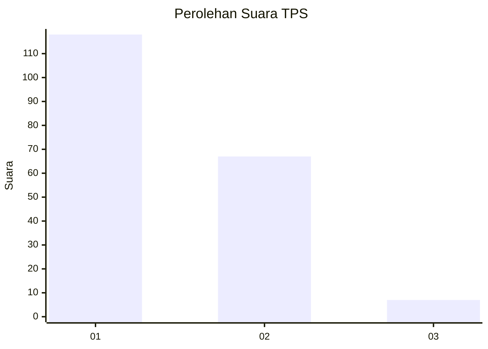
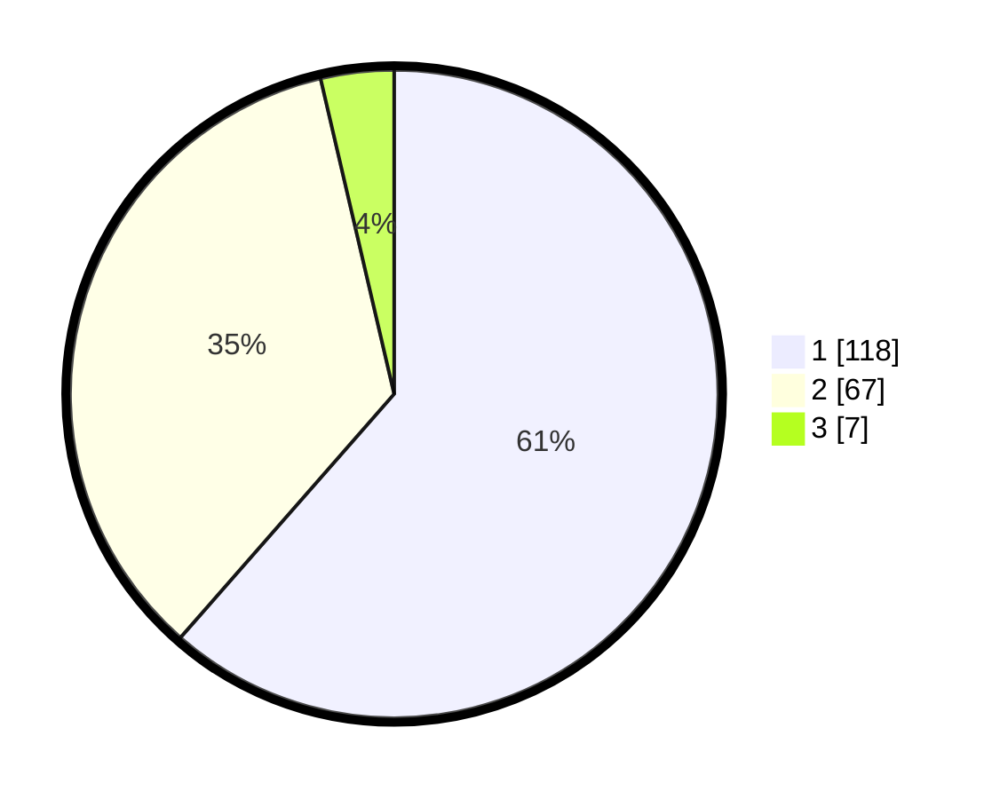

# Hasil

## Grafik

## Tabel

| No. | Nama Paslon    | Suara | Suara (raw) | Persentase |
|:--- |:-------------- | -----:| -----------:| ----------:|
| 1   | ANIES MUHAIMIN | 118   | [118][p-1]  | 61,46      |
| 2   | PRABOWO GIBRAN | 67    | [67][p-2]   | 34,90      |
| 3   | GANJAR MAHFUD  | 7     | [7][p-3]    | 3,65       |

[p-1]: https://github.com/gigit-pemilu/pemilu-2024-12-sumatera-utara/blob/main/pilpres/hitung-suara/sub/12-sumatera-utara/sub/74-kota-tanjung-balai/sub/03-sei-tualang-raso/sub/1001-keramat-kubah/sub/012-tps/sub/paslon-1.txt
[p-2]: https://github.com/gigit-pemilu/pemilu-2024-12-sumatera-utara/blob/main/pilpres/hitung-suara/sub/12-sumatera-utara/sub/74-kota-tanjung-balai/sub/03-sei-tualang-raso/sub/1001-keramat-kubah/sub/012-tps/sub/paslon-2.txt
[p-3]: https://github.com/gigit-pemilu/pemilu-2024-12-sumatera-utara/blob/main/pilpres/hitung-suara/sub/12-sumatera-utara/sub/74-kota-tanjung-balai/sub/03-sei-tualang-raso/sub/1001-keramat-kubah/sub/012-tps/sub/paslon-3.txt

## Foto C Plano

https://sirekap-obj-formc.kpu.go.id/277b/pemilu/ppwp/12/74/03/10/01/1274031001012-20240215-064236--b2e0c51d-100b-4d4b-af99-ead40b325655.jpg

https://sirekap-obj-formc.kpu.go.id/277b/pemilu/ppwp/12/74/03/10/01/1274031001012-20240215-064427--3d47665f-cc85-4deb-a7e5-3084f56af9da.jpg

https://sirekap-obj-formc.kpu.go.id/277b/pemilu/ppwp/12/74/03/10/01/1274031001012-20240215-064600--1ac86712-7991-4ffc-8d29-ca358178fb1e.jpg

## Metadata

| Key        | Value               |
| ---------- | ------------------- |
| Time Stamp | 2024-02-24 22:31:28 |

