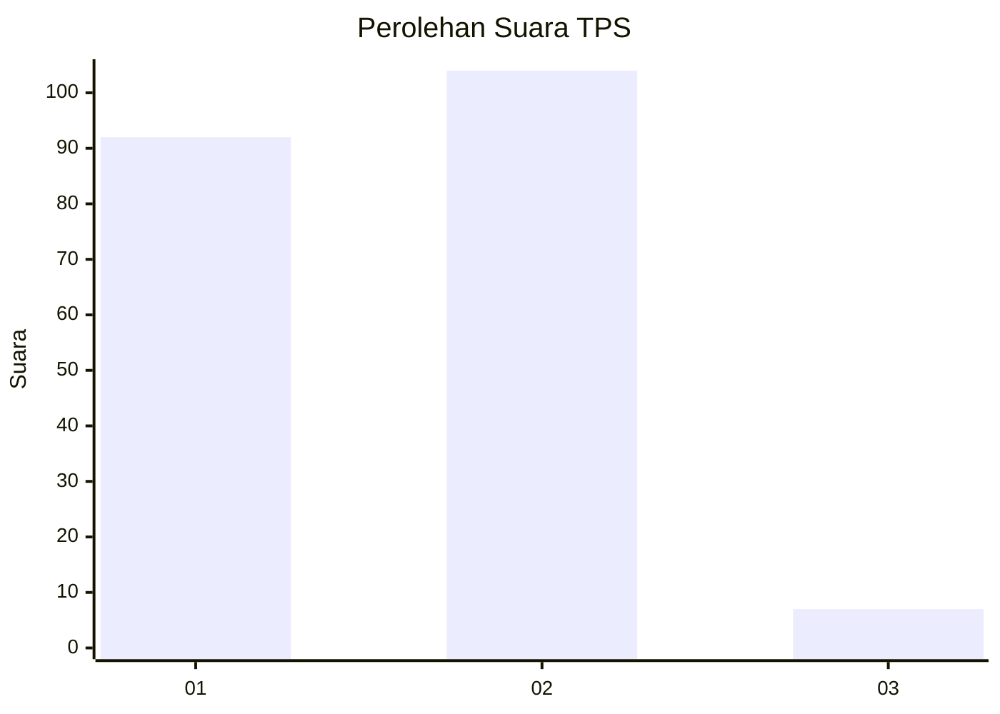
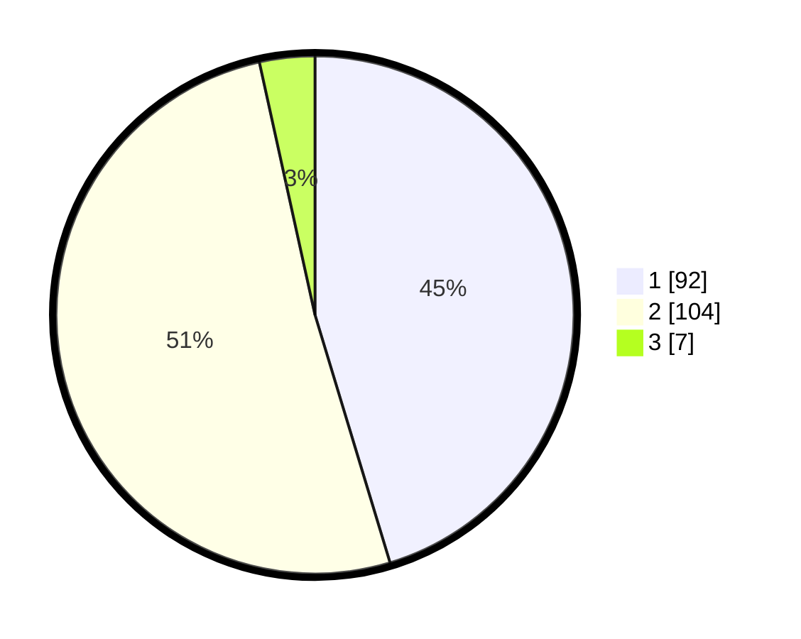

# Hasil

## Grafik

## Tabel

| No. | Nama Paslon    | Suara | Suara (raw) | Persentase |
|:--- |:-------------- | -----:| -----------:| ----------:|
| 1   | ANIES MUHAIMIN | 92    | [92][p-1]   | 45,32      |
| 2   | PRABOWO GIBRAN | 104   | [104][p-2]  | 51,23      |
| 3   | GANJAR MAHFUD  | 7     | [7][p-3]    | 3,45       |

[p-1]: https://github.com/gigit-pemilu/pemilu-2024-12-sumatera-utara/blob/main/pilpres/hitung-suara/sub/12-sumatera-utara/sub/74-kota-tanjung-balai/sub/04-teluk-nibung/sub/1001-sei-merbau/sub/002-tps/sub/paslon-1.txt
[p-2]: https://github.com/gigit-pemilu/pemilu-2024-12-sumatera-utara/blob/main/pilpres/hitung-suara/sub/12-sumatera-utara/sub/74-kota-tanjung-balai/sub/04-teluk-nibung/sub/1001-sei-merbau/sub/002-tps/sub/paslon-2.txt
[p-3]: https://github.com/gigit-pemilu/pemilu-2024-12-sumatera-utara/blob/main/pilpres/hitung-suara/sub/12-sumatera-utara/sub/74-kota-tanjung-balai/sub/04-teluk-nibung/sub/1001-sei-merbau/sub/002-tps/sub/paslon-3.txt

## Foto C Plano

https://sirekap-obj-formc.kpu.go.id/32b4/pemilu/ppwp/12/74/04/10/01/1274041001002-20240214-201311--d13d13ba-40d2-4709-bc39-548b94c345b5.jpg

https://sirekap-obj-formc.kpu.go.id/32b4/pemilu/ppwp/12/74/04/10/01/1274041001002-20240214-155639--e5385a98-b8b0-4f1c-b73f-b2ddb485be84.jpg

https://sirekap-obj-formc.kpu.go.id/32b4/pemilu/ppwp/12/74/04/10/01/1274041001002-20240214-155748--29bdc1b9-a51b-4563-bb90-fd518101cc1c.jpg

## Metadata

| Key        | Value               |
| ---------- | ------------------- |
| Time Stamp | 2024-02-15 19:30:26 |

