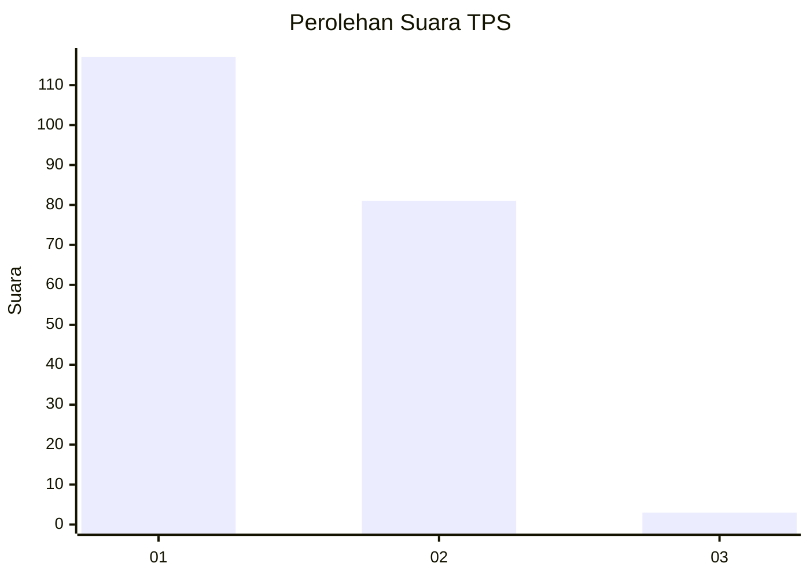
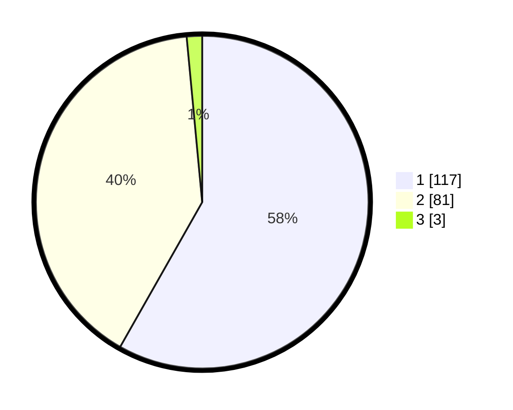

# Hasil

## Grafik

## Tabel

| No. | Nama Paslon    | Suara | Suara (raw) | Persentase |
|:--- |:-------------- | -----:| -----------:| ----------:|
| 1   | ANIES MUHAIMIN | 117   | [117][p-1]  | 58,21      |
| 2   | PRABOWO GIBRAN | 81    | [81][p-2]   | 40,30      |
| 3   | GANJAR MAHFUD  | 3     | [3][p-3]    | 1,49       |

[p-1]: https://github.com/gigit-pemilu/pemilu-2024/blob/main/pilpres/hitung-suara/sub/12-sumatera-utara/sub/74-kota-tanjung-balai/sub/04-teluk-nibung/sub/1001-sei-merbau/sub/014-tps/sub/paslon-1.txt
[p-2]: https://github.com/gigit-pemilu/pemilu-2024/blob/main/pilpres/hitung-suara/sub/12-sumatera-utara/sub/74-kota-tanjung-balai/sub/04-teluk-nibung/sub/1001-sei-merbau/sub/014-tps/sub/paslon-2.txt
[p-3]: https://github.com/gigit-pemilu/pemilu-2024/blob/main/pilpres/hitung-suara/sub/12-sumatera-utara/sub/74-kota-tanjung-balai/sub/04-teluk-nibung/sub/1001-sei-merbau/sub/014-tps/sub/paslon-3.txt

## Foto C Plano

https://sirekap-obj-formc.kpu.go.id/2620/pemilu/ppwp/12/74/04/10/01/1274041001014-20240215-023133--8173c8c8-2d46-44fe-b49f-092caad4d2ac.jpg

https://sirekap-obj-formc.kpu.go.id/2620/pemilu/ppwp/12/74/04/10/01/1274041001014-20240215-023437--c8ab6121-2754-46cb-9a8f-147d5d122b5d.jpg

https://sirekap-obj-formc.kpu.go.id/2620/pemilu/ppwp/12/74/04/10/01/1274041001014-20240215-023738--4fec7ef8-9d0f-43c7-80cf-50ec4c7230aa.jpg

## Metadata

| Key        | Value               |
| ---------- | ------------------- |
| Time Stamp | 2024-02-15 22:00:27 |

