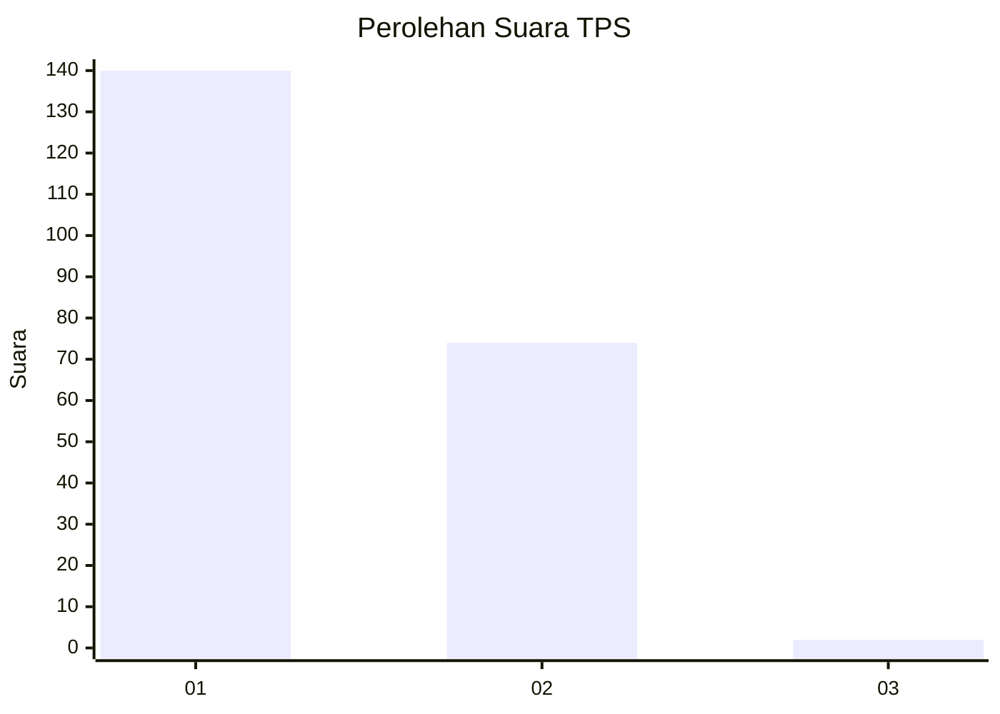
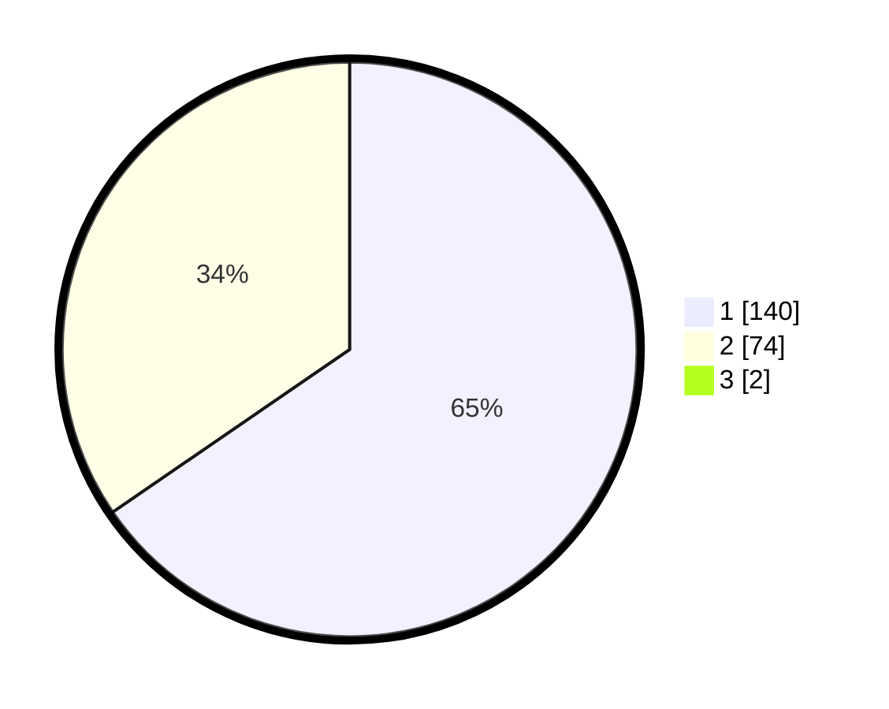

# Hasil

## Grafik

## Tabel

| No. | Nama Paslon    | Suara | Suara (raw) | Persentase |
|:--- |:-------------- | -----:| -----------:| ----------:|
| 1   | ANIES MUHAIMIN | 140   | [140][p-1]  | 64,81      |
| 2   | PRABOWO GIBRAN | 74    | [74][p-2]   | 34,26      |
| 3   | GANJAR MAHFUD  | 2     | [2][p-3]    | 0,93       |

[p-1]: https://github.com/gigit-pemilu/pemilu-2024/blob/main/pilpres/hitung-suara/sub/12-sumatera-utara/sub/74-kota-tanjung-balai/sub/05-datuk-bandar/sub/1003-gading/sub/024-tps/sub/paslon-1.txt
[p-2]: https://github.com/gigit-pemilu/pemilu-2024/blob/main/pilpres/hitung-suara/sub/12-sumatera-utara/sub/74-kota-tanjung-balai/sub/05-datuk-bandar/sub/1003-gading/sub/024-tps/sub/paslon-2.txt
[p-3]: https://github.com/gigit-pemilu/pemilu-2024/blob/main/pilpres/hitung-suara/sub/12-sumatera-utara/sub/74-kota-tanjung-balai/sub/05-datuk-bandar/sub/1003-gading/sub/024-tps/sub/paslon-3.txt

## Foto C Plano

https://sirekap-obj-formc.kpu.go.id/fca1/pemilu/ppwp/12/74/05/10/03/1274051003024-20240214-204816--2608941f-2f8b-42e2-a294-bb4d15f8cc69.jpg

https://sirekap-obj-formc.kpu.go.id/fca1/pemilu/ppwp/12/74/05/10/03/1274051003024-20240214-205720--4808d354-f7d8-4025-9084-747fff1bdca7.jpg

https://sirekap-obj-formc.kpu.go.id/fca1/pemilu/ppwp/12/74/05/10/03/1274051003024-20240214-205046--4def1e81-9472-4aa1-8d74-d10310cc2c19.jpg

## Metadata

| Key        | Value               |
| ---------- | ------------------- |
| Time Stamp | 2024-02-15 21:30:27 |

