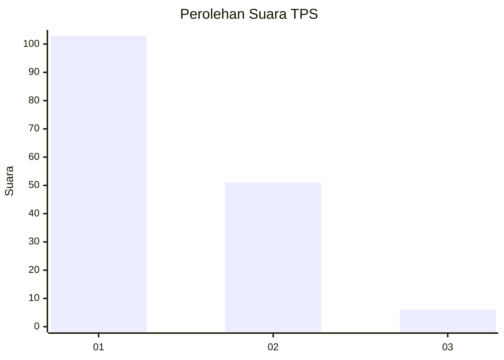
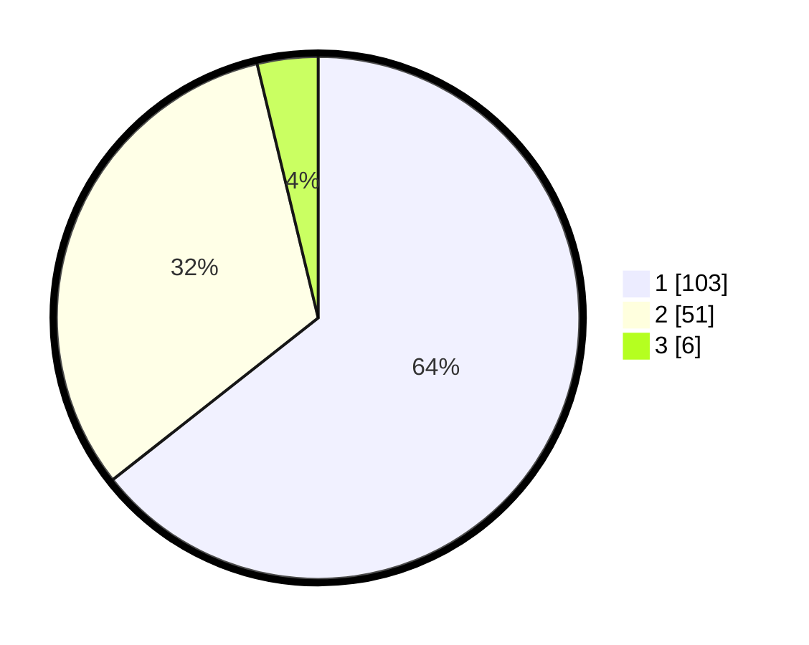

# Hasil

## Grafik

## Tabel

| No. | Nama Paslon    | Suara | Suara (raw) | Persentase |
|:--- |:-------------- | -----:| -----------:| ----------:|
| 1   | ANIES MUHAIMIN | 103   | [103][p-1]  | 64,38      |
| 2   | PRABOWO GIBRAN | 51    | [51][p-2]   | 31,88      |
| 3   | GANJAR MAHFUD  | 6     | [6][p-3]    | 3,75       |

[p-1]: https://github.com/gigit-pemilu/pemilu-2024-12-sumatera-utara/blob/main/pilpres/hitung-suara/sub/12-sumatera-utara/sub/74-kota-tanjung-balai/sub/05-datuk-bandar/sub/1006-pahang/sub/007-tps/sub/paslon-1.txt
[p-2]: https://github.com/gigit-pemilu/pemilu-2024-12-sumatera-utara/blob/main/pilpres/hitung-suara/sub/12-sumatera-utara/sub/74-kota-tanjung-balai/sub/05-datuk-bandar/sub/1006-pahang/sub/007-tps/sub/paslon-2.txt
[p-3]: https://github.com/gigit-pemilu/pemilu-2024-12-sumatera-utara/blob/main/pilpres/hitung-suara/sub/12-sumatera-utara/sub/74-kota-tanjung-balai/sub/05-datuk-bandar/sub/1006-pahang/sub/007-tps/sub/paslon-3.txt

## Foto C Plano

https://sirekap-obj-formc.kpu.go.id/05ea/pemilu/ppwp/12/74/05/10/06/1274051006007-20240215-065127--5cc3e416-42f1-4ec7-bbe2-364fe4ea65e1.jpg

https://sirekap-obj-formc.kpu.go.id/05ea/pemilu/ppwp/12/74/05/10/06/1274051006007-20240216-135036--f20980b2-04d0-460d-99da-eb43b532506e.jpg

https://sirekap-obj-formc.kpu.go.id/05ea/pemilu/ppwp/12/74/05/10/06/1274051006007-20240216-135035--733fdf5d-432e-427d-acfc-7ff3fba48767.jpg

## Metadata

| Key        | Value               |
| ---------- | ------------------- |
| Time Stamp | 2024-02-19 16:00:00 |

