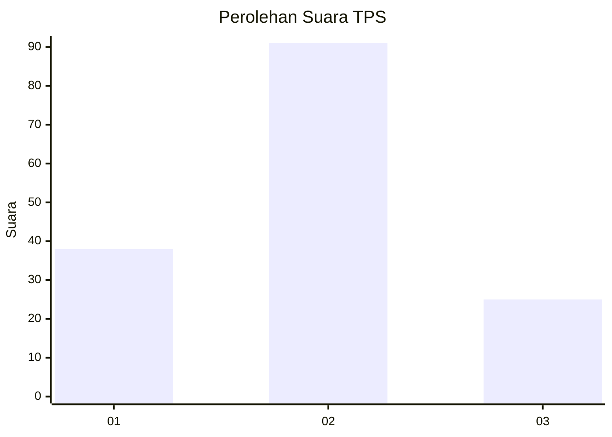
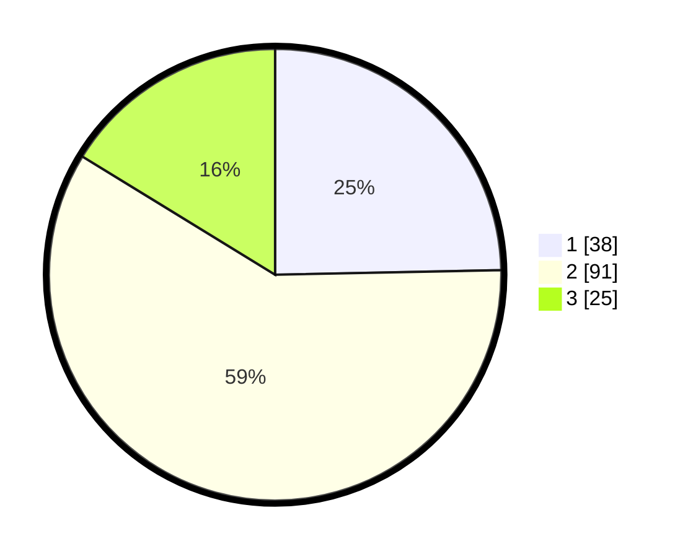

# Hasil

## Grafik

## Tabel

| No. | Nama Paslon    | Suara | Suara (raw) | Persentase |
|:--- |:-------------- | -----:| -----------:| ----------:|
| 1   | ANIES MUHAIMIN | 38    | [38][p-1]   | 24,68      |
| 2   | PRABOWO GIBRAN | 91    | [91][p-2]   | 59,09      |
| 3   | GANJAR MAHFUD  | 25    | [25][p-3]   | 16,23      |

[p-1]: https://github.com/gigit-pemilu/pemilu-2024-12-sumatera-utara/blob/main/pilpres/hitung-suara/sub/12-sumatera-utara/sub/74-kota-tanjung-balai/sub/06-datuk-bandar-timur/sub/1001-pulau-simardan/sub/001-tps/sub/paslon-1.txt
[p-2]: https://github.com/gigit-pemilu/pemilu-2024-12-sumatera-utara/blob/main/pilpres/hitung-suara/sub/12-sumatera-utara/sub/74-kota-tanjung-balai/sub/06-datuk-bandar-timur/sub/1001-pulau-simardan/sub/001-tps/sub/paslon-2.txt
[p-3]: https://github.com/gigit-pemilu/pemilu-2024-12-sumatera-utara/blob/main/pilpres/hitung-suara/sub/12-sumatera-utara/sub/74-kota-tanjung-balai/sub/06-datuk-bandar-timur/sub/1001-pulau-simardan/sub/001-tps/sub/paslon-3.txt

## Foto C Plano

https://sirekap-obj-formc.kpu.go.id/9496/pemilu/ppwp/12/74/06/10/01/1274061001001-20240215-044204--2ac7c931-b05d-482b-8982-62398b3a0db7.jpg

https://sirekap-obj-formc.kpu.go.id/9496/pemilu/ppwp/12/74/06/10/01/1274061001001-20240215-044256--90d09ddc-d5a1-4885-83c6-e346327310e0.jpg

https://sirekap-obj-formc.kpu.go.id/9496/pemilu/ppwp/12/74/06/10/01/1274061001001-20240215-044430--004f0777-44a1-4901-9fbd-02a46a17f9f6.jpg

## Metadata

| Key        | Value               |
| ---------- | ------------------- |
| Time Stamp | 2024-02-25 22:00:00 |

