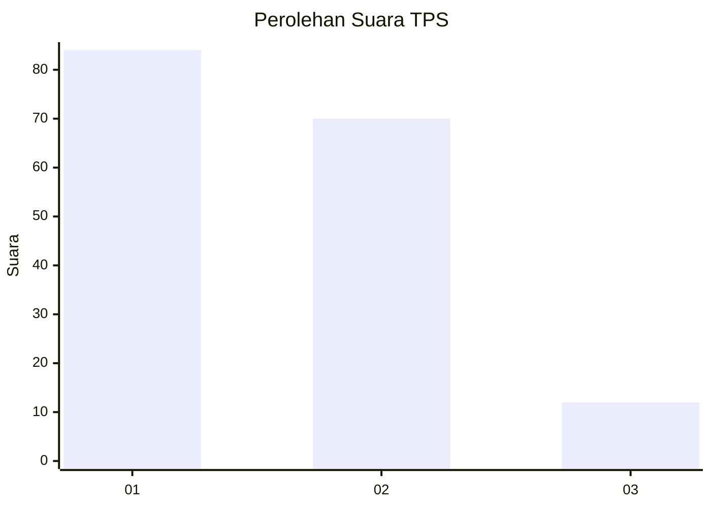
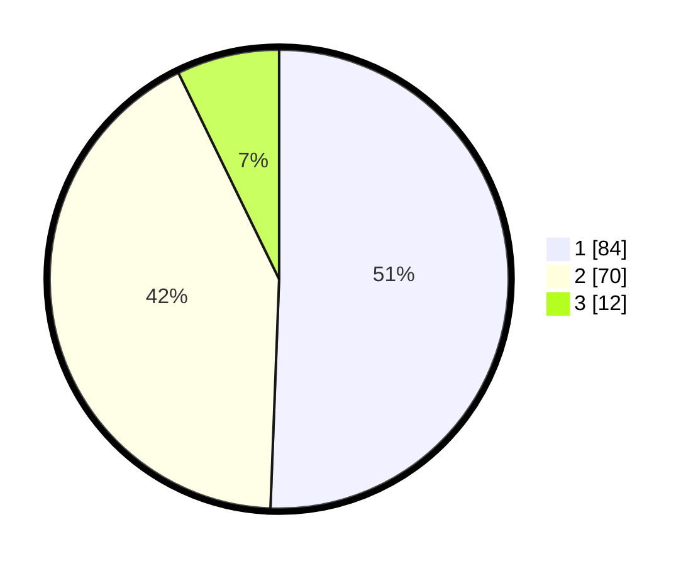

# Hasil

## Grafik

## Tabel

| No. | Nama Paslon    | Suara | Suara (raw) | Persentase |
|:--- |:-------------- | -----:| -----------:| ----------:|
| 1   | ANIES MUHAIMIN | 84    | [84][p-1]   | 50,60      |
| 2   | PRABOWO GIBRAN | 70    | [70][p-2]   | 42,17      |
| 3   | GANJAR MAHFUD  | 12    | [12][p-3]   | 7,23       |

[p-1]: https://github.com/gigit-pemilu/pemilu-2024-12-sumatera-utara/blob/main/pilpres/hitung-suara/sub/12-sumatera-utara/sub/74-kota-tanjung-balai/sub/06-datuk-bandar-timur/sub/1001-pulau-simardan/sub/002-tps/sub/paslon-1.txt
[p-2]: https://github.com/gigit-pemilu/pemilu-2024-12-sumatera-utara/blob/main/pilpres/hitung-suara/sub/12-sumatera-utara/sub/74-kota-tanjung-balai/sub/06-datuk-bandar-timur/sub/1001-pulau-simardan/sub/002-tps/sub/paslon-2.txt
[p-3]: https://github.com/gigit-pemilu/pemilu-2024-12-sumatera-utara/blob/main/pilpres/hitung-suara/sub/12-sumatera-utara/sub/74-kota-tanjung-balai/sub/06-datuk-bandar-timur/sub/1001-pulau-simardan/sub/002-tps/sub/paslon-3.txt

## Foto C Plano

https://sirekap-obj-formc.kpu.go.id/1d30/pemilu/ppwp/12/74/06/10/01/1274061001002-20240215-014016--f2f58f2d-639c-41b8-b69c-abaa2efb6cfb.jpg

https://sirekap-obj-formc.kpu.go.id/1d30/pemilu/ppwp/12/74/06/10/01/1274061001002-20240215-020217--7940cc4e-7af6-4fe5-a1c2-8d1642842139.jpg

https://sirekap-obj-formc.kpu.go.id/1d30/pemilu/ppwp/12/74/06/10/01/1274061001002-20240215-020654--ea202718-0ed7-4dad-9321-46ede2e5f2fb.jpg

## Metadata

| Key        | Value               |
| ---------- | ------------------- |
| Time Stamp | 2024-02-15 22:00:27 |

