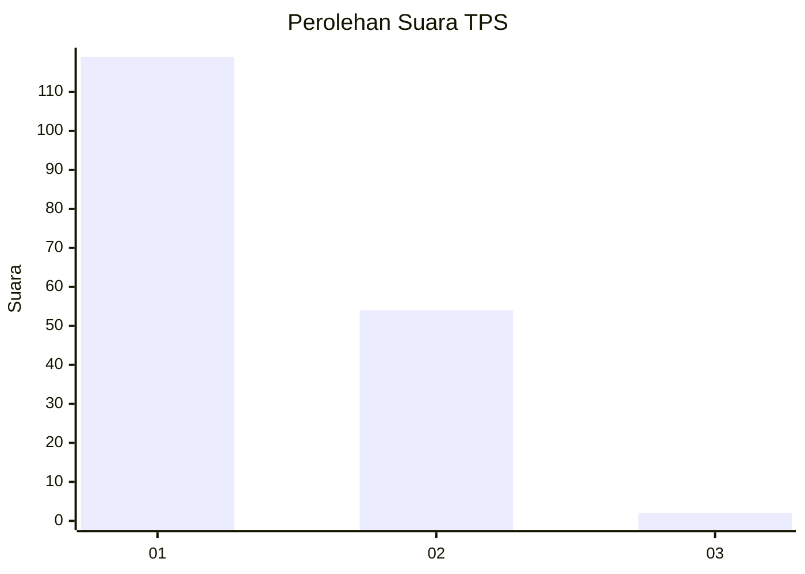
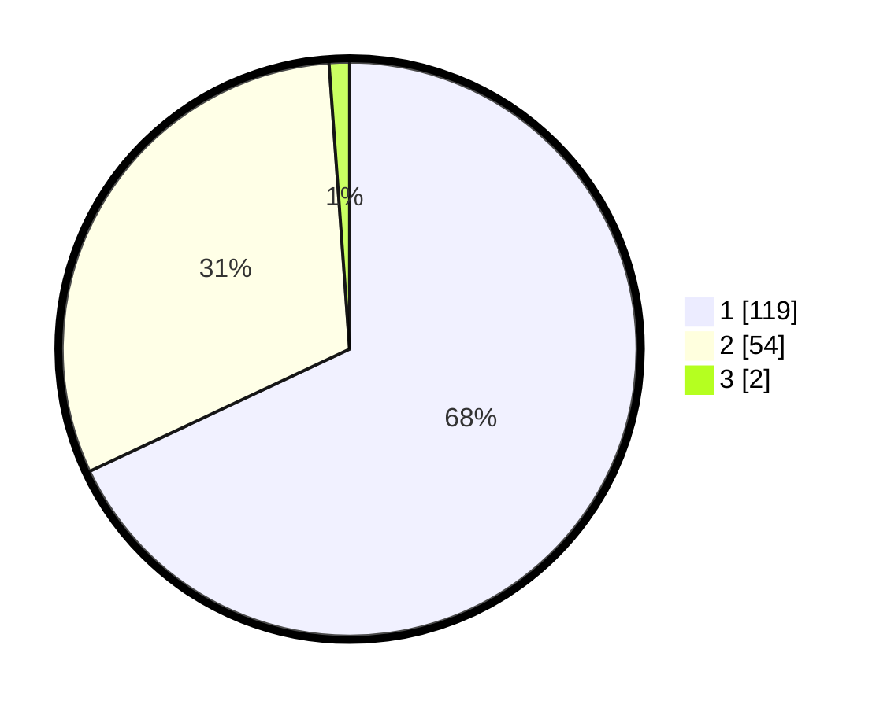

# Hasil

## Grafik

## Tabel

| No. | Nama Paslon    | Suara | Suara (raw) | Persentase |
|:--- |:-------------- | -----:| -----------:| ----------:|
| 1   | ANIES MUHAIMIN | 119   | [119][p-1]  | 68,00      |
| 2   | PRABOWO GIBRAN | 54    | [54][p-2]   | 30,86      |
| 3   | GANJAR MAHFUD  | 2     | [2][p-3]    | 1,14       |

[p-1]: https://github.com/gigit-pemilu/pemilu-2024/blob/main/pilpres/hitung-suara/sub/12-sumatera-utara/sub/74-kota-tanjung-balai/sub/06-datuk-bandar-timur/sub/1005-selat-tanjung-medan/sub/016-tps/sub/paslon-1.txt
[p-2]: https://github.com/gigit-pemilu/pemilu-2024/blob/main/pilpres/hitung-suara/sub/12-sumatera-utara/sub/74-kota-tanjung-balai/sub/06-datuk-bandar-timur/sub/1005-selat-tanjung-medan/sub/016-tps/sub/paslon-2.txt
[p-3]: https://github.com/gigit-pemilu/pemilu-2024/blob/main/pilpres/hitung-suara/sub/12-sumatera-utara/sub/74-kota-tanjung-balai/sub/06-datuk-bandar-timur/sub/1005-selat-tanjung-medan/sub/016-tps/sub/paslon-3.txt

## Foto C Plano

https://sirekap-obj-formc.kpu.go.id/b9dc/pemilu/ppwp/12/74/06/10/05/1274061005016-20240214-203108--1b335dcc-0e1d-4b01-bf08-a007e3c4db54.jpg

https://sirekap-obj-formc.kpu.go.id/b9dc/pemilu/ppwp/12/74/06/10/05/1274061005016-20240214-203415--008bb2ad-33fc-4599-a8fe-64db857e71d0.jpg

https://sirekap-obj-formc.kpu.go.id/b9dc/pemilu/ppwp/12/74/06/10/05/1274061005016-20240214-203527--6d4b097f-9ea0-4cb5-becd-28dd57195482.jpg

## Metadata

| Key        | Value               |
| ---------- | ------------------- |
| Time Stamp | 2024-02-24 22:31:28 |

