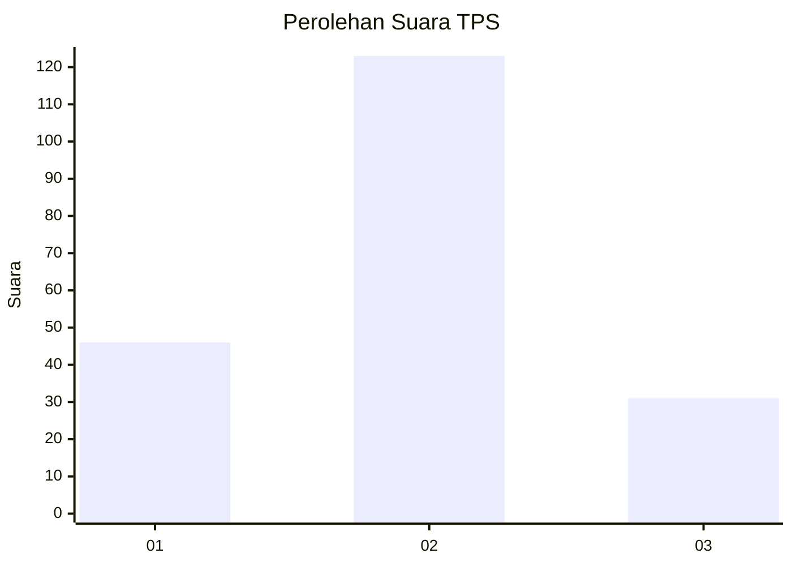
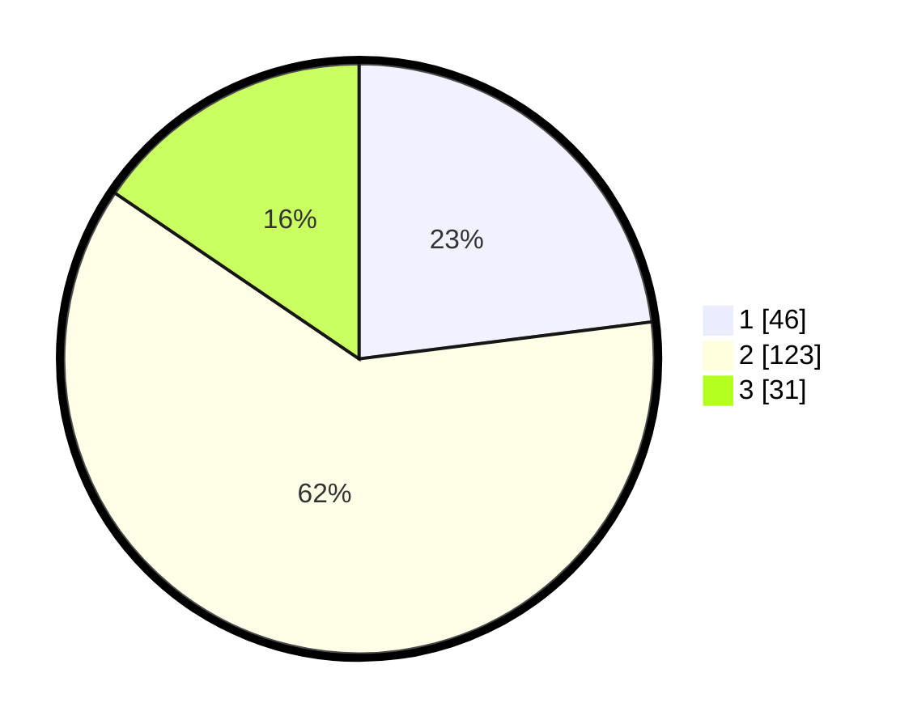

# Hasil

## Grafik

## Tabel

| No. | Nama Paslon    | Suara | Suara (raw) | Persentase |
|:--- |:-------------- | -----:| -----------:| ----------:|
| 1   | ANIES MUHAIMIN | 46    | [46][p-1]   | 23,00      |
| 2   | PRABOWO GIBRAN | 123   | [123][p-2]  | 61,50      |
| 3   | GANJAR MAHFUD  | 31    | [31][p-3]   | 15,50      |

[p-1]: https://github.com/gigit-pemilu/pemilu-2024/blob/main/pilpres/hitung-suara/sub/12-sumatera-utara/sub/75-kota-binjai/sub/01-binjai-utara/sub/1001-pahlawan/sub/004-tps/sub/paslon-1.txt
[p-2]: https://github.com/gigit-pemilu/pemilu-2024/blob/main/pilpres/hitung-suara/sub/12-sumatera-utara/sub/75-kota-binjai/sub/01-binjai-utara/sub/1001-pahlawan/sub/004-tps/sub/paslon-2.txt
[p-3]: https://github.com/gigit-pemilu/pemilu-2024/blob/main/pilpres/hitung-suara/sub/12-sumatera-utara/sub/75-kota-binjai/sub/01-binjai-utara/sub/1001-pahlawan/sub/004-tps/sub/paslon-3.txt

## Foto C Plano

https://sirekap-obj-formc.kpu.go.id/d0b3/pemilu/ppwp/12/75/01/10/01/1275011001004-20240215-022657--904893ed-fbca-4285-b8b0-5579e7b960e7.jpg

https://sirekap-obj-formc.kpu.go.id/d0b3/pemilu/ppwp/12/75/01/10/01/1275011001004-20240215-023014--6d6d287c-a3ea-4686-81fd-5f9bb8604f7b.jpg

https://sirekap-obj-formc.kpu.go.id/d0b3/pemilu/ppwp/12/75/01/10/01/1275011001004-20240215-024354--bb5b6dc3-ff39-4048-9d6a-b5e62466ca95.jpg

## Metadata

| Key        | Value               |
| ---------- | ------------------- |
| Time Stamp | 2024-02-25 12:00:00 |

