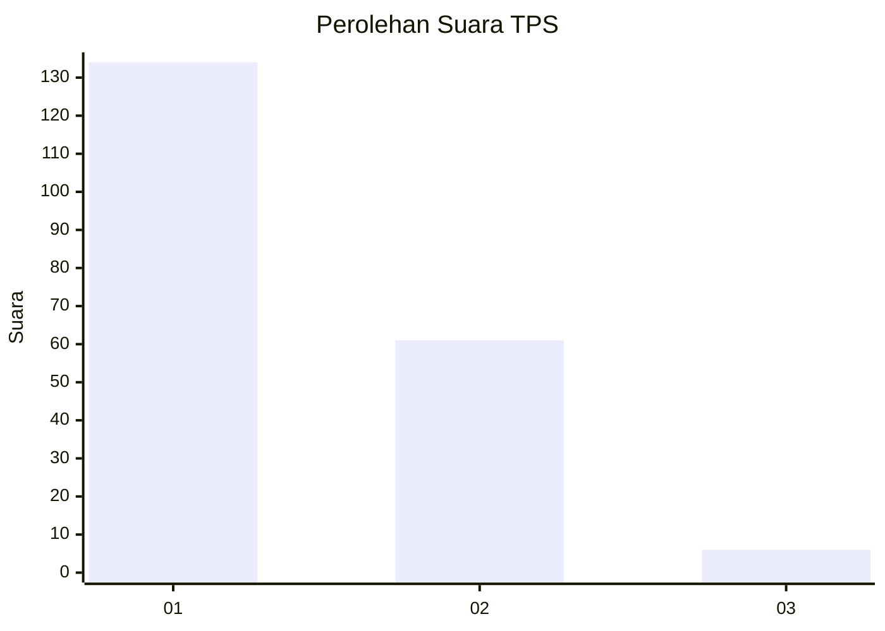
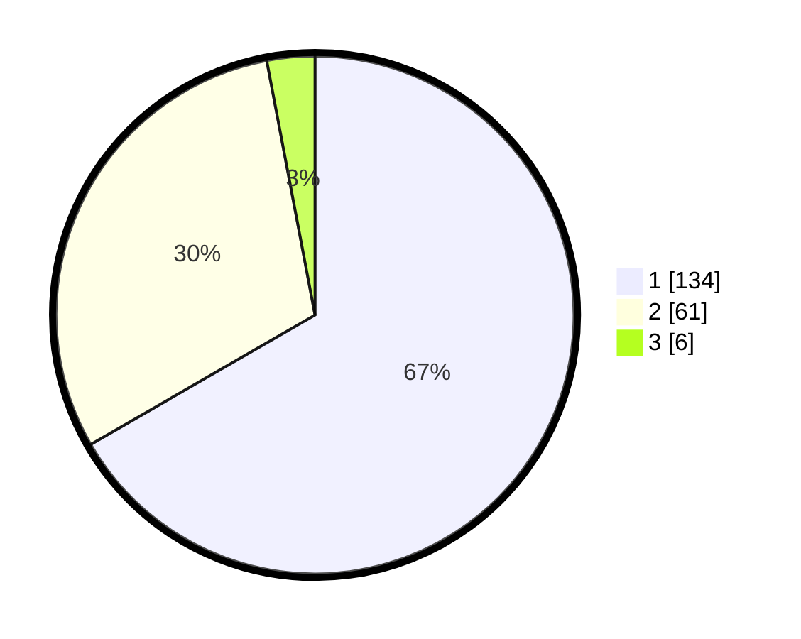

# Hasil

## Grafik

## Tabel

| No. | Nama Paslon    | Suara | Suara (raw) | Persentase |
|:--- |:-------------- | -----:| -----------:| ----------:|
| 1   | ANIES MUHAIMIN | 134   | [134][p-1]  | 66,67      |
| 2   | PRABOWO GIBRAN | 61    | [61][p-2]   | 30,35      |
| 3   | GANJAR MAHFUD  | 6     | [6][p-3]    | 2,99       |

[p-1]: https://github.com/gigit-pemilu/pemilu-2024/blob/main/pilpres/hitung-suara/sub/12-sumatera-utara/sub/75-kota-binjai/sub/01-binjai-utara/sub/1001-pahlawan/sub/012-tps/sub/paslon-1.txt
[p-2]: https://github.com/gigit-pemilu/pemilu-2024/blob/main/pilpres/hitung-suara/sub/12-sumatera-utara/sub/75-kota-binjai/sub/01-binjai-utara/sub/1001-pahlawan/sub/012-tps/sub/paslon-2.txt
[p-3]: https://github.com/gigit-pemilu/pemilu-2024/blob/main/pilpres/hitung-suara/sub/12-sumatera-utara/sub/75-kota-binjai/sub/01-binjai-utara/sub/1001-pahlawan/sub/012-tps/sub/paslon-3.txt

## Foto C Plano

https://sirekap-obj-formc.kpu.go.id/5063/pemilu/ppwp/12/75/01/10/01/1275011001012-20240215-030434--2dd9bf5f-e182-46d3-9dcb-2ba78843a038.jpg

https://sirekap-obj-formc.kpu.go.id/5063/pemilu/ppwp/12/75/01/10/01/1275011001012-20240215-030806--6e1b18c3-f210-43af-b383-3594419b3567.jpg

https://sirekap-obj-formc.kpu.go.id/5063/pemilu/ppwp/12/75/01/10/01/1275011001012-20240215-030929--131f8278-7b96-4b8c-a0c2-4996e207b62e.jpg

## Metadata

| Key        | Value               |
| ---------- | ------------------- |
| Time Stamp | 2024-02-15 12:00:28 |

