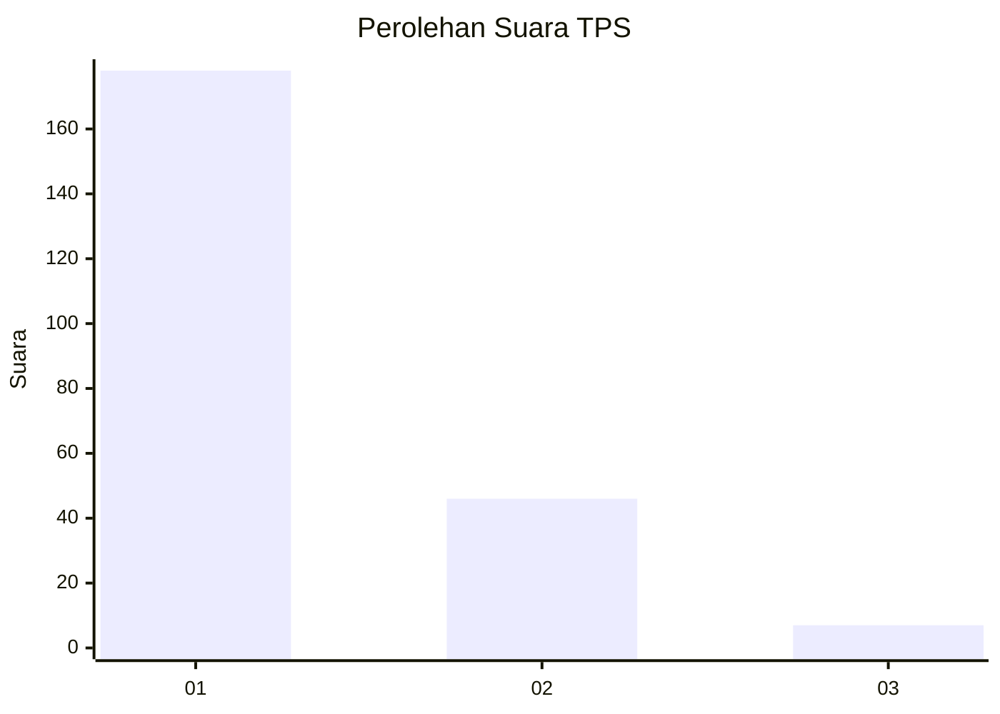
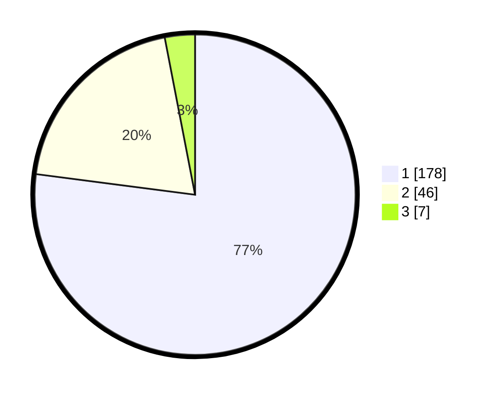

# Hasil

## Grafik

## Tabel

| No. | Nama Paslon    | Suara | Suara (raw) | Persentase |
|:--- |:-------------- | -----:| -----------:| ----------:|
| 1   | ANIES MUHAIMIN | 178   | [178][p-1]  | 77,06      |
| 2   | PRABOWO GIBRAN | 46    | [46][p-2]   | 19,91      |
| 3   | GANJAR MAHFUD  | 7     | [7][p-3]    | 3,03       |

[p-1]: https://github.com/gigit-pemilu/pemilu-2024-12-sumatera-utara/blob/main/pilpres/hitung-suara/sub/12-sumatera-utara/sub/75-kota-binjai/sub/01-binjai-utara/sub/1003-nangka/sub/008-tps/sub/paslon-1.txt
[p-2]: https://github.com/gigit-pemilu/pemilu-2024-12-sumatera-utara/blob/main/pilpres/hitung-suara/sub/12-sumatera-utara/sub/75-kota-binjai/sub/01-binjai-utara/sub/1003-nangka/sub/008-tps/sub/paslon-2.txt
[p-3]: https://github.com/gigit-pemilu/pemilu-2024-12-sumatera-utara/blob/main/pilpres/hitung-suara/sub/12-sumatera-utara/sub/75-kota-binjai/sub/01-binjai-utara/sub/1003-nangka/sub/008-tps/sub/paslon-3.txt

## Foto C Plano

https://sirekap-obj-formc.kpu.go.id/14f7/pemilu/ppwp/12/75/01/10/03/1275011003008-20240215-005437--3c87e3e8-6594-4722-8219-3b200cc691da.jpg

https://sirekap-obj-formc.kpu.go.id/14f7/pemilu/ppwp/12/75/01/10/03/1275011003008-20240215-004030--9c326c53-e839-49c2-b7c1-d31b1ada866f.jpg

https://sirekap-obj-formc.kpu.go.id/14f7/pemilu/ppwp/12/75/01/10/03/1275011003008-20240214-190748--6e1638fd-50e9-4dbd-ac09-8941ac9f5012.jpg

## Metadata

| Key        | Value               |
| ---------- | ------------------- |
| Time Stamp | 2024-02-24 22:31:28 |

