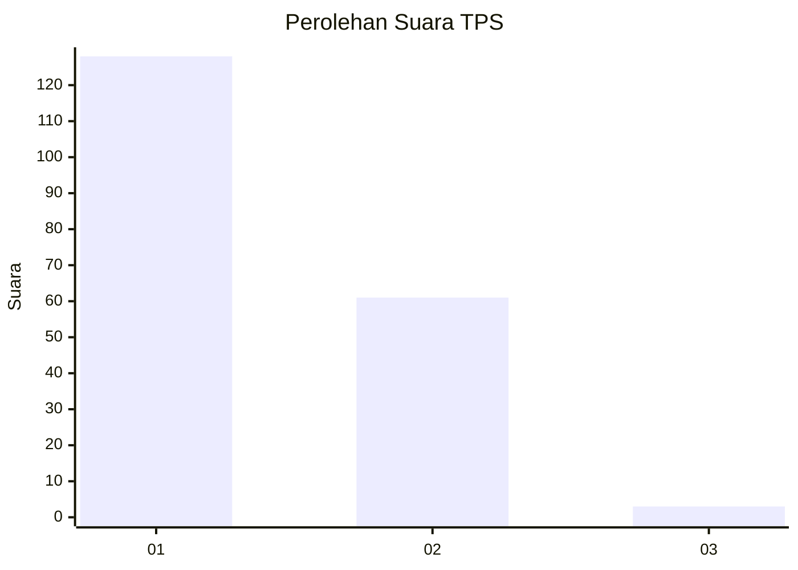
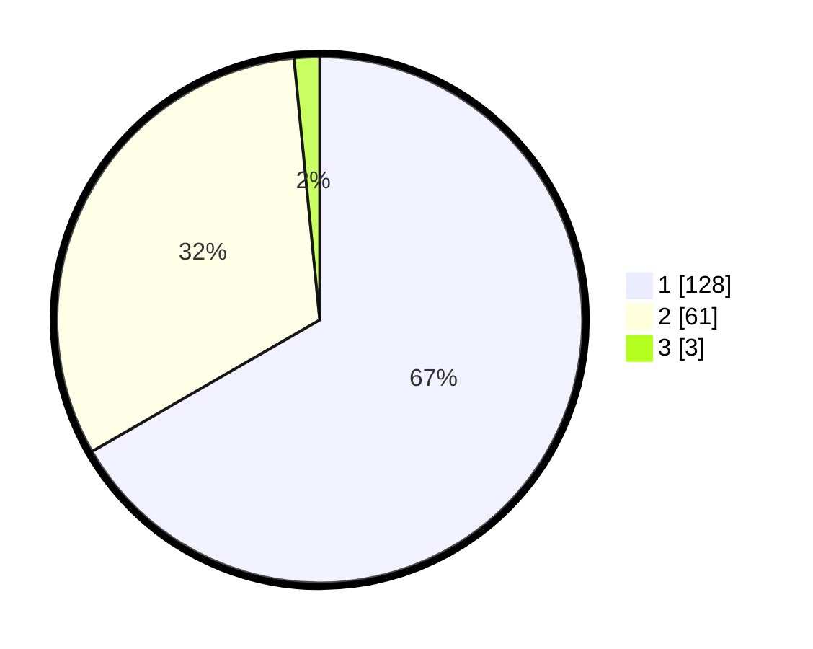

# Hasil

## Grafik

## Tabel

| No. | Nama Paslon    | Suara | Suara (raw) | Persentase |
|:--- |:-------------- | -----:| -----------:| ----------:|
| 1   | ANIES MUHAIMIN | 128   | [128][p-1]  | 66,67      |
| 2   | PRABOWO GIBRAN | 61    | [61][p-2]   | 31,77      |
| 3   | GANJAR MAHFUD  | 3     | [3][p-3]    | 1,56       |

[p-1]: https://github.com/gigit-pemilu/pemilu-2024/blob/main/pilpres/hitung-suara/sub/12-sumatera-utara/sub/75-kota-binjai/sub/01-binjai-utara/sub/1003-nangka/sub/011-tps/sub/paslon-1.txt
[p-2]: https://github.com/gigit-pemilu/pemilu-2024/blob/main/pilpres/hitung-suara/sub/12-sumatera-utara/sub/75-kota-binjai/sub/01-binjai-utara/sub/1003-nangka/sub/011-tps/sub/paslon-2.txt
[p-3]: https://github.com/gigit-pemilu/pemilu-2024/blob/main/pilpres/hitung-suara/sub/12-sumatera-utara/sub/75-kota-binjai/sub/01-binjai-utara/sub/1003-nangka/sub/011-tps/sub/paslon-3.txt

## Foto C Plano

https://sirekap-obj-formc.kpu.go.id/c0e2/pemilu/ppwp/12/75/01/10/03/1275011003011-20240214-160103--c05b90de-8648-4112-a3a3-3949745e94f6.jpg

https://sirekap-obj-formc.kpu.go.id/c0e2/pemilu/ppwp/12/75/01/10/03/1275011003011-20240214-155512--b079b1e4-8f52-49de-b47c-5ae4b83415a2.jpg

https://sirekap-obj-formc.kpu.go.id/c0e2/pemilu/ppwp/12/75/01/10/03/1275011003011-20240214-155633--cbbee450-d72a-43ab-8c18-4d8469c96e8c.jpg

## Metadata

| Key        | Value               |
| ---------- | ------------------- |
| Time Stamp | 2024-02-15 12:00:28 |

