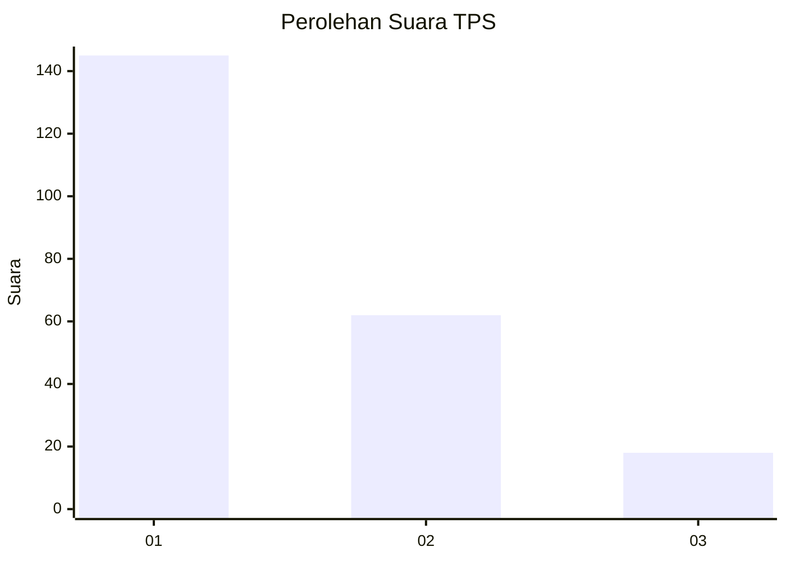
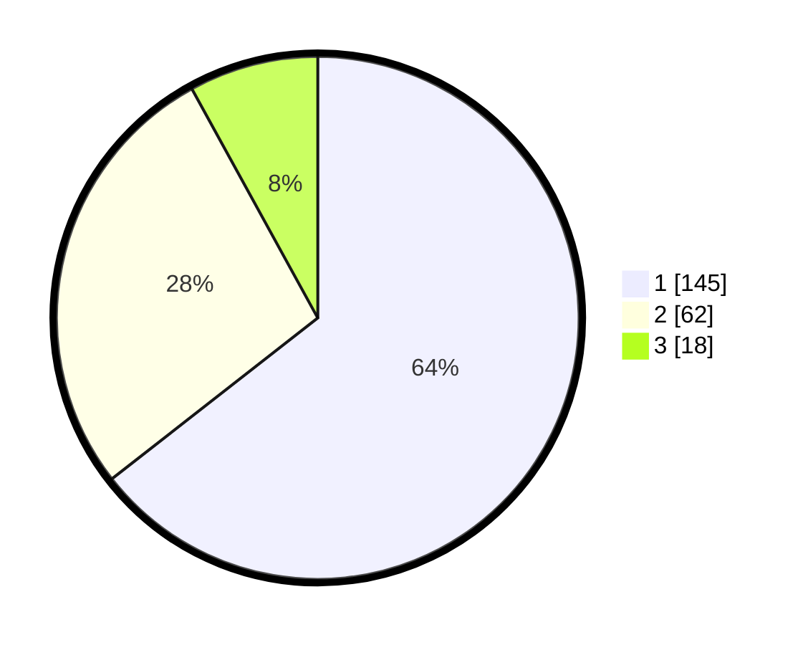

# Hasil

## Grafik

## Tabel

| No. | Nama Paslon    | Suara | Suara (raw) | Persentase |
|:--- |:-------------- | -----:| -----------:| ----------:|
| 1   | ANIES MUHAIMIN | 145   | [145][p-1]  | 64,44      |
| 2   | PRABOWO GIBRAN | 62    | [62][p-2]   | 27,56      |
| 3   | GANJAR MAHFUD  | 18    | [18][p-3]   | 8,00       |

[p-1]: https://github.com/gigit-pemilu/pemilu-2024/blob/main/pilpres/hitung-suara/sub/12-sumatera-utara/sub/75-kota-binjai/sub/01-binjai-utara/sub/1009-jati-karya/sub/021-tps/sub/paslon-1.txt
[p-2]: https://github.com/gigit-pemilu/pemilu-2024/blob/main/pilpres/hitung-suara/sub/12-sumatera-utara/sub/75-kota-binjai/sub/01-binjai-utara/sub/1009-jati-karya/sub/021-tps/sub/paslon-2.txt
[p-3]: https://github.com/gigit-pemilu/pemilu-2024/blob/main/pilpres/hitung-suara/sub/12-sumatera-utara/sub/75-kota-binjai/sub/01-binjai-utara/sub/1009-jati-karya/sub/021-tps/sub/paslon-3.txt

## Foto C Plano

https://sirekap-obj-formc.kpu.go.id/1a2f/pemilu/ppwp/12/75/01/10/09/1275011009021-20240227-165713--c53b6c28-d649-4def-bbaf-e0d59543ef6d.jpg

https://sirekap-obj-formc.kpu.go.id/1a2f/pemilu/ppwp/12/75/01/10/09/1275011009021-20240215-035531--1d7454f6-4d50-46a4-8a1e-c391bccb662e.jpg

https://sirekap-obj-formc.kpu.go.id/1a2f/pemilu/ppwp/12/75/01/10/09/1275011009021-20240215-035822--49dc62d4-b6c2-4573-b4e8-d4cac9b28ffa.jpg

## Metadata

| Key        | Value               |
| ---------- | ------------------- |
| Time Stamp | 2024-02-27 17:00:00 |

