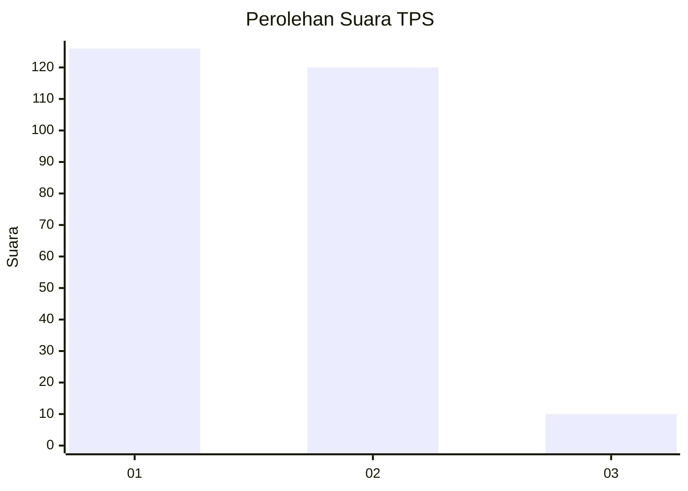
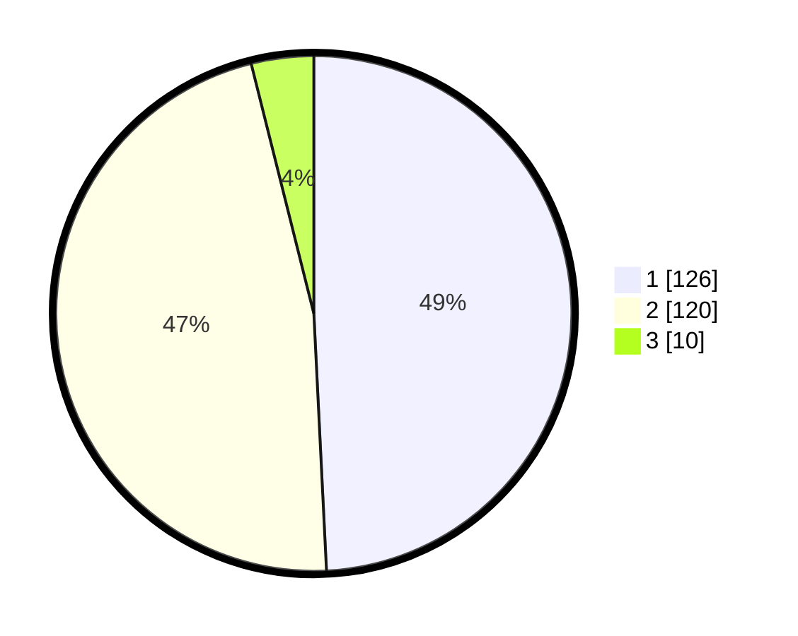

# Hasil

## Grafik

## Tabel

| No. | Nama Paslon    | Suara | Suara (raw) | Persentase |
|:--- |:-------------- | -----:| -----------:| ----------:|
| 1   | ANIES MUHAIMIN | 126   | [126][p-1]  | 49,22      |
| 2   | PRABOWO GIBRAN | 120   | [120][p-2]  | 46,88      |
| 3   | GANJAR MAHFUD  | 10    | [10][p-3]   | 3,91       |

[p-1]: https://github.com/gigit-pemilu/pemilu-2024/blob/main/pilpres/hitung-suara/sub/12-sumatera-utara/sub/75-kota-binjai/sub/02-binjai-kota/sub/1001-berngam/sub/016-tps/sub/paslon-1.txt
[p-2]: https://github.com/gigit-pemilu/pemilu-2024/blob/main/pilpres/hitung-suara/sub/12-sumatera-utara/sub/75-kota-binjai/sub/02-binjai-kota/sub/1001-berngam/sub/016-tps/sub/paslon-2.txt
[p-3]: https://github.com/gigit-pemilu/pemilu-2024/blob/main/pilpres/hitung-suara/sub/12-sumatera-utara/sub/75-kota-binjai/sub/02-binjai-kota/sub/1001-berngam/sub/016-tps/sub/paslon-3.txt

## Foto C Plano

https://sirekap-obj-formc.kpu.go.id/b4b8/pemilu/ppwp/12/75/02/10/01/1275021001016-20240215-051945--27b0af1d-8595-44bd-a386-0e12ca893f17.jpg

https://sirekap-obj-formc.kpu.go.id/b4b8/pemilu/ppwp/12/75/02/10/01/1275021001016-20240215-052105--d7907176-d69c-419e-a523-b59cb4126007.jpg

https://sirekap-obj-formc.kpu.go.id/b4b8/pemilu/ppwp/12/75/02/10/01/1275021001016-20240215-052253--3e89490f-5529-474e-b50b-02c4cbe585ef.jpg

## Metadata

| Key        | Value               |
| ---------- | ------------------- |
| Time Stamp | 2024-02-16 21:01:00 |

