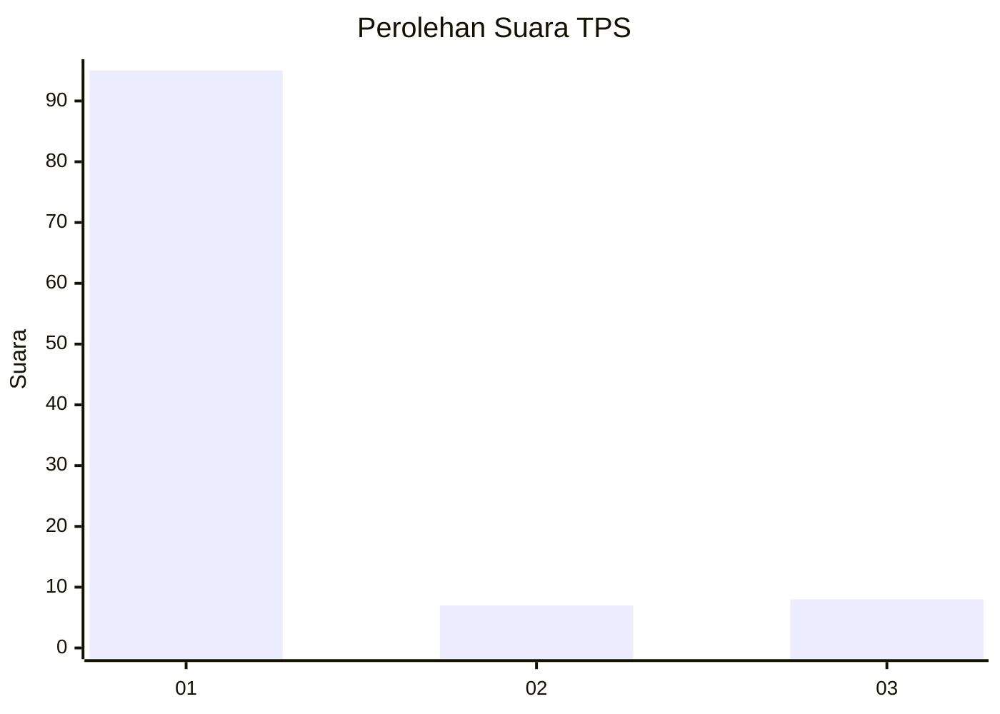
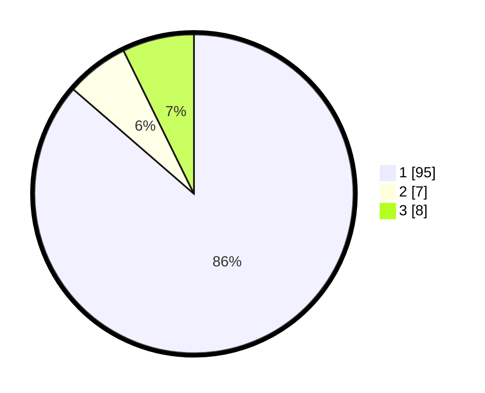

# Hasil

## Grafik

## Tabel

| No. | Nama Paslon    | Suara | Suara (raw) | Persentase |
|:--- |:-------------- | -----:| -----------:| ----------:|
| 1   | ANIES MUHAIMIN | 95    | [95][p-1]   | 86,36      |
| 2   | PRABOWO GIBRAN | 7     | [7][p-2]    | 6,36       |
| 3   | GANJAR MAHFUD  | 8     | [8][p-3]    | 7,27       |

[p-1]: https://github.com/gigit-pemilu/pemilu-2024/blob/main/pilpres/hitung-suara/sub/12-sumatera-utara/sub/75-kota-binjai/sub/02-binjai-kota/sub/1003-setia/sub/001-tps/sub/paslon-1.txt
[p-2]: https://github.com/gigit-pemilu/pemilu-2024/blob/main/pilpres/hitung-suara/sub/12-sumatera-utara/sub/75-kota-binjai/sub/02-binjai-kota/sub/1003-setia/sub/001-tps/sub/paslon-2.txt
[p-3]: https://github.com/gigit-pemilu/pemilu-2024/blob/main/pilpres/hitung-suara/sub/12-sumatera-utara/sub/75-kota-binjai/sub/02-binjai-kota/sub/1003-setia/sub/001-tps/sub/paslon-3.txt

## Foto C Plano

https://sirekap-obj-formc.kpu.go.id/3950/pemilu/ppwp/12/75/02/10/03/1275021003001-20240219-205837--81b4280e-ff05-4297-a7fe-0f0dc3780033.jpg

https://sirekap-obj-formc.kpu.go.id/3950/pemilu/ppwp/12/75/02/10/03/1275021003001-20240219-210051--71769066-e6de-40d0-91e2-03977205e2f6.jpg

https://sirekap-obj-formc.kpu.go.id/3950/pemilu/ppwp/12/75/02/10/03/1275021003001-20240219-210124--029eba10-636e-4e25-8792-81a09e0a29c7.jpg

## Metadata

| Key        | Value               |
| ---------- | ------------------- |
| Time Stamp | 2024-02-19 22:00:00 |

