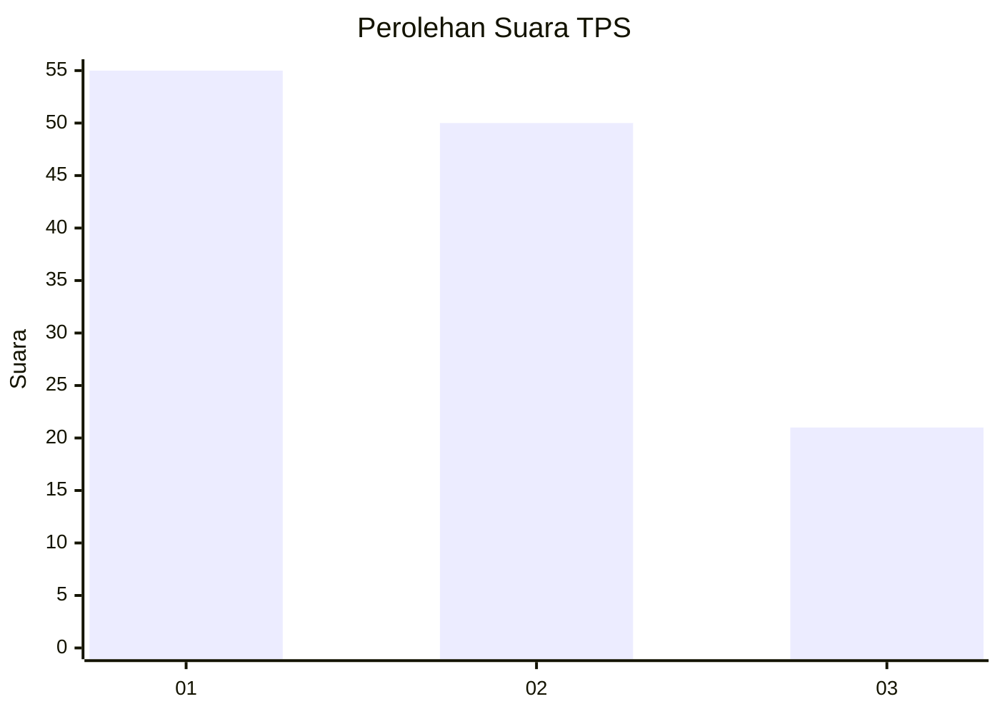
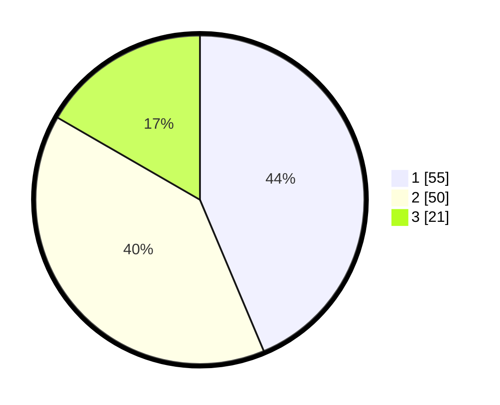

# Hasil

## Grafik

## Tabel

| No. | Nama Paslon    | Suara | Suara (raw) | Persentase |
|:--- |:-------------- | -----:| -----------:| ----------:|
| 1   | ANIES MUHAIMIN | 55    | [55][p-1]   | 43,65      |
| 2   | PRABOWO GIBRAN | 50    | [50][p-2]   | 39,68      |
| 3   | GANJAR MAHFUD  | 21    | [21][p-3]   | 16,67      |

[p-1]: https://github.com/gigit-pemilu/pemilu-2024-12-sumatera-utara/blob/main/pilpres/hitung-suara/sub/12-sumatera-utara/sub/75-kota-binjai/sub/02-binjai-kota/sub/1004-kartini/sub/008-tps/sub/paslon-1.txt
[p-2]: https://github.com/gigit-pemilu/pemilu-2024-12-sumatera-utara/blob/main/pilpres/hitung-suara/sub/12-sumatera-utara/sub/75-kota-binjai/sub/02-binjai-kota/sub/1004-kartini/sub/008-tps/sub/paslon-2.txt
[p-3]: https://github.com/gigit-pemilu/pemilu-2024-12-sumatera-utara/blob/main/pilpres/hitung-suara/sub/12-sumatera-utara/sub/75-kota-binjai/sub/02-binjai-kota/sub/1004-kartini/sub/008-tps/sub/paslon-3.txt

## Foto C Plano

https://sirekap-obj-formc.kpu.go.id/f8e1/pemilu/ppwp/12/75/02/10/04/1275021004008-20240214-224810--01e9ad7c-3116-422b-b743-459571a4ed01.jpg

https://sirekap-obj-formc.kpu.go.id/f8e1/pemilu/ppwp/12/75/02/10/04/1275021004008-20240214-224417--a23e08b7-ef83-4887-9b70-e1f77ef0fc39.jpg

https://sirekap-obj-formc.kpu.go.id/f8e1/pemilu/ppwp/12/75/02/10/04/1275021004008-20240214-224045--00fb5cc4-90af-4bad-9075-676dd9d59f60.jpg

## Metadata

| Key        | Value               |
| ---------- | ------------------- |
| Time Stamp | 2024-02-15 19:00:26 |

