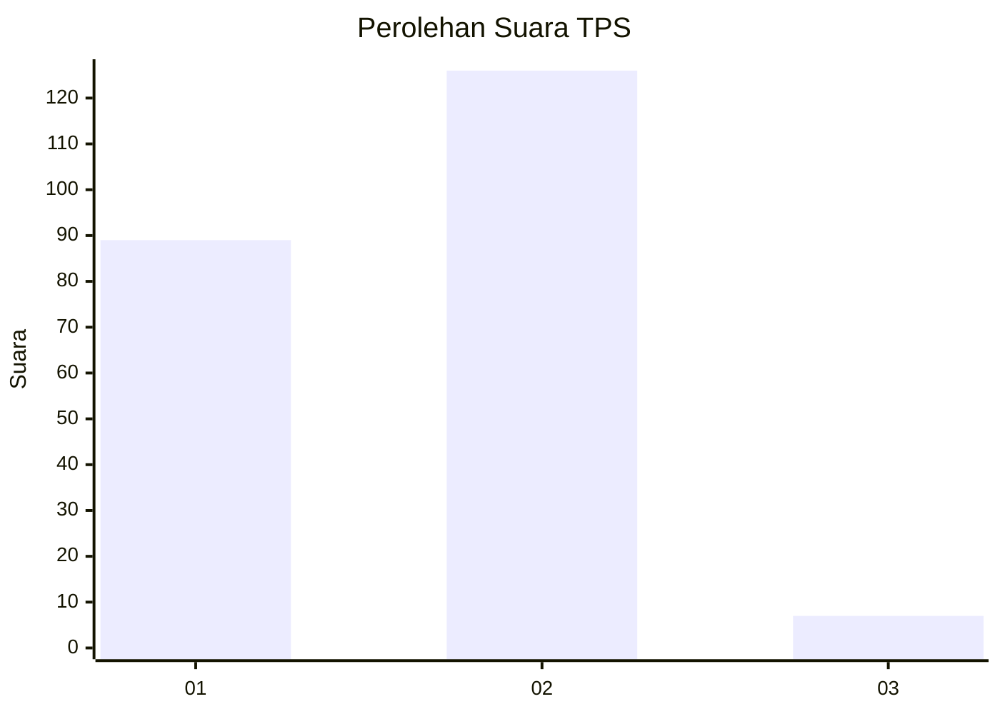
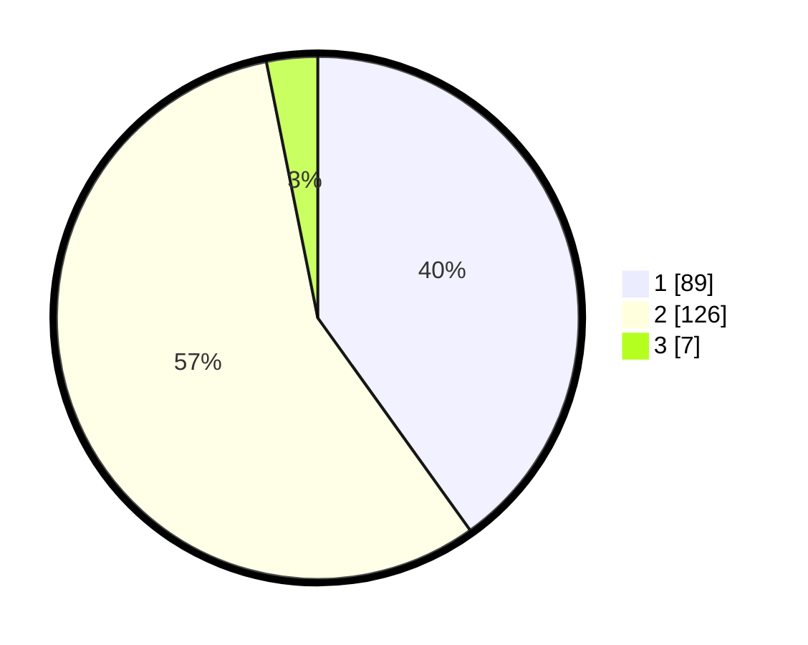

# Hasil

## Grafik

## Tabel

| No. | Nama Paslon    | Suara | Suara (raw) | Persentase |
|:--- |:-------------- | -----:| -----------:| ----------:|
| 1   | ANIES MUHAIMIN | 89    | [89][p-1]   | 40,09      |
| 2   | PRABOWO GIBRAN | 126   | [126][p-2]  | 56,76      |
| 3   | GANJAR MAHFUD  | 7     | [7][p-3]    | 3,15       |

[p-1]: https://github.com/gigit-pemilu/pemilu-2024/blob/main/pilpres/hitung-suara/sub/12-sumatera-utara/sub/75-kota-binjai/sub/03-binjai-barat/sub/1001-bandar-senembah/sub/003-tps/sub/paslon-1.txt
[p-2]: https://github.com/gigit-pemilu/pemilu-2024/blob/main/pilpres/hitung-suara/sub/12-sumatera-utara/sub/75-kota-binjai/sub/03-binjai-barat/sub/1001-bandar-senembah/sub/003-tps/sub/paslon-2.txt
[p-3]: https://github.com/gigit-pemilu/pemilu-2024/blob/main/pilpres/hitung-suara/sub/12-sumatera-utara/sub/75-kota-binjai/sub/03-binjai-barat/sub/1001-bandar-senembah/sub/003-tps/sub/paslon-3.txt

## Foto C Plano

https://sirekap-obj-formc.kpu.go.id/f88f/pemilu/ppwp/12/75/03/10/01/1275031001003-20240222-105046--29a8b0f2-a388-4ab8-9bd0-fd7f2b7cdb15.jpg

https://sirekap-obj-formc.kpu.go.id/f88f/pemilu/ppwp/12/75/03/10/01/1275031001003-20240222-105113--9d81562d-4cd7-4301-b7ce-9bee6bc97230.jpg

https://sirekap-obj-formc.kpu.go.id/f88f/pemilu/ppwp/12/75/03/10/01/1275031001003-20240222-105140--3729919c-7e8b-432f-9d34-3d9af2beb56b.jpg

## Metadata

| Key        | Value               |
| ---------- | ------------------- |
| Time Stamp | 2024-02-25 12:00:00 |

