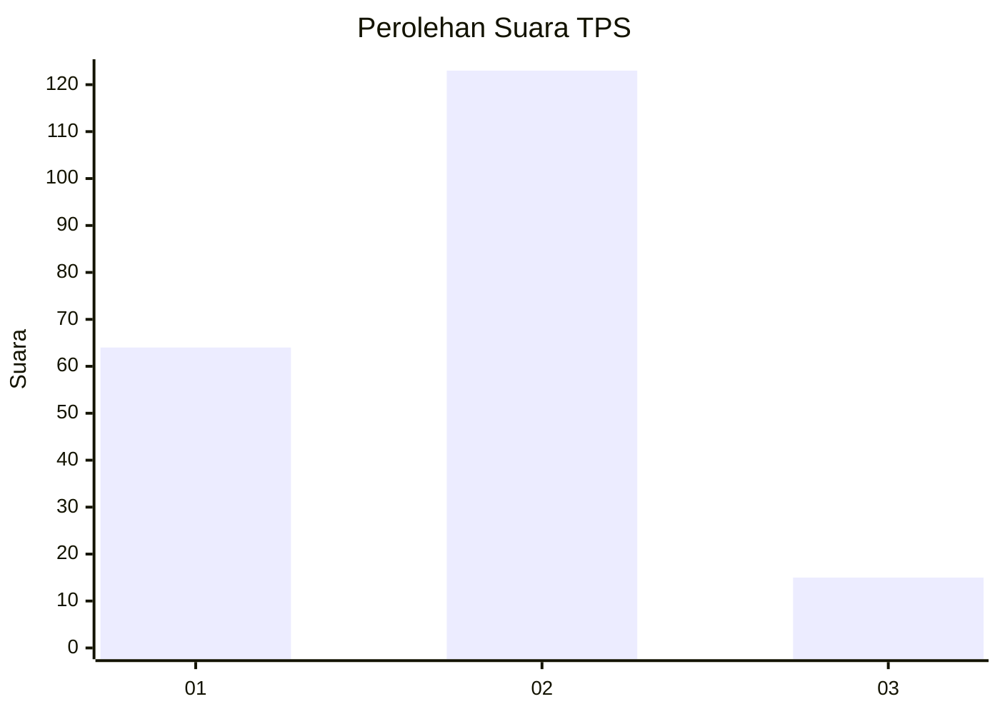
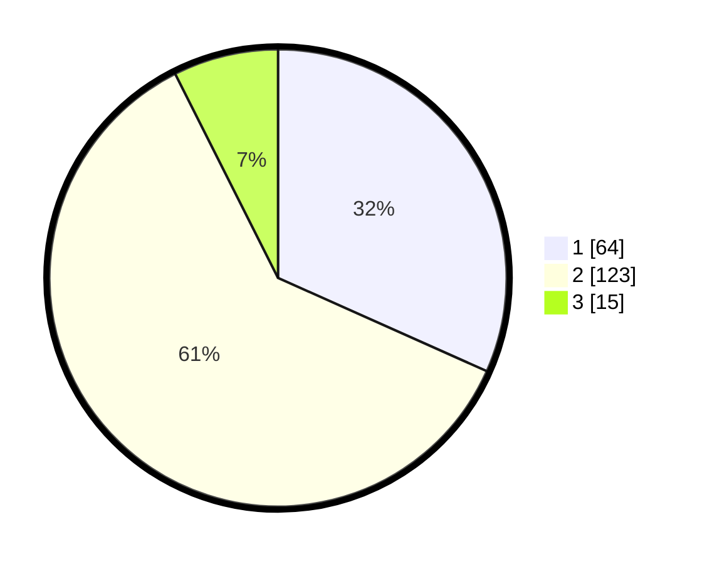

# Hasil

## Grafik

## Tabel

| No. | Nama Paslon    | Suara | Suara (raw) | Persentase |
|:--- |:-------------- | -----:| -----------:| ----------:|
| 1   | ANIES MUHAIMIN | 64    | [64][p-1]   | 31,68      |
| 2   | PRABOWO GIBRAN | 123   | [123][p-2]  | 60,89      |
| 3   | GANJAR MAHFUD  | 15    | [15][p-3]   | 7,43       |

[p-1]: https://github.com/gigit-pemilu/pemilu-2024-12-sumatera-utara/blob/main/pilpres/hitung-suara/sub/12-sumatera-utara/sub/75-kota-binjai/sub/03-binjai-barat/sub/1001-bandar-senembah/sub/007-tps/sub/paslon-1.txt
[p-2]: https://github.com/gigit-pemilu/pemilu-2024-12-sumatera-utara/blob/main/pilpres/hitung-suara/sub/12-sumatera-utara/sub/75-kota-binjai/sub/03-binjai-barat/sub/1001-bandar-senembah/sub/007-tps/sub/paslon-2.txt
[p-3]: https://github.com/gigit-pemilu/pemilu-2024-12-sumatera-utara/blob/main/pilpres/hitung-suara/sub/12-sumatera-utara/sub/75-kota-binjai/sub/03-binjai-barat/sub/1001-bandar-senembah/sub/007-tps/sub/paslon-3.txt

## Foto C Plano

https://sirekap-obj-formc.kpu.go.id/d9e0/pemilu/ppwp/12/75/03/10/01/1275031001007-20240214-230439--fc3a6efe-e056-4c39-acef-e8427c471552.jpg

https://sirekap-obj-formc.kpu.go.id/d9e0/pemilu/ppwp/12/75/03/10/01/1275031001007-20240214-230450--777fb415-fd74-4bea-9f16-46e281ae0b1f.jpg

https://sirekap-obj-formc.kpu.go.id/d9e0/pemilu/ppwp/12/75/03/10/01/1275031001007-20240214-230525--beaaa58d-b636-48b2-98f2-936204e6e3a6.jpg

## Metadata

| Key        | Value               |
| ---------- | ------------------- |
| Time Stamp | 2024-02-15 19:00:26 |

