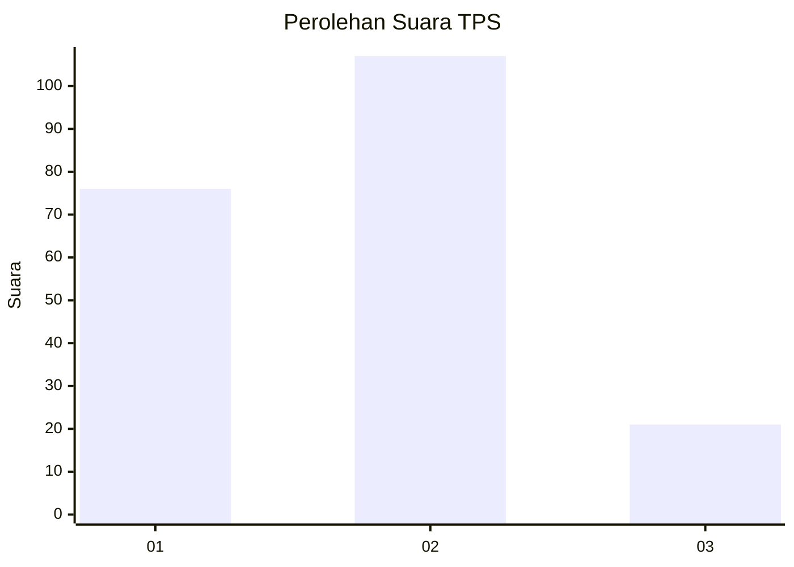
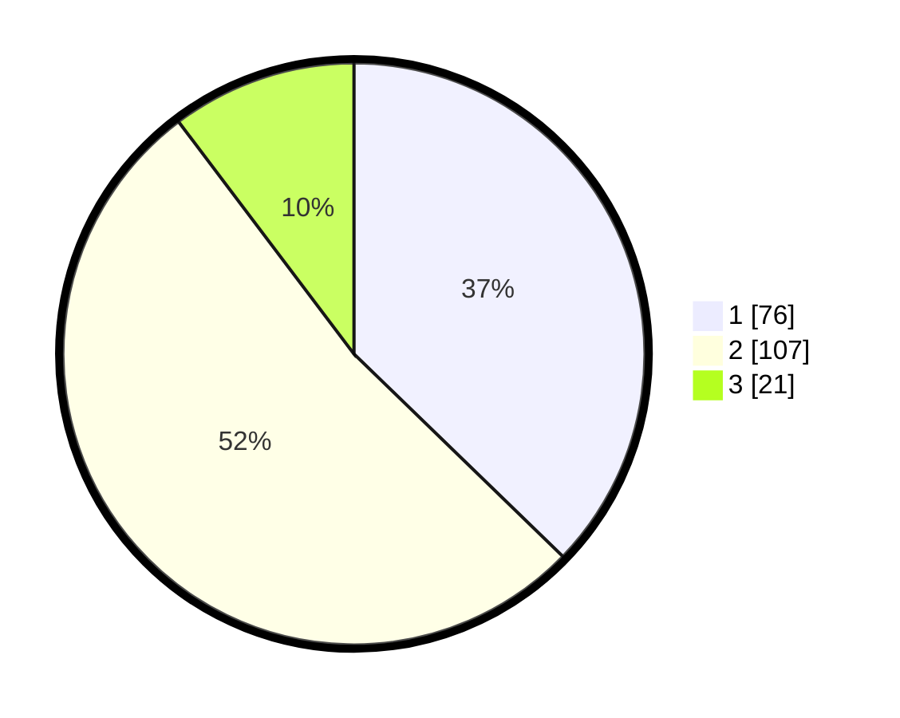

# Hasil

## Grafik

## Tabel

| No. | Nama Paslon    | Suara | Suara (raw) | Persentase |
|:--- |:-------------- | -----:| -----------:| ----------:|
| 1   | ANIES MUHAIMIN | 76    | [76][p-1]   | 37,25      |
| 2   | PRABOWO GIBRAN | 107   | [107][p-2]  | 52,45      |
| 3   | GANJAR MAHFUD  | 21    | [21][p-3]   | 10,29      |

[p-1]: https://github.com/gigit-pemilu/pemilu-2024-12-sumatera-utara/blob/main/pilpres/hitung-suara/sub/12-sumatera-utara/sub/75-kota-binjai/sub/04-binjai-timur/sub/1001-tanah-tinggi/sub/001-tps/sub/paslon-1.txt
[p-2]: https://github.com/gigit-pemilu/pemilu-2024-12-sumatera-utara/blob/main/pilpres/hitung-suara/sub/12-sumatera-utara/sub/75-kota-binjai/sub/04-binjai-timur/sub/1001-tanah-tinggi/sub/001-tps/sub/paslon-2.txt
[p-3]: https://github.com/gigit-pemilu/pemilu-2024-12-sumatera-utara/blob/main/pilpres/hitung-suara/sub/12-sumatera-utara/sub/75-kota-binjai/sub/04-binjai-timur/sub/1001-tanah-tinggi/sub/001-tps/sub/paslon-3.txt

## Foto C Plano

https://sirekap-obj-formc.kpu.go.id/5a07/pemilu/ppwp/12/75/04/10/01/1275041001001-20240221-203143--9d9f3895-8396-4f6a-91a3-794cb18ea2cf.jpg

https://sirekap-obj-formc.kpu.go.id/5a07/pemilu/ppwp/12/75/04/10/01/1275041001001-20240221-203304--02b9e774-460d-4a40-95b5-820cd0ebbafc.jpg

https://sirekap-obj-formc.kpu.go.id/5a07/pemilu/ppwp/12/75/04/10/01/1275041001001-20240221-203246--18f8308d-e376-421e-b521-7c33a5f284bb.jpg

## Metadata

| Key        | Value               |
| ---------- | ------------------- |
| Time Stamp | 2024-02-26 14:00:00 |

