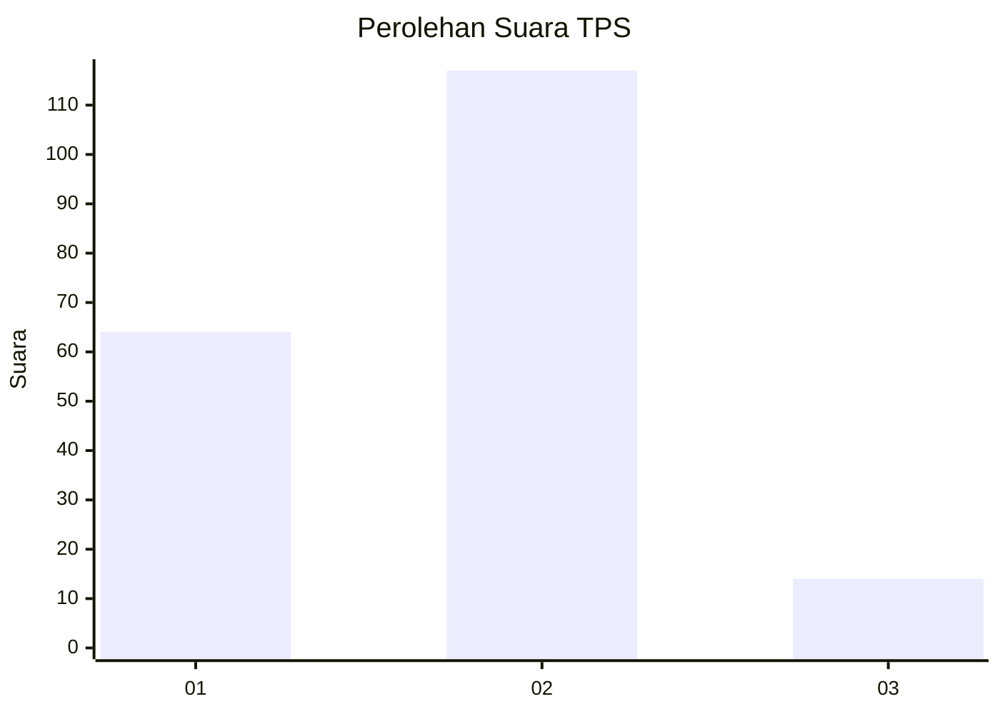
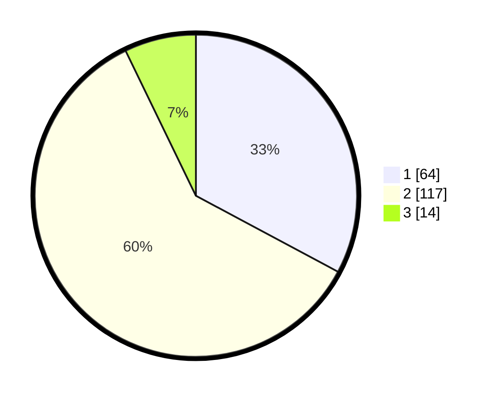

# Hasil

## Grafik

## Tabel

| No. | Nama Paslon    | Suara | Suara (raw) | Persentase |
|:--- |:-------------- | -----:| -----------:| ----------:|
| 1   | ANIES MUHAIMIN | 64    | [64][p-1]   | 32,82      |
| 2   | PRABOWO GIBRAN | 117   | [117][p-2]  | 60,00      |
| 3   | GANJAR MAHFUD  | 14    | [14][p-3]   | 7,18       |

[p-1]: https://github.com/gigit-pemilu/pemilu-2024/blob/main/pilpres/hitung-suara/sub/12-sumatera-utara/sub/75-kota-binjai/sub/04-binjai-timur/sub/1001-tanah-tinggi/sub/002-tps/sub/paslon-1.txt
[p-2]: https://github.com/gigit-pemilu/pemilu-2024/blob/main/pilpres/hitung-suara/sub/12-sumatera-utara/sub/75-kota-binjai/sub/04-binjai-timur/sub/1001-tanah-tinggi/sub/002-tps/sub/paslon-2.txt
[p-3]: https://github.com/gigit-pemilu/pemilu-2024/blob/main/pilpres/hitung-suara/sub/12-sumatera-utara/sub/75-kota-binjai/sub/04-binjai-timur/sub/1001-tanah-tinggi/sub/002-tps/sub/paslon-3.txt

## Foto C Plano

https://sirekap-obj-formc.kpu.go.id/85a6/pemilu/ppwp/12/75/04/10/01/1275041001002-20240214-223834--7347a708-61d2-4818-a571-aa6d561eaa7d.jpg

https://sirekap-obj-formc.kpu.go.id/85a6/pemilu/ppwp/12/75/04/10/01/1275041001002-20240214-213935--e899342d-e165-48f5-a668-061fdee9f40d.jpg

https://sirekap-obj-formc.kpu.go.id/85a6/pemilu/ppwp/12/75/04/10/01/1275041001002-20240214-214259--5eed57f2-fdde-4659-8fd3-a49b9adcce52.jpg

## Metadata

| Key        | Value               |
| ---------- | ------------------- |
| Time Stamp | 2024-02-25 19:00:00 |

