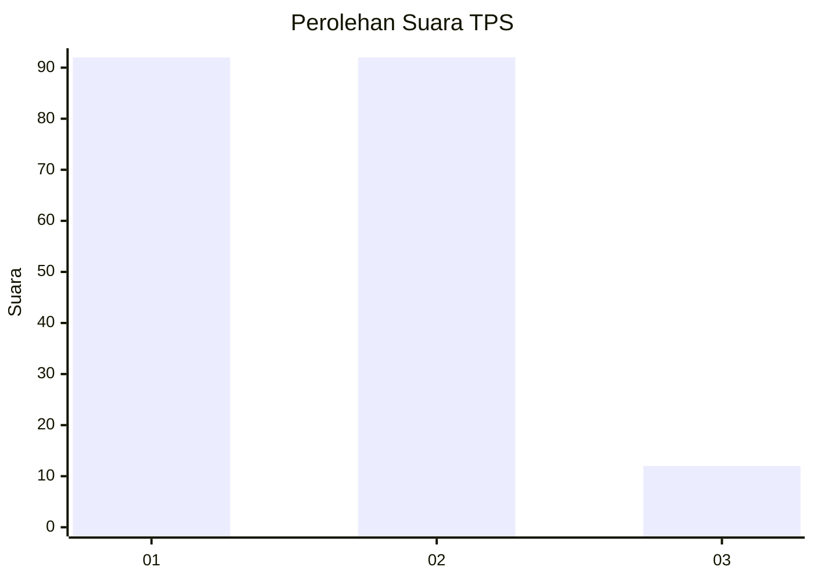
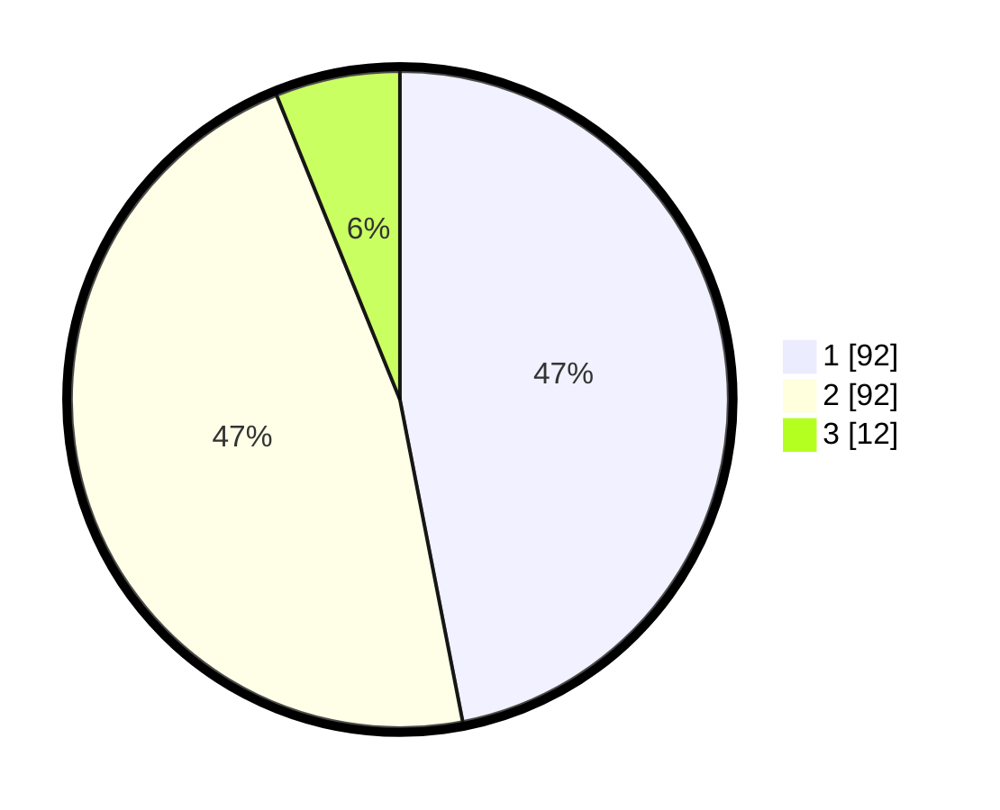

# Hasil

## Grafik

## Tabel

| No. | Nama Paslon    | Suara | Suara (raw) | Persentase |
|:--- |:-------------- | -----:| -----------:| ----------:|
| 1   | ANIES MUHAIMIN | 92    | [92][p-1]   | 46,94      |
| 2   | PRABOWO GIBRAN | 92    | [92][p-2]   | 46,94      |
| 3   | GANJAR MAHFUD  | 12    | [12][p-3]   | 6,12       |

[p-1]: https://github.com/gigit-pemilu/pemilu-2024/blob/main/pilpres/hitung-suara/sub/12-sumatera-utara/sub/75-kota-binjai/sub/04-binjai-timur/sub/1001-tanah-tinggi/sub/005-tps/sub/paslon-1.txt
[p-2]: https://github.com/gigit-pemilu/pemilu-2024/blob/main/pilpres/hitung-suara/sub/12-sumatera-utara/sub/75-kota-binjai/sub/04-binjai-timur/sub/1001-tanah-tinggi/sub/005-tps/sub/paslon-2.txt
[p-3]: https://github.com/gigit-pemilu/pemilu-2024/blob/main/pilpres/hitung-suara/sub/12-sumatera-utara/sub/75-kota-binjai/sub/04-binjai-timur/sub/1001-tanah-tinggi/sub/005-tps/sub/paslon-3.txt

## Foto C Plano

https://sirekap-obj-formc.kpu.go.id/5c2f/pemilu/ppwp/12/75/04/10/01/1275041001005-20240221-215222--68f4fc08-92b0-4bd5-8f4d-032c7dcb2217.jpg

https://sirekap-obj-formc.kpu.go.id/5c2f/pemilu/ppwp/12/75/04/10/01/1275041001005-20240215-013528--9e2f3445-a70a-40e4-95af-cb89af571ed3.jpg

https://sirekap-obj-formc.kpu.go.id/5c2f/pemilu/ppwp/12/75/04/10/01/1275041001005-20240215-013559--3d8671da-c3f6-41a9-85d1-c6afac6b1d9b.jpg

## Metadata

| Key        | Value               |
| ---------- | ------------------- |
| Time Stamp | 2024-02-21 22:00:00 |

