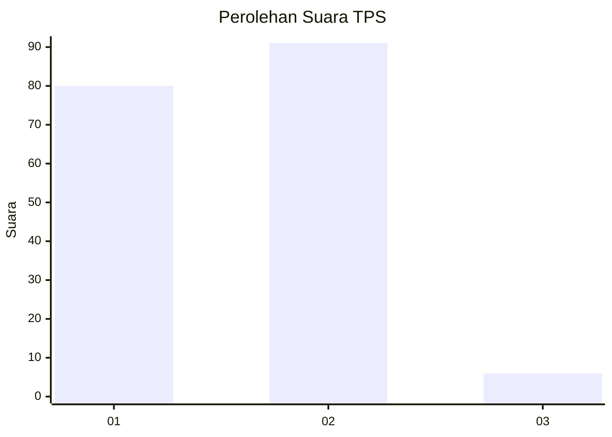
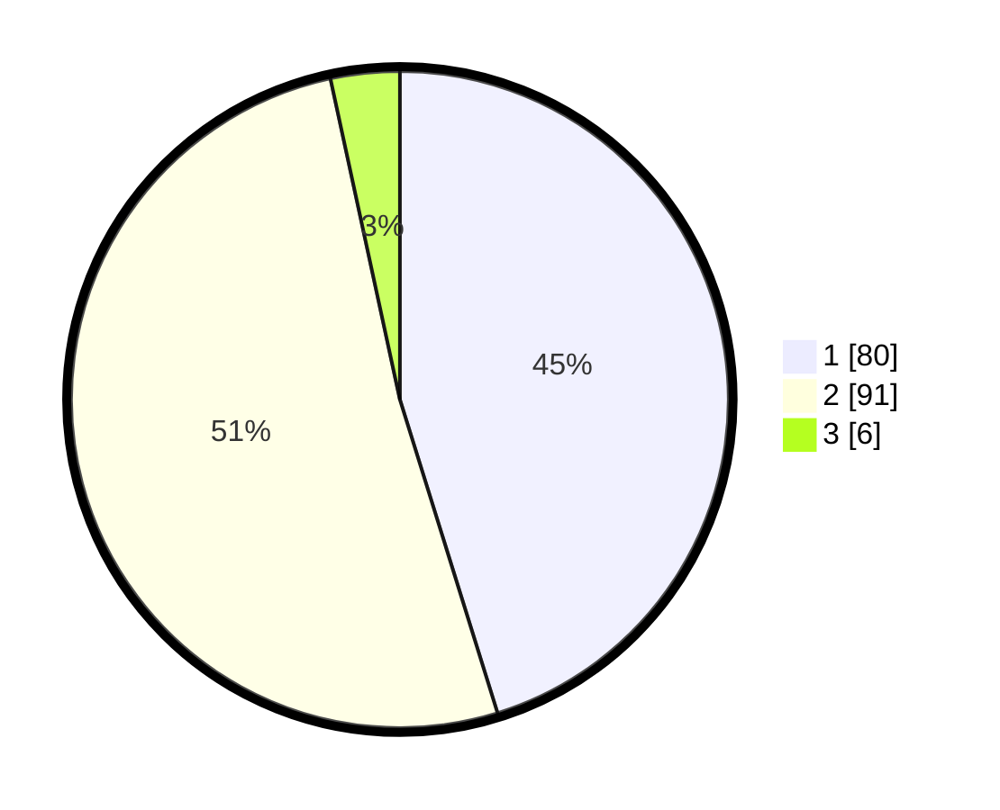

# Hasil

## Grafik

## Tabel

| No. | Nama Paslon    | Suara | Suara (raw) | Persentase |
|:--- |:-------------- | -----:| -----------:| ----------:|
| 1   | ANIES MUHAIMIN | 80    | [80][p-1]   | 45,20      |
| 2   | PRABOWO GIBRAN | 91    | [91][p-2]   | 51,41      |
| 3   | GANJAR MAHFUD  | 6     | [6][p-3]    | 3,39       |

[p-1]: https://github.com/gigit-pemilu/pemilu-2024/blob/main/pilpres/hitung-suara/sub/12-sumatera-utara/sub/75-kota-binjai/sub/04-binjai-timur/sub/1003-timbang-langkat/sub/006-tps/sub/paslon-1.txt
[p-2]: https://github.com/gigit-pemilu/pemilu-2024/blob/main/pilpres/hitung-suara/sub/12-sumatera-utara/sub/75-kota-binjai/sub/04-binjai-timur/sub/1003-timbang-langkat/sub/006-tps/sub/paslon-2.txt
[p-3]: https://github.com/gigit-pemilu/pemilu-2024/blob/main/pilpres/hitung-suara/sub/12-sumatera-utara/sub/75-kota-binjai/sub/04-binjai-timur/sub/1003-timbang-langkat/sub/006-tps/sub/paslon-3.txt

## Foto C Plano

https://sirekap-obj-formc.kpu.go.id/a34d/pemilu/ppwp/12/75/04/10/03/1275041003006-20240218-114319--4c7c987a-ad9c-4168-8be6-e6a803f66fa4.jpg

https://sirekap-obj-formc.kpu.go.id/a34d/pemilu/ppwp/12/75/04/10/03/1275041003006-20240218-114352--a5314ba0-0c29-4f5a-bbf4-6802021be5fe.jpg

https://sirekap-obj-formc.kpu.go.id/a34d/pemilu/ppwp/12/75/04/10/03/1275041003006-20240218-114420--726f5c50-ec3c-4569-942b-b600617eb7b6.jpg

## Metadata

| Key        | Value               |
| ---------- | ------------------- |
| Time Stamp | 2024-02-21 16:00:00 |

## DATA PEMILIH TETAP

Jumlah pemilih dalam DPT: **254**.
 * L: **582**.
 * P: **335**.

## DATA PENGGUNA HAK PILIH

Jumlah pengguna hak pilih dalam DPT: **880**.
 * L: **83**.
 * P: **37**.

Jumlah pengguna hak pilih dalam DPTb: **0**.
 * L: **400**.
 * P: **0**.

Jumlah pengguna hak pilih dalam DPK: **2**.
 * L: **1**.
 * P: **6**.

Jumlah pengguna hak pilih: **332**.
 * L: **84**.
 * P: **98**.

## JUMLAH SUARA SAH DAN TIDAK SAH

JUMLAH SELURUH SUARA SAH: **177**.

JUMLAH SUARA TIDAK SAH: **5**.

JUMLAH SELURUH SUARA SAH DAN SUARA TIDAK SAH: **182**.

