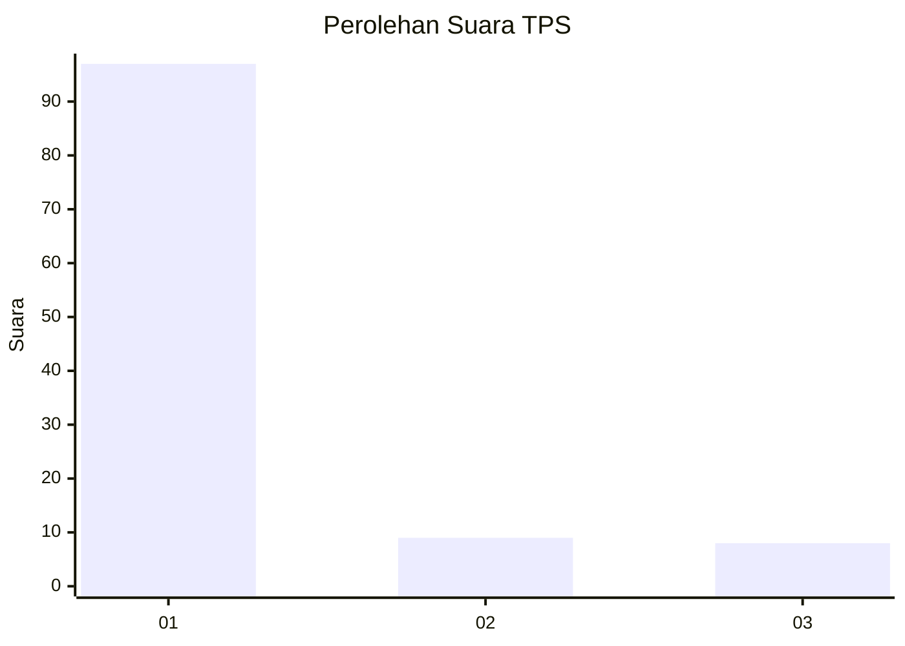
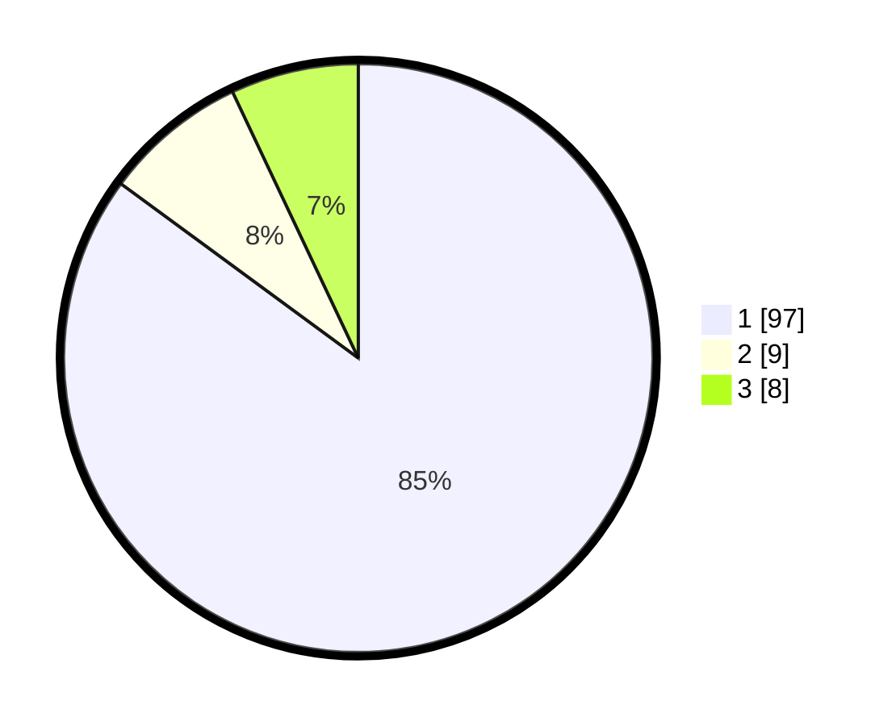

# Hasil

## Grafik

## Tabel

| No. | Nama Paslon    | Suara | Suara (raw) | Persentase |
|:--- |:-------------- | -----:| -----------:| ----------:|
| 1   | ANIES MUHAIMIN | 97    | [97][p-1]   | 85,09      |
| 2   | PRABOWO GIBRAN | 9     | [9][p-2]    | 7,89       |
| 3   | GANJAR MAHFUD  | 8     | [8][p-3]    | 7,02       |

[p-1]: https://github.com/gigit-pemilu/pemilu-2024-12-sumatera-utara/blob/main/pilpres/hitung-suara/sub/12-sumatera-utara/sub/75-kota-binjai/sub/04-binjai-timur/sub/1004-mencirim/sub/005-tps/sub/paslon-1.txt
[p-2]: https://github.com/gigit-pemilu/pemilu-2024-12-sumatera-utara/blob/main/pilpres/hitung-suara/sub/12-sumatera-utara/sub/75-kota-binjai/sub/04-binjai-timur/sub/1004-mencirim/sub/005-tps/sub/paslon-2.txt
[p-3]: https://github.com/gigit-pemilu/pemilu-2024-12-sumatera-utara/blob/main/pilpres/hitung-suara/sub/12-sumatera-utara/sub/75-kota-binjai/sub/04-binjai-timur/sub/1004-mencirim/sub/005-tps/sub/paslon-3.txt

## Foto C Plano

https://sirekap-obj-formc.kpu.go.id/b270/pemilu/ppwp/12/75/04/10/04/1275041004005-20240224-110447--279d55dd-5974-4f16-bdbe-b4b17110002f.jpg

https://sirekap-obj-formc.kpu.go.id/b270/pemilu/ppwp/12/75/04/10/04/1275041004005-20240224-110513--887c8f66-72a6-4a2b-8cf1-7931473be81c.jpg

https://sirekap-obj-formc.kpu.go.id/b270/pemilu/ppwp/12/75/04/10/04/1275041004005-20240224-110542--883b9786-bb49-46a0-ad11-120343f9a3a5.jpg

## Metadata

| Key        | Value               |
| ---------- | ------------------- |
| Time Stamp | 2024-02-28 19:00:00 |

