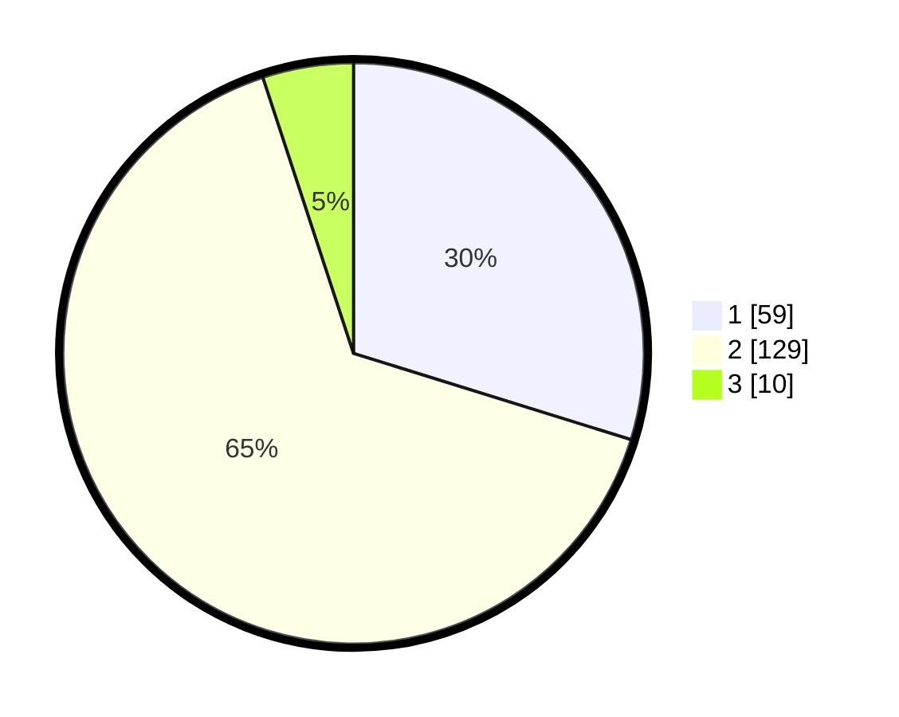

# Hasil

## Grafik

## Tabel

| No. | Nama Paslon    | Suara | Suara (raw) | Persentase |
|:--- |:-------------- | -----:| -----------:| ----------:|
| 1   | ANIES MUHAIMIN | 59    | [59][p-1]   | 29,80      |
| 2   | PRABOWO GIBRAN | 129   | [129][p-2]  | 65,15      |
| 3   | GANJAR MAHFUD  | 10    | [10][p-3]   | 5,05       |

[p-1]: https://github.com/gigit-pemilu/pemilu-2024/blob/main/pilpres/hitung-suara/sub/12-sumatera-utara/sub/75-kota-binjai/sub/05-binjai-selatan/sub/1001-tanah-merah/sub/003-tps/sub/paslon-1.txt
[p-2]: https://github.com/gigit-pemilu/pemilu-2024/blob/main/pilpres/hitung-suara/sub/12-sumatera-utara/sub/75-kota-binjai/sub/05-binjai-selatan/sub/1001-tanah-merah/sub/003-tps/sub/paslon-2.txt
[p-3]: https://github.com/gigit-pemilu/pemilu-2024/blob/main/pilpres/hitung-suara/sub/12-sumatera-utara/sub/75-kota-binjai/sub/05-binjai-selatan/sub/1001-tanah-merah/sub/003-tps/sub/paslon-3.txt

## Foto C Plano

https://sirekap-obj-formc.kpu.go.id/e83a/pemilu/ppwp/12/75/05/10/01/1275051001003-20240220-212952--a05ea2fb-44e2-4221-a51c-4a4bafc0cbcc.jpg

https://sirekap-obj-formc.kpu.go.id/e83a/pemilu/ppwp/12/75/05/10/01/1275051001003-20240215-020903--42d918fb-c137-46c0-a9d9-47d007924d8d.jpg

https://sirekap-obj-formc.kpu.go.id/e83a/pemilu/ppwp/12/75/05/10/01/1275051001003-20240215-020949--8170e10d-a22a-4990-9b87-da57023a77b2.jpg

## Metadata

| Key        | Value               |
| ---------- | ------------------- |
| Time Stamp | 2024-02-20 22:00:00 |

