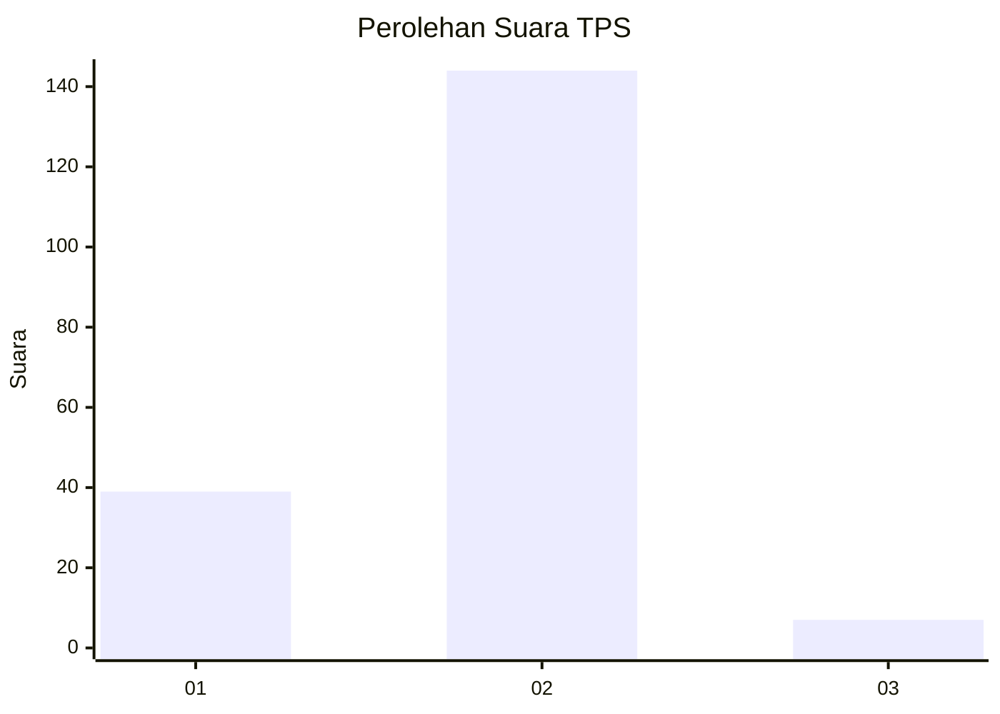

# Hasil

## Grafik

## Tabel

| No. | Nama Paslon    | Suara | Suara (raw) | Persentase |
|:--- |:-------------- | -----:| -----------:| ----------:|
| 1   | ANIES MUHAIMIN | 39    | [39][p-1]   | 20,53      |
| 2   | PRABOWO GIBRAN | 144   | [144][p-2]  | 75,79      |
| 3   | GANJAR MAHFUD  | 7     | [7][p-3]    | 3,68       |

[p-1]: https://github.com/gigit-pemilu/pemilu-2024/blob/main/pilpres/hitung-suara/sub/12-sumatera-utara/sub/75-kota-binjai/sub/05-binjai-selatan/sub/1001-tanah-merah/sub/006-tps/sub/paslon-1.txt
[p-2]: https://github.com/gigit-pemilu/pemilu-2024/blob/main/pilpres/hitung-suara/sub/12-sumatera-utara/sub/75-kota-binjai/sub/05-binjai-selatan/sub/1001-tanah-merah/sub/006-tps/sub/paslon-2.txt
[p-3]: https://github.com/gigit-pemilu/pemilu-2024/blob/main/pilpres/hitung-suara/sub/12-sumatera-utara/sub/75-kota-binjai/sub/05-binjai-selatan/sub/1001-tanah-merah/sub/006-tps/sub/paslon-3.txt

## Foto C Plano

https://sirekap-obj-formc.kpu.go.id/7bb7/pemilu/ppwp/12/75/05/10/01/1275051001006-20240215-015457--380b2556-165e-4753-a105-00b8c7b34308.jpg

https://sirekap-obj-formc.kpu.go.id/7bb7/pemilu/ppwp/12/75/05/10/01/1275051001006-20240215-015503--e23af8e7-ff55-4c12-81c1-079ad0e52e4b.jpg

https://sirekap-obj-formc.kpu.go.id/7bb7/pemilu/ppwp/12/75/05/10/01/1275051001006-20240215-015511--4daf6936-ec53-47bd-84f5-e4bb2106c61d.jpg

## Metadata

| Key        | Value               |
| ---------- | ------------------- |
| Time Stamp | 2024-02-15 20:00:44 |

