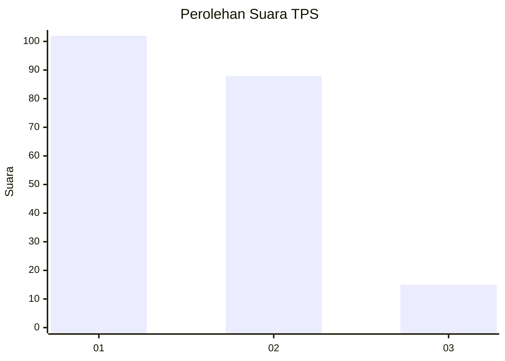
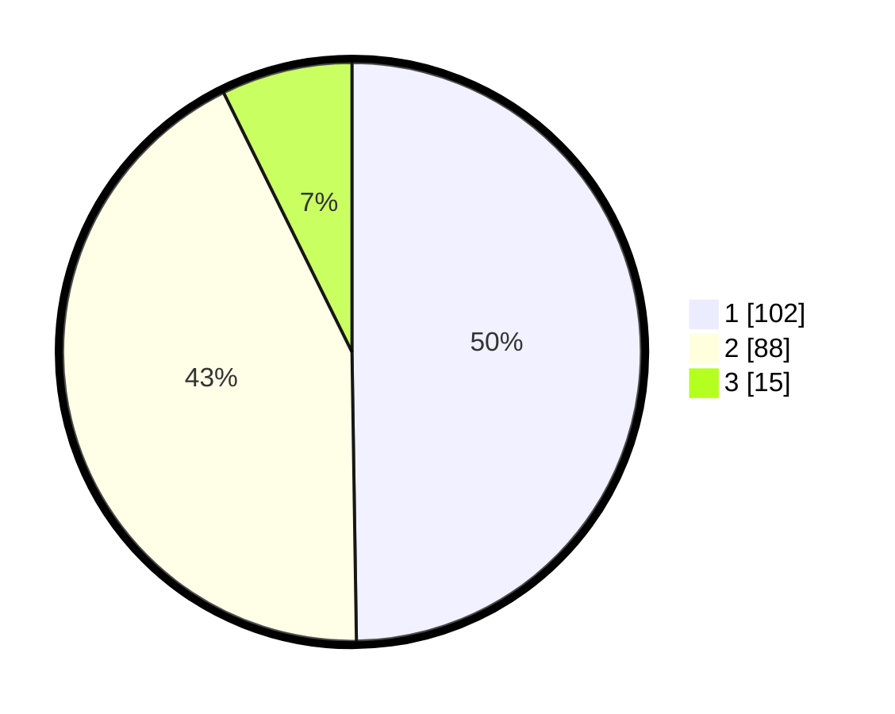

# Hasil

## Grafik

## Tabel

| No. | Nama Paslon    | Suara | Suara (raw) | Persentase |
|:--- |:-------------- | -----:| -----------:| ----------:|
| 1   | ANIES MUHAIMIN | 102   | [102][p-1]  | 49,76      |
| 2   | PRABOWO GIBRAN | 88    | [88][p-2]   | 42,93      |
| 3   | GANJAR MAHFUD  | 15    | [15][p-3]   | 7,32       |

[p-1]: https://github.com/gigit-pemilu/pemilu-2024-12-sumatera-utara/blob/main/pilpres/hitung-suara/sub/12-sumatera-utara/sub/76-kota-tebing-tinggi/sub/01-padang-hulu/sub/1001-pabatu/sub/002-tps/sub/paslon-1.txt
[p-2]: https://github.com/gigit-pemilu/pemilu-2024-12-sumatera-utara/blob/main/pilpres/hitung-suara/sub/12-sumatera-utara/sub/76-kota-tebing-tinggi/sub/01-padang-hulu/sub/1001-pabatu/sub/002-tps/sub/paslon-2.txt
[p-3]: https://github.com/gigit-pemilu/pemilu-2024-12-sumatera-utara/blob/main/pilpres/hitung-suara/sub/12-sumatera-utara/sub/76-kota-tebing-tinggi/sub/01-padang-hulu/sub/1001-pabatu/sub/002-tps/sub/paslon-3.txt

## Foto C Plano

https://sirekap-obj-formc.kpu.go.id/da9a/pemilu/ppwp/12/76/01/10/01/1276011001002-20240219-164521--66820427-ebbe-49b3-be85-edc93ae08522.jpg

https://sirekap-obj-formc.kpu.go.id/da9a/pemilu/ppwp/12/76/01/10/01/1276011001002-20240217-100620--a55b44ed-e19f-4cc3-84ef-ad353b599d55.jpg

https://sirekap-obj-formc.kpu.go.id/da9a/pemilu/ppwp/12/76/01/10/01/1276011001002-20240217-100731--22ddae1d-c41e-45a9-8587-d08f78ab4ca7.jpg

## Metadata

| Key        | Value               |
| ---------- | ------------------- |
| Time Stamp | 2024-02-19 17:00:00 |

