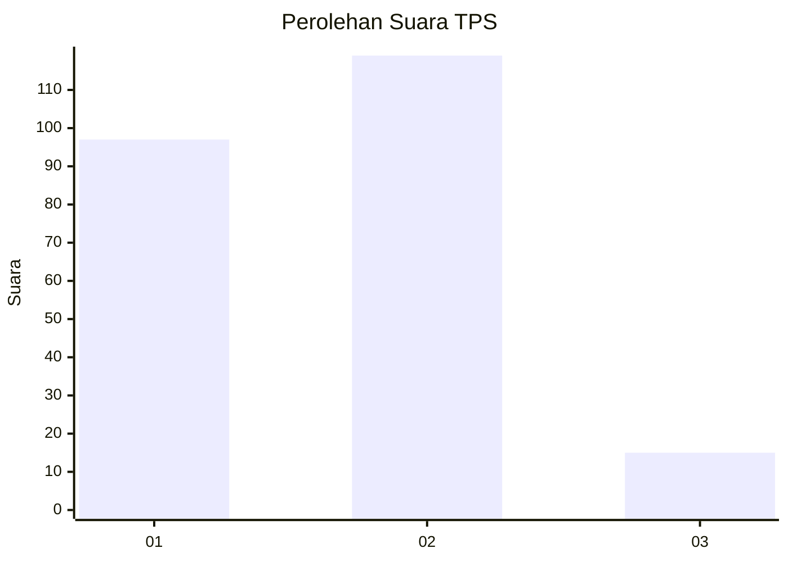

# Hasil

## Grafik

## Tabel

| No. | Nama Paslon    | Suara | Suara (raw) | Persentase |
|:--- |:-------------- | -----:| -----------:| ----------:|
| 1   | ANIES MUHAIMIN | 97    | [97][p-1]   | 41,99      |
| 2   | PRABOWO GIBRAN | 119   | [119][p-2]  | 51,52      |
| 3   | GANJAR MAHFUD  | 15    | [15][p-3]   | 6,49       |

[p-1]: https://github.com/gigit-pemilu/pemilu-2024/blob/main/pilpres/hitung-suara/sub/12-sumatera-utara/sub/76-kota-tebing-tinggi/sub/02-rambutan/sub/1007-karya-jaya/sub/001-tps/sub/paslon-1.txt
[p-2]: https://github.com/gigit-pemilu/pemilu-2024/blob/main/pilpres/hitung-suara/sub/12-sumatera-utara/sub/76-kota-tebing-tinggi/sub/02-rambutan/sub/1007-karya-jaya/sub/001-tps/sub/paslon-2.txt
[p-3]: https://github.com/gigit-pemilu/pemilu-2024/blob/main/pilpres/hitung-suara/sub/12-sumatera-utara/sub/76-kota-tebing-tinggi/sub/02-rambutan/sub/1007-karya-jaya/sub/001-tps/sub/paslon-3.txt

## Foto C Plano

https://sirekap-obj-formc.kpu.go.id/2032/pemilu/ppwp/12/76/02/10/07/1276021007001-20240214-194740--a394f7cb-7e64-44f9-aee7-5a6ae6bc7fe6.jpg

https://sirekap-obj-formc.kpu.go.id/2032/pemilu/ppwp/12/76/02/10/07/1276021007001-20240217-085704--ca6f2149-d1c5-4fee-aec4-15d0777fff66.jpg

https://sirekap-obj-formc.kpu.go.id/2032/pemilu/ppwp/12/76/02/10/07/1276021007001-20240217-085703--c77c546c-cb95-4271-8e02-494ea5e2649d.jpg

## Metadata

| Key        | Value               |
| ---------- | ------------------- |
| Time Stamp | 2024-02-17 11:00:02 |

## DATA PEMILIH TETAP

Jumlah pemilih dalam DPT: **55**.
 * L: **507**.
 * P: **55**.

## DATA PENGGUNA HAK PILIH

Jumlah pengguna hak pilih dalam DPT: **341**.
 * L: **22**.
 * P: **225**.

Jumlah pengguna hak pilih dalam DPTb: **226**.
 * L: **2**.
 * P: **222**.

Jumlah pengguna hak pilih dalam DPK: **0**.
 * L: **50**.
 * P: **0**.

Jumlah pengguna hak pilih: **555**.
 * L: **0**.
 * P: **0**.

## JUMLAH SUARA SAH DAN TIDAK SAH

JUMLAH SELURUH SUARA SAH: **231**.

JUMLAH SUARA TIDAK SAH: **7**.

JUMLAH SELURUH SUARA SAH DAN SUARA TIDAK SAH: **238**.

