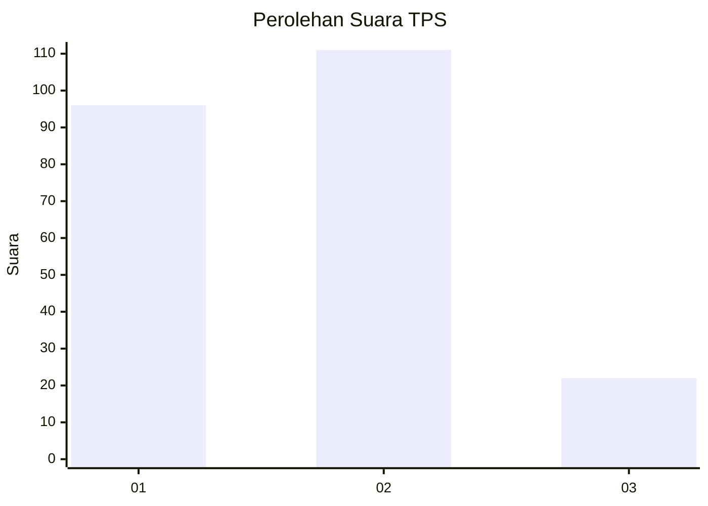
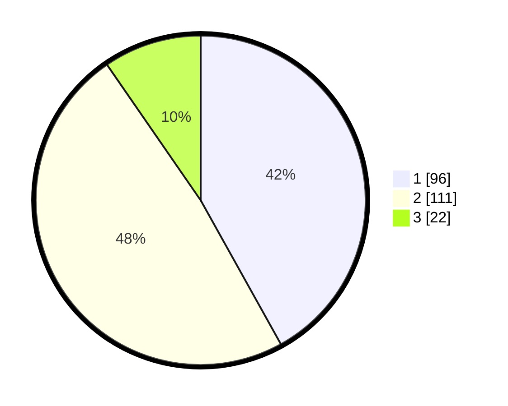

# Hasil

## Grafik

## Tabel

| No. | Nama Paslon    | Suara | Suara (raw) | Persentase |
|:--- |:-------------- | -----:| -----------:| ----------:|
| 1   | ANIES MUHAIMIN | 96    | [96][p-1]   | 41,92      |
| 2   | PRABOWO GIBRAN | 111   | [111][p-2]  | 48,47      |
| 3   | GANJAR MAHFUD  | 22    | [22][p-3]   | 9,61       |

[p-1]: https://github.com/gigit-pemilu/pemilu-2024-12-sumatera-utara/blob/main/pilpres/hitung-suara/sub/12-sumatera-utara/sub/76-kota-tebing-tinggi/sub/03-padang-hilir/sub/1001-bagelen/sub/002-tps/sub/paslon-1.txt
[p-2]: https://github.com/gigit-pemilu/pemilu-2024-12-sumatera-utara/blob/main/pilpres/hitung-suara/sub/12-sumatera-utara/sub/76-kota-tebing-tinggi/sub/03-padang-hilir/sub/1001-bagelen/sub/002-tps/sub/paslon-2.txt
[p-3]: https://github.com/gigit-pemilu/pemilu-2024-12-sumatera-utara/blob/main/pilpres/hitung-suara/sub/12-sumatera-utara/sub/76-kota-tebing-tinggi/sub/03-padang-hilir/sub/1001-bagelen/sub/002-tps/sub/paslon-3.txt

## Foto C Plano

https://sirekap-obj-formc.kpu.go.id/09d1/pemilu/ppwp/12/76/03/10/01/1276031001002-20240215-023451--9038233b-428a-48d5-b198-983dd75e147a.jpg

https://sirekap-obj-formc.kpu.go.id/09d1/pemilu/ppwp/12/76/03/10/01/1276031001002-20240215-023359--c42736ac-c891-42b5-9e7a-2ed26cbe336e.jpg

https://sirekap-obj-formc.kpu.go.id/09d1/pemilu/ppwp/12/76/03/10/01/1276031001002-20240215-023251--7c3fedb8-d3a5-4201-a419-d4c332cf172b.jpg

## Metadata

| Key        | Value               |
| ---------- | ------------------- |
| Time Stamp | 2024-02-15 15:00:29 |

