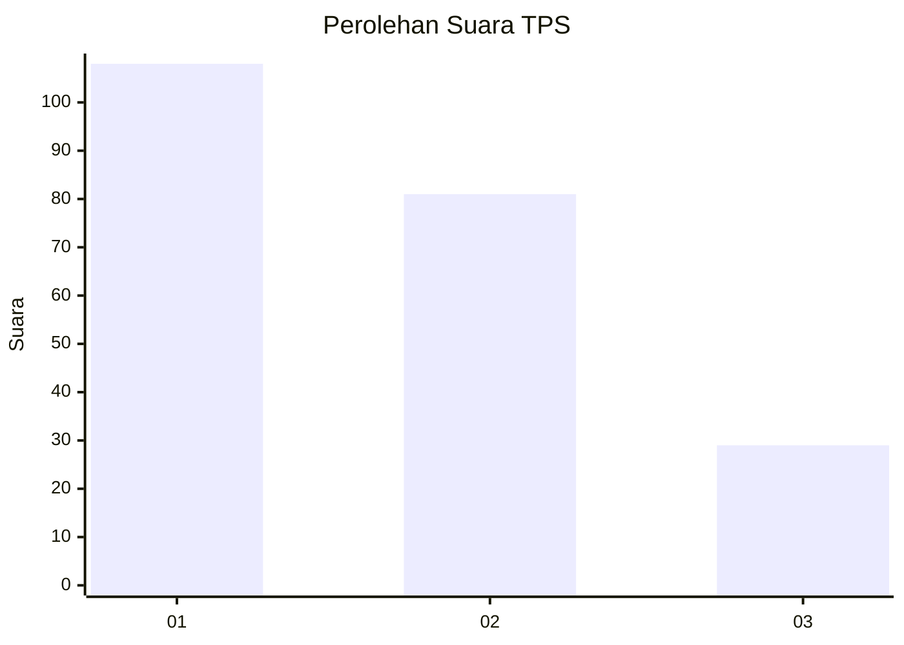
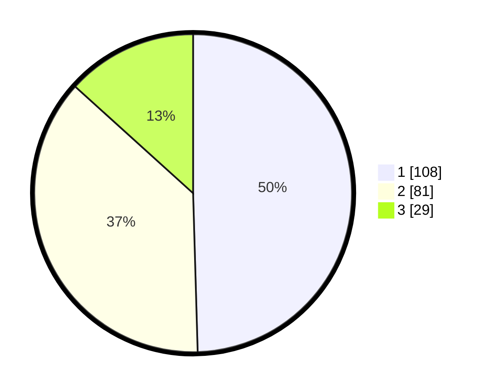

# Hasil

## Grafik

## Tabel

| No. | Nama Paslon    | Suara | Suara (raw) | Persentase |
|:--- |:-------------- | -----:| -----------:| ----------:|
| 1   | ANIES MUHAIMIN | 108   | [108][p-1]  | 49,54      |
| 2   | PRABOWO GIBRAN | 81    | [81][p-2]   | 37,16      |
| 3   | GANJAR MAHFUD  | 29    | [29][p-3]   | 13,30      |

[p-1]: https://github.com/gigit-pemilu/pemilu-2024-12-sumatera-utara/blob/main/pilpres/hitung-suara/sub/12-sumatera-utara/sub/76-kota-tebing-tinggi/sub/05-tebing-tinggi-kota/sub/1001-mandailing/sub/001-tps/sub/paslon-1.txt
[p-2]: https://github.com/gigit-pemilu/pemilu-2024-12-sumatera-utara/blob/main/pilpres/hitung-suara/sub/12-sumatera-utara/sub/76-kota-tebing-tinggi/sub/05-tebing-tinggi-kota/sub/1001-mandailing/sub/001-tps/sub/paslon-2.txt
[p-3]: https://github.com/gigit-pemilu/pemilu-2024-12-sumatera-utara/blob/main/pilpres/hitung-suara/sub/12-sumatera-utara/sub/76-kota-tebing-tinggi/sub/05-tebing-tinggi-kota/sub/1001-mandailing/sub/001-tps/sub/paslon-3.txt

## Foto C Plano

https://sirekap-obj-formc.kpu.go.id/865c/pemilu/ppwp/12/76/05/10/01/1276051001001-20240224-024837--06cbafba-1475-47ad-98d5-155792f12a7f.jpg

https://sirekap-obj-formc.kpu.go.id/865c/pemilu/ppwp/12/76/05/10/01/1276051001001-20240224-024901--3a014e60-50f4-4300-89e8-65ac07e1f885.jpg

https://sirekap-obj-formc.kpu.go.id/865c/pemilu/ppwp/12/76/05/10/01/1276051001001-20240224-024916--88edd05e-42f0-4ac6-8cc1-7826d0b46d95.jpg

## Metadata

| Key        | Value               |
| ---------- | ------------------- |
| Time Stamp | 2024-02-24 22:31:28 |

