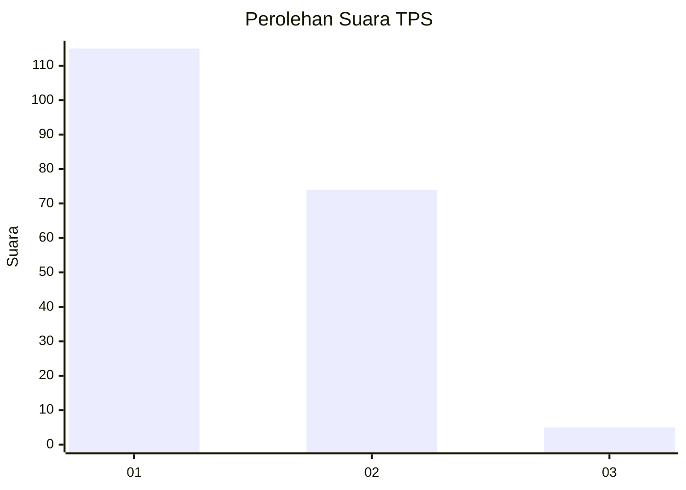
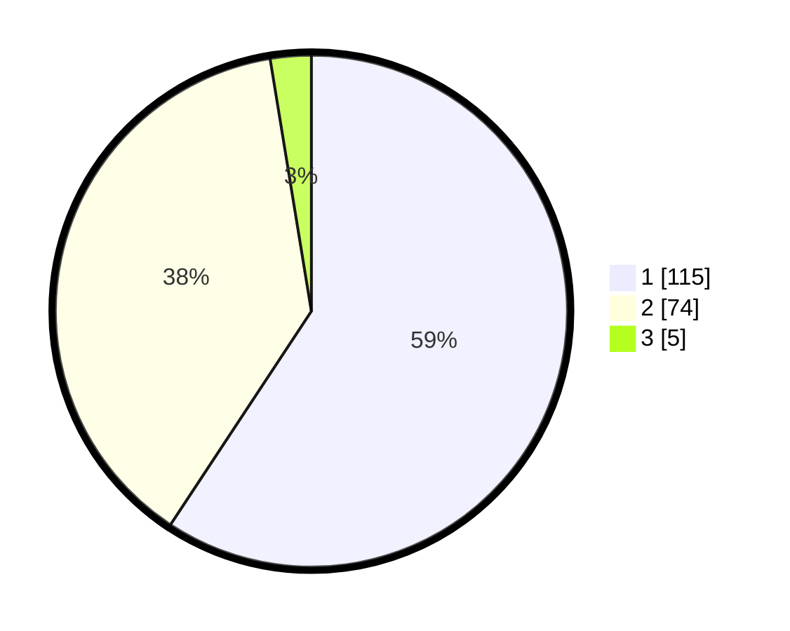

# Hasil

## Grafik

## Tabel

| No. | Nama Paslon    | Suara | Suara (raw) | Persentase |
|:--- |:-------------- | -----:| -----------:| ----------:|
| 1   | ANIES MUHAIMIN | 115   | [115][p-1]  | 59,28      |
| 2   | PRABOWO GIBRAN | 74    | [74][p-2]   | 38,14      |
| 3   | GANJAR MAHFUD  | 5     | [5][p-3]    | 2,58       |

[p-1]: https://github.com/gigit-pemilu/pemilu-2024/blob/main/pilpres/hitung-suara/sub/12-sumatera-utara/sub/76-kota-tebing-tinggi/sub/05-tebing-tinggi-kota/sub/1001-mandailing/sub/003-tps/sub/paslon-1.txt
[p-2]: https://github.com/gigit-pemilu/pemilu-2024/blob/main/pilpres/hitung-suara/sub/12-sumatera-utara/sub/76-kota-tebing-tinggi/sub/05-tebing-tinggi-kota/sub/1001-mandailing/sub/003-tps/sub/paslon-2.txt
[p-3]: https://github.com/gigit-pemilu/pemilu-2024/blob/main/pilpres/hitung-suara/sub/12-sumatera-utara/sub/76-kota-tebing-tinggi/sub/05-tebing-tinggi-kota/sub/1001-mandailing/sub/003-tps/sub/paslon-3.txt

## Foto C Plano

https://sirekap-obj-formc.kpu.go.id/6cfe/pemilu/ppwp/12/76/05/10/01/1276051001003-20240215-042300--24bdb20a-9513-4950-a33e-aad632503533.jpg

https://sirekap-obj-formc.kpu.go.id/6cfe/pemilu/ppwp/12/76/05/10/01/1276051001003-20240215-042429--ae551f63-df77-4e29-adf7-11d3c414ae5a.jpg

https://sirekap-obj-formc.kpu.go.id/6cfe/pemilu/ppwp/12/76/05/10/01/1276051001003-20240215-042514--e3ab81d0-e872-445a-90f2-3de61004c306.jpg

## Metadata

| Key        | Value               |
| ---------- | ------------------- |
| Time Stamp | 2024-02-17 04:00:03 |

