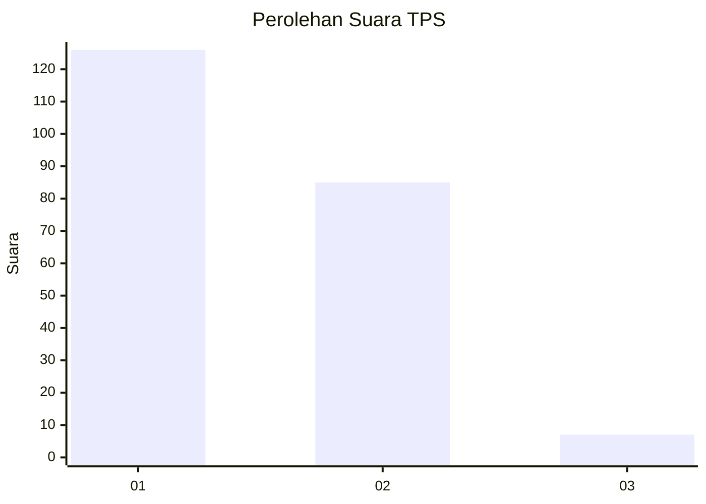
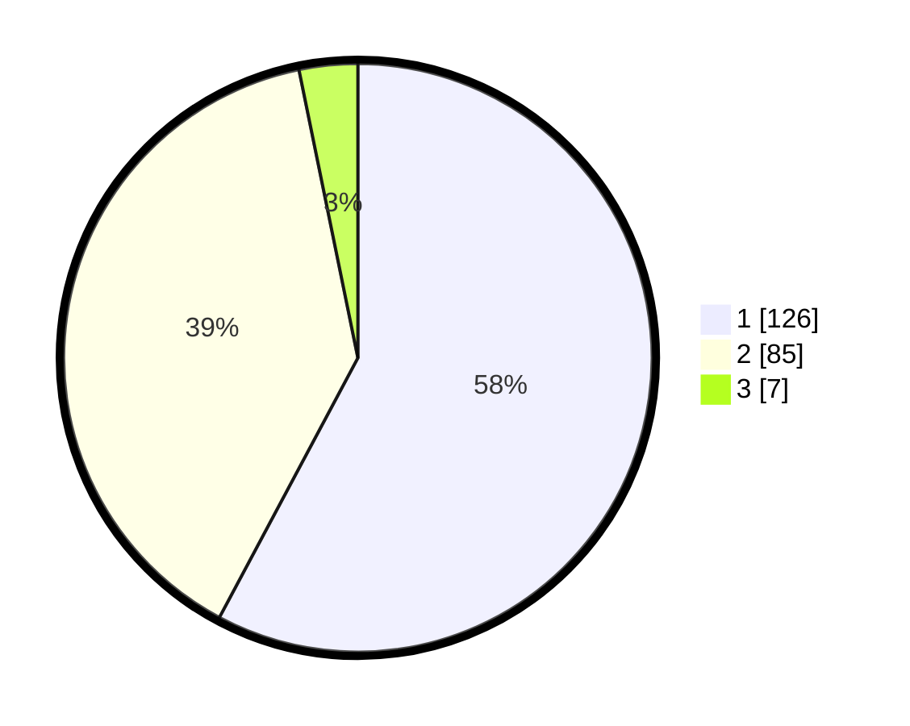

# Hasil

## Grafik

## Tabel

| No. | Nama Paslon    | Suara | Suara (raw) | Persentase |
|:--- |:-------------- | -----:| -----------:| ----------:|
| 1   | ANIES MUHAIMIN | 126   | [126][p-1]  | 57,80      |
| 2   | PRABOWO GIBRAN | 85    | [85][p-2]   | 38,99      |
| 3   | GANJAR MAHFUD  | 7     | [7][p-3]    | 3,21       |

[p-1]: https://github.com/gigit-pemilu/pemilu-2024/blob/main/pilpres/hitung-suara/sub/12-sumatera-utara/sub/77-kota-padang-sidempuan/sub/01-padangsidimpuan-utara/sub/1001-wek-i/sub/005-tps/sub/paslon-1.txt
[p-2]: https://github.com/gigit-pemilu/pemilu-2024/blob/main/pilpres/hitung-suara/sub/12-sumatera-utara/sub/77-kota-padang-sidempuan/sub/01-padangsidimpuan-utara/sub/1001-wek-i/sub/005-tps/sub/paslon-2.txt
[p-3]: https://github.com/gigit-pemilu/pemilu-2024/blob/main/pilpres/hitung-suara/sub/12-sumatera-utara/sub/77-kota-padang-sidempuan/sub/01-padangsidimpuan-utara/sub/1001-wek-i/sub/005-tps/sub/paslon-3.txt

## Foto C Plano

https://sirekap-obj-formc.kpu.go.id/bd98/pemilu/ppwp/12/77/01/10/01/1277011001005-20240215-021848--c765bebe-643f-4adf-a3d2-8c5054ef1dfc.jpg

https://sirekap-obj-formc.kpu.go.id/bd98/pemilu/ppwp/12/77/01/10/01/1277011001005-20240215-021052--08d34f12-db11-4fc2-819e-485a6bb147d7.jpg

https://sirekap-obj-formc.kpu.go.id/bd98/pemilu/ppwp/12/77/01/10/01/1277011001005-20240215-043103--edca879c-fcfe-4804-9f13-2e6e74ebd693.jpg

## Metadata

| Key        | Value               |
| ---------- | ------------------- |
| Time Stamp | 2024-02-16 10:30:29 |

