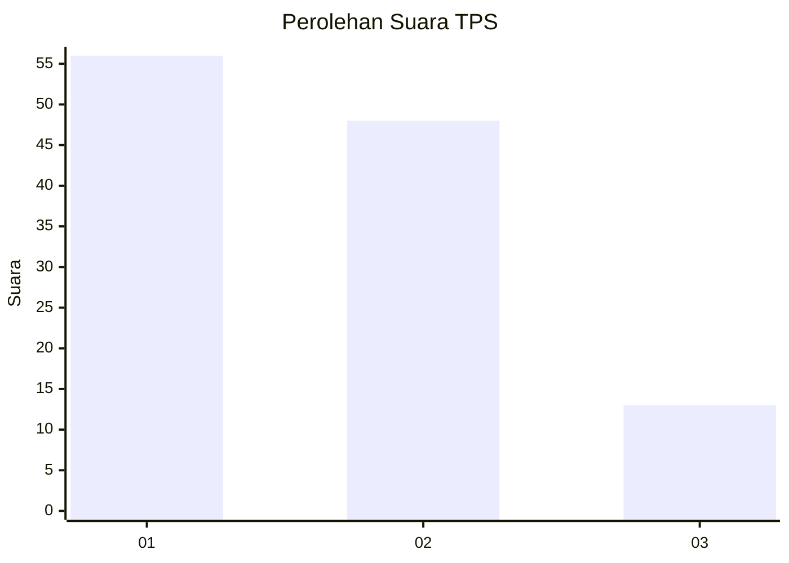
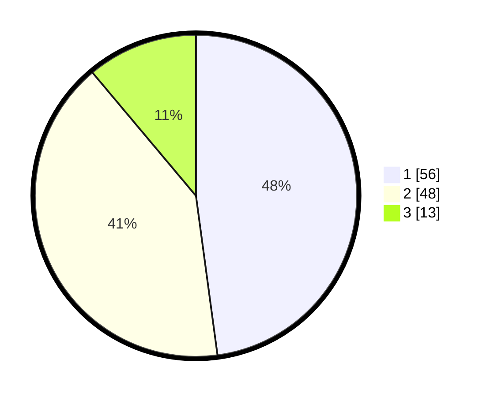

# Hasil

## Grafik

## Tabel

| No. | Nama Paslon    | Suara | Suara (raw) | Persentase |
|:--- |:-------------- | -----:| -----------:| ----------:|
| 1   | ANIES MUHAIMIN | 56    | [56][p-1]   | 47,86      |
| 2   | PRABOWO GIBRAN | 48    | [48][p-2]   | 41,03      |
| 3   | GANJAR MAHFUD  | 13    | [13][p-3]   | 11,11      |

[p-1]: https://github.com/gigit-pemilu/pemilu-2024/blob/main/pilpres/hitung-suara/sub/12-sumatera-utara/sub/77-kota-padang-sidempuan/sub/01-padangsidimpuan-utara/sub/1002-wek-ii/sub/005-tps/sub/paslon-1.txt
[p-2]: https://github.com/gigit-pemilu/pemilu-2024/blob/main/pilpres/hitung-suara/sub/12-sumatera-utara/sub/77-kota-padang-sidempuan/sub/01-padangsidimpuan-utara/sub/1002-wek-ii/sub/005-tps/sub/paslon-2.txt
[p-3]: https://github.com/gigit-pemilu/pemilu-2024/blob/main/pilpres/hitung-suara/sub/12-sumatera-utara/sub/77-kota-padang-sidempuan/sub/01-padangsidimpuan-utara/sub/1002-wek-ii/sub/005-tps/sub/paslon-3.txt

## Foto C Plano

https://sirekap-obj-formc.kpu.go.id/a4a3/pemilu/ppwp/12/77/01/10/02/1277011002005-20240214-160147--f461c081-c2f5-4560-a210-ebd7ed3c42e6.jpg

https://sirekap-obj-formc.kpu.go.id/a4a3/pemilu/ppwp/12/77/01/10/02/1277011002005-20240215-220053--b0acc6a7-f017-452c-b86b-c81cb4db0722.jpg

https://sirekap-obj-formc.kpu.go.id/a4a3/pemilu/ppwp/12/77/01/10/02/1277011002005-20240215-210316--55cec517-ef4e-47a5-a22c-5b23a003ed00.jpg

## Metadata

| Key        | Value               |
| ---------- | ------------------- |
| Time Stamp | 2024-02-19 11:00:00 |

