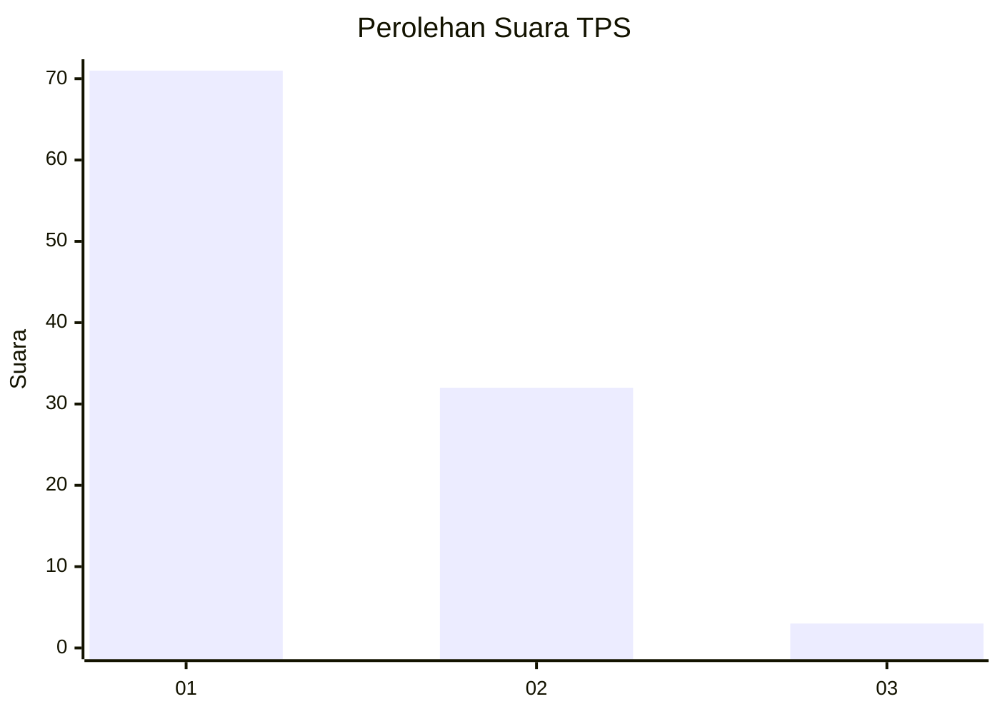
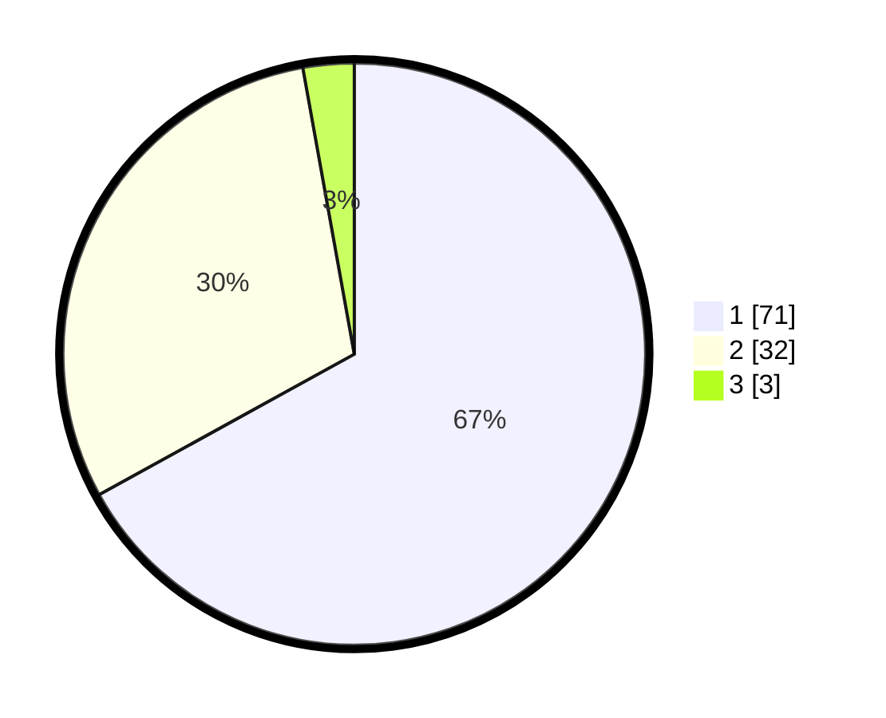

# Hasil

## Grafik

## Tabel

| No. | Nama Paslon    | Suara | Suara (raw) | Persentase |
|:--- |:-------------- | -----:| -----------:| ----------:|
| 1   | ANIES MUHAIMIN | 71    | [71][p-1]   | 66,98      |
| 2   | PRABOWO GIBRAN | 32    | [32][p-2]   | 30,19      |
| 3   | GANJAR MAHFUD  | 3     | [3][p-3]    | 2,83       |

[p-1]: https://github.com/gigit-pemilu/pemilu-2024-12-sumatera-utara/blob/main/pilpres/hitung-suara/sub/12-sumatera-utara/sub/77-kota-padang-sidempuan/sub/01-padangsidimpuan-utara/sub/1003-wek-iii/sub/001-tps/sub/paslon-1.txt
[p-2]: https://github.com/gigit-pemilu/pemilu-2024-12-sumatera-utara/blob/main/pilpres/hitung-suara/sub/12-sumatera-utara/sub/77-kota-padang-sidempuan/sub/01-padangsidimpuan-utara/sub/1003-wek-iii/sub/001-tps/sub/paslon-2.txt
[p-3]: https://github.com/gigit-pemilu/pemilu-2024-12-sumatera-utara/blob/main/pilpres/hitung-suara/sub/12-sumatera-utara/sub/77-kota-padang-sidempuan/sub/01-padangsidimpuan-utara/sub/1003-wek-iii/sub/001-tps/sub/paslon-3.txt

## Foto C Plano

https://sirekap-obj-formc.kpu.go.id/fe5e/pemilu/ppwp/12/77/01/10/03/1277011003001-20240215-000004--424c483a-c6c3-4da6-8712-606c91c08cd0.jpg

https://sirekap-obj-formc.kpu.go.id/fe5e/pemilu/ppwp/12/77/01/10/03/1277011003001-20240215-001210--e815e92a-3240-442d-9a2d-5ceda9a70b59.jpg

https://sirekap-obj-formc.kpu.go.id/fe5e/pemilu/ppwp/12/77/01/10/03/1277011003001-20240215-001745--973385b2-4a5e-4213-8366-e3d0831ff3f2.jpg

## Metadata

| Key        | Value               |
| ---------- | ------------------- |
| Time Stamp | 2024-02-19 11:00:00 |

