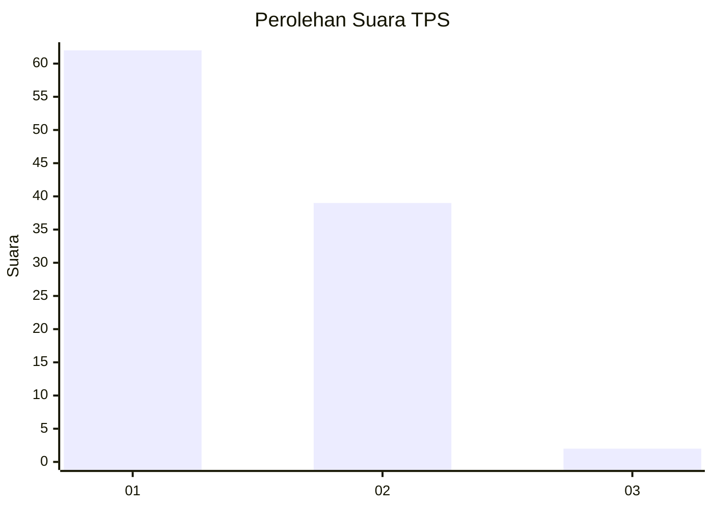
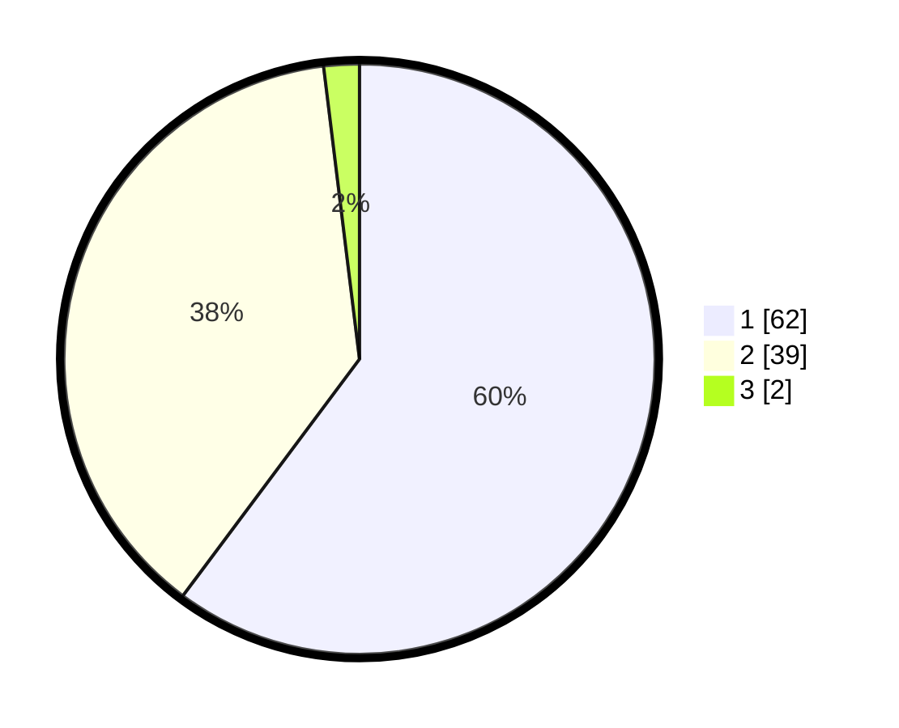

# Hasil

## Grafik

## Tabel

| No. | Nama Paslon    | Suara | Suara (raw) | Persentase |
|:--- |:-------------- | -----:| -----------:| ----------:|
| 1   | ANIES MUHAIMIN | 62    | [62][p-1]   | 60,19      |
| 2   | PRABOWO GIBRAN | 39    | [39][p-2]   | 37,86      |
| 3   | GANJAR MAHFUD  | 2     | [2][p-3]    | 1,94       |

[p-1]: https://github.com/gigit-pemilu/pemilu-2024/blob/main/pilpres/hitung-suara/sub/12-sumatera-utara/sub/77-kota-padang-sidempuan/sub/01-padangsidimpuan-utara/sub/1003-wek-iii/sub/009-tps/sub/paslon-1.txt
[p-2]: https://github.com/gigit-pemilu/pemilu-2024/blob/main/pilpres/hitung-suara/sub/12-sumatera-utara/sub/77-kota-padang-sidempuan/sub/01-padangsidimpuan-utara/sub/1003-wek-iii/sub/009-tps/sub/paslon-2.txt
[p-3]: https://github.com/gigit-pemilu/pemilu-2024/blob/main/pilpres/hitung-suara/sub/12-sumatera-utara/sub/77-kota-padang-sidempuan/sub/01-padangsidimpuan-utara/sub/1003-wek-iii/sub/009-tps/sub/paslon-3.txt

## Foto C Plano

https://sirekap-obj-formc.kpu.go.id/5af1/pemilu/ppwp/12/77/01/10/03/1277011003009-20240214-231818--c70fa2b6-d36f-410e-8d59-67addb7f8600.jpg

https://sirekap-obj-formc.kpu.go.id/5af1/pemilu/ppwp/12/77/01/10/03/1277011003009-20240214-231914--b420b77d-271c-47fb-b951-97062fbb3190.jpg

https://sirekap-obj-formc.kpu.go.id/5af1/pemilu/ppwp/12/77/01/10/03/1277011003009-20240214-232027--065be5d4-470f-45a4-b46d-50a3d2b0630c.jpg

## Metadata

| Key        | Value               |
| ---------- | ------------------- |
| Time Stamp | 2024-02-19 10:00:00 |

