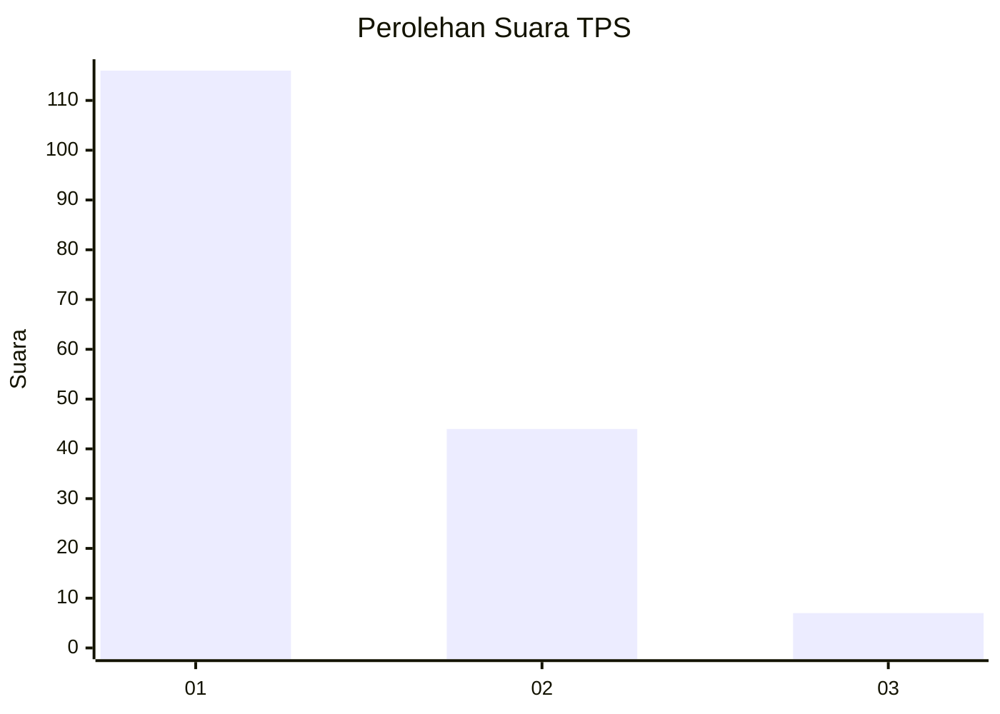
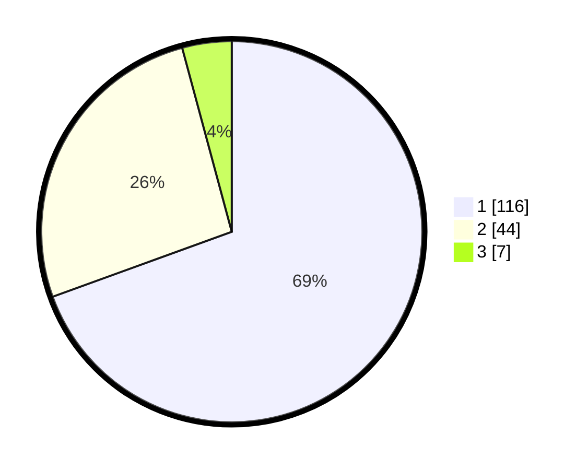

# Hasil

## Grafik

## Tabel

| No. | Nama Paslon    | Suara | Suara (raw) | Persentase |
|:--- |:-------------- | -----:| -----------:| ----------:|
| 1   | ANIES MUHAIMIN | 116   | [116][p-1]  | 69,46      |
| 2   | PRABOWO GIBRAN | 44    | [44][p-2]   | 26,35      |
| 3   | GANJAR MAHFUD  | 7     | [7][p-3]    | 4,19       |

[p-1]: https://github.com/gigit-pemilu/pemilu-2024-12-sumatera-utara/blob/main/pilpres/hitung-suara/sub/12-sumatera-utara/sub/77-kota-padang-sidempuan/sub/01-padangsidimpuan-utara/sub/1004-wek-iv/sub/001-tps/sub/paslon-1.txt
[p-2]: https://github.com/gigit-pemilu/pemilu-2024-12-sumatera-utara/blob/main/pilpres/hitung-suara/sub/12-sumatera-utara/sub/77-kota-padang-sidempuan/sub/01-padangsidimpuan-utara/sub/1004-wek-iv/sub/001-tps/sub/paslon-2.txt
[p-3]: https://github.com/gigit-pemilu/pemilu-2024-12-sumatera-utara/blob/main/pilpres/hitung-suara/sub/12-sumatera-utara/sub/77-kota-padang-sidempuan/sub/01-padangsidimpuan-utara/sub/1004-wek-iv/sub/001-tps/sub/paslon-3.txt

## Foto C Plano

https://sirekap-obj-formc.kpu.go.id/9e49/pemilu/ppwp/12/77/01/10/04/1277011004001-20240215-011407--449f0a84-af44-48cf-b044-660c28e9c6e5.jpg

https://sirekap-obj-formc.kpu.go.id/9e49/pemilu/ppwp/12/77/01/10/04/1277011004001-20240215-011505--690e0a2d-ea77-4b7d-9c20-04eff600d559.jpg

https://sirekap-obj-formc.kpu.go.id/9e49/pemilu/ppwp/12/77/01/10/04/1277011004001-20240215-105331--16cf5204-b6bd-4bd4-be3f-3cbf85819d69.jpg

## Metadata

| Key        | Value               |
| ---------- | ------------------- |
| Time Stamp | 2024-02-19 10:00:00 |

