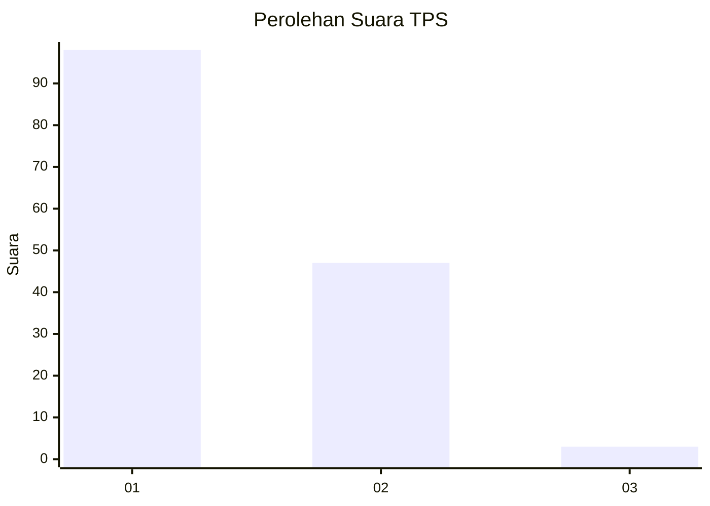
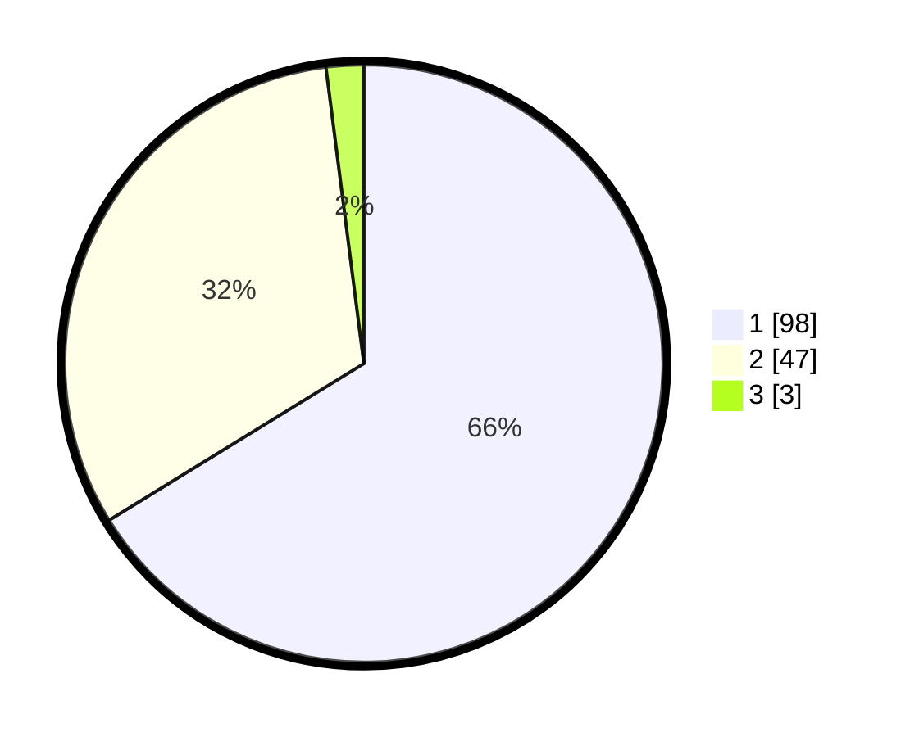

# Hasil

## Grafik

## Tabel

| No. | Nama Paslon    | Suara | Suara (raw) | Persentase |
|:--- |:-------------- | -----:| -----------:| ----------:|
| 1   | ANIES MUHAIMIN | 98    | [98][p-1]   | 66,22      |
| 2   | PRABOWO GIBRAN | 47    | [47][p-2]   | 31,76      |
| 3   | GANJAR MAHFUD  | 3     | [3][p-3]    | 2,03       |

[p-1]: https://github.com/gigit-pemilu/pemilu-2024-12-sumatera-utara/blob/main/pilpres/hitung-suara/sub/12-sumatera-utara/sub/77-kota-padang-sidempuan/sub/01-padangsidimpuan-utara/sub/1005-tanobato/sub/004-tps/sub/paslon-1.txt
[p-2]: https://github.com/gigit-pemilu/pemilu-2024-12-sumatera-utara/blob/main/pilpres/hitung-suara/sub/12-sumatera-utara/sub/77-kota-padang-sidempuan/sub/01-padangsidimpuan-utara/sub/1005-tanobato/sub/004-tps/sub/paslon-2.txt
[p-3]: https://github.com/gigit-pemilu/pemilu-2024-12-sumatera-utara/blob/main/pilpres/hitung-suara/sub/12-sumatera-utara/sub/77-kota-padang-sidempuan/sub/01-padangsidimpuan-utara/sub/1005-tanobato/sub/004-tps/sub/paslon-3.txt

## Foto C Plano

https://sirekap-obj-formc.kpu.go.id/552c/pemilu/ppwp/12/77/01/10/05/1277011005004-20240215-033723--4d34cf45-a1b8-48dd-b516-bdb93d7e6166.jpg

https://sirekap-obj-formc.kpu.go.id/552c/pemilu/ppwp/12/77/01/10/05/1277011005004-20240215-033853--064b41d6-1457-411a-8c85-8ecf078654fd.jpg

https://sirekap-obj-formc.kpu.go.id/552c/pemilu/ppwp/12/77/01/10/05/1277011005004-20240215-034114--d9d94c5b-830a-4239-b252-6bb12e719408.jpg

## Metadata

| Key        | Value               |
| ---------- | ------------------- |
| Time Stamp | 2024-02-19 10:00:00 |

