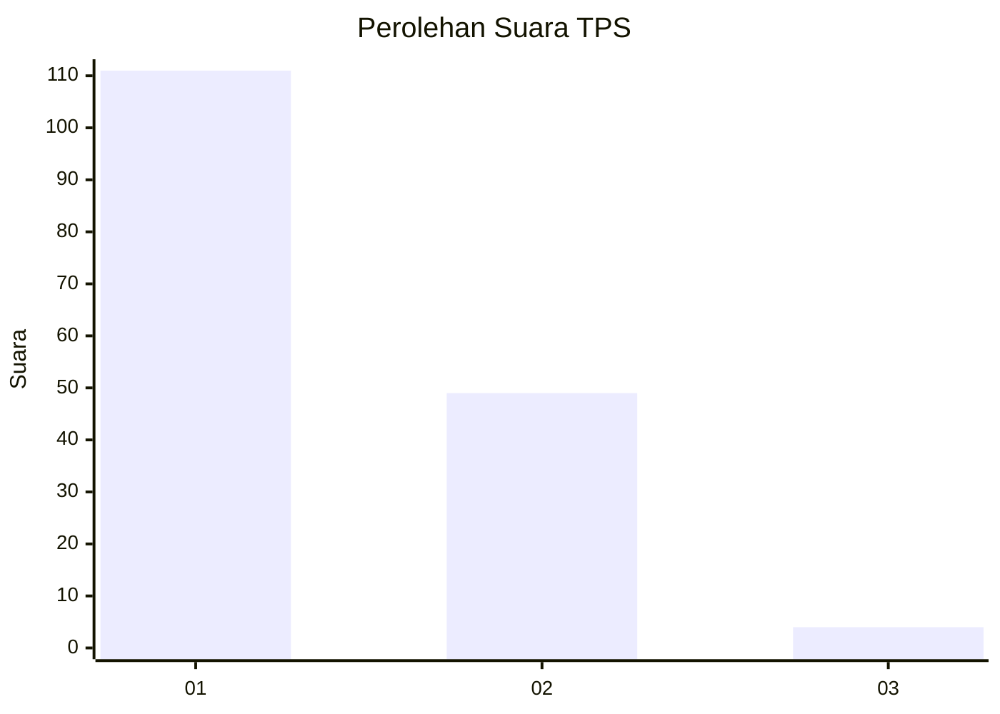
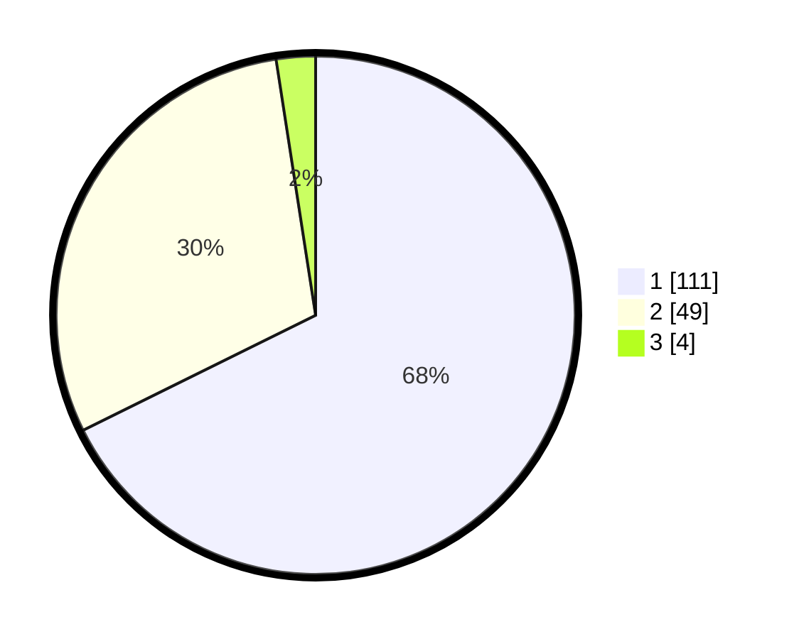

# Hasil

## Grafik

## Tabel

| No. | Nama Paslon    | Suara | Suara (raw) | Persentase |
|:--- |:-------------- | -----:| -----------:| ----------:|
| 1   | ANIES MUHAIMIN | 111   | [111][p-1]  | 67,68      |
| 2   | PRABOWO GIBRAN | 49    | [49][p-2]   | 29,88      |
| 3   | GANJAR MAHFUD  | 4     | [4][p-3]    | 2,44       |

[p-1]: https://github.com/gigit-pemilu/pemilu-2024/blob/main/pilpres/hitung-suara/sub/12-sumatera-utara/sub/77-kota-padang-sidempuan/sub/01-padangsidimpuan-utara/sub/1005-tanobato/sub/007-tps/sub/paslon-1.txt
[p-2]: https://github.com/gigit-pemilu/pemilu-2024/blob/main/pilpres/hitung-suara/sub/12-sumatera-utara/sub/77-kota-padang-sidempuan/sub/01-padangsidimpuan-utara/sub/1005-tanobato/sub/007-tps/sub/paslon-2.txt
[p-3]: https://github.com/gigit-pemilu/pemilu-2024/blob/main/pilpres/hitung-suara/sub/12-sumatera-utara/sub/77-kota-padang-sidempuan/sub/01-padangsidimpuan-utara/sub/1005-tanobato/sub/007-tps/sub/paslon-3.txt

## Foto C Plano

https://sirekap-obj-formc.kpu.go.id/5550/pemilu/ppwp/12/77/01/10/05/1277011005007-20240215-014424--a1f64868-7024-443f-9550-d0e4c083f1f9.jpg

https://sirekap-obj-formc.kpu.go.id/5550/pemilu/ppwp/12/77/01/10/05/1277011005007-20240215-014520--d47b0c5f-18f4-4baa-865c-9c0ea4dcc936.jpg

https://sirekap-obj-formc.kpu.go.id/5550/pemilu/ppwp/12/77/01/10/05/1277011005007-20240216-122800--12b4203b-27d4-4570-bcdc-ad9854085cb9.jpg

## Metadata

| Key        | Value               |
| ---------- | ------------------- |
| Time Stamp | 2024-02-19 10:00:00 |

