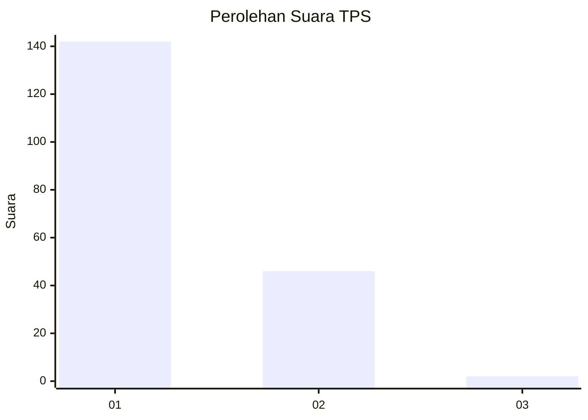
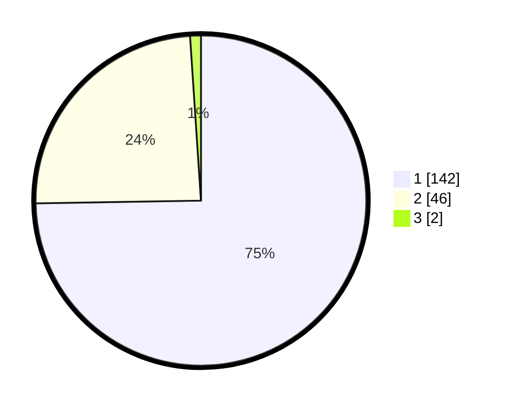

# Hasil

## Grafik

## Tabel

| No. | Nama Paslon    | Suara | Suara (raw) | Persentase |
|:--- |:-------------- | -----:| -----------:| ----------:|
| 1   | ANIES MUHAIMIN | 142   | [142][p-1]  | 74,74      |
| 2   | PRABOWO GIBRAN | 46    | [46][p-2]   | 24,21      |
| 3   | GANJAR MAHFUD  | 2     | [2][p-3]    | 1,05       |

[p-1]: https://github.com/gigit-pemilu/pemilu-2024/blob/main/pilpres/hitung-suara/sub/12-sumatera-utara/sub/77-kota-padang-sidempuan/sub/01-padangsidimpuan-utara/sub/1006-tobat/sub/005-tps/sub/paslon-1.txt
[p-2]: https://github.com/gigit-pemilu/pemilu-2024/blob/main/pilpres/hitung-suara/sub/12-sumatera-utara/sub/77-kota-padang-sidempuan/sub/01-padangsidimpuan-utara/sub/1006-tobat/sub/005-tps/sub/paslon-2.txt
[p-3]: https://github.com/gigit-pemilu/pemilu-2024/blob/main/pilpres/hitung-suara/sub/12-sumatera-utara/sub/77-kota-padang-sidempuan/sub/01-padangsidimpuan-utara/sub/1006-tobat/sub/005-tps/sub/paslon-3.txt

## Foto C Plano

https://sirekap-obj-formc.kpu.go.id/edd7/pemilu/ppwp/12/77/01/10/06/1277011006005-20240215-020822--acba525d-83bf-4d5d-a0a4-4fa90b6b7119.jpg

https://sirekap-obj-formc.kpu.go.id/edd7/pemilu/ppwp/12/77/01/10/06/1277011006005-20240215-021035--9a804bab-c443-4aba-901c-3f9ae6a34542.jpg

https://sirekap-obj-formc.kpu.go.id/edd7/pemilu/ppwp/12/77/01/10/06/1277011006005-20240215-021245--c736502a-6509-49d5-bc7f-06da10cd9a5a.jpg

## Metadata

| Key        | Value               |
| ---------- | ------------------- |
| Time Stamp | 2024-02-19 10:00:00 |

