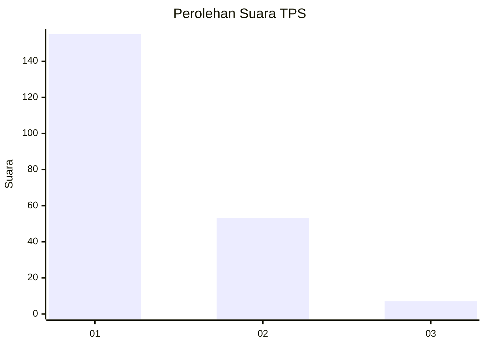
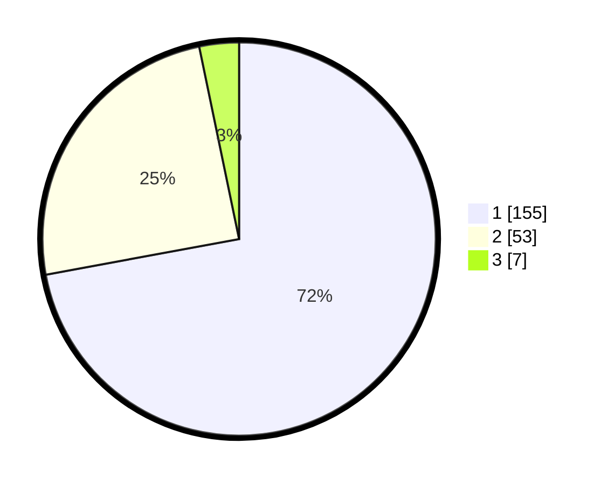

# Hasil

## Grafik

## Tabel

| No. | Nama Paslon    | Suara | Suara (raw) | Persentase |
|:--- |:-------------- | -----:| -----------:| ----------:|
| 1   | ANIES MUHAIMIN | 155   | [155][p-1]  | 72,09      |
| 2   | PRABOWO GIBRAN | 53    | [53][p-2]   | 24,65      |
| 3   | GANJAR MAHFUD  | 7     | [7][p-3]    | 3,26       |

[p-1]: https://github.com/gigit-pemilu/pemilu-2024-12-sumatera-utara/blob/main/pilpres/hitung-suara/sub/12-sumatera-utara/sub/77-kota-padang-sidempuan/sub/01-padangsidimpuan-utara/sub/1006-tobat/sub/006-tps/sub/paslon-1.txt
[p-2]: https://github.com/gigit-pemilu/pemilu-2024-12-sumatera-utara/blob/main/pilpres/hitung-suara/sub/12-sumatera-utara/sub/77-kota-padang-sidempuan/sub/01-padangsidimpuan-utara/sub/1006-tobat/sub/006-tps/sub/paslon-2.txt
[p-3]: https://github.com/gigit-pemilu/pemilu-2024-12-sumatera-utara/blob/main/pilpres/hitung-suara/sub/12-sumatera-utara/sub/77-kota-padang-sidempuan/sub/01-padangsidimpuan-utara/sub/1006-tobat/sub/006-tps/sub/paslon-3.txt

## Foto C Plano

https://sirekap-obj-formc.kpu.go.id/4628/pemilu/ppwp/12/77/01/10/06/1277011006006-20240214-222726--191bf87b-a119-4c95-ae44-486e52e4937d.jpg

https://sirekap-obj-formc.kpu.go.id/4628/pemilu/ppwp/12/77/01/10/06/1277011006006-20240214-222818--c9f59b3e-fb8d-43eb-af9d-a371b5843242.jpg

https://sirekap-obj-formc.kpu.go.id/4628/pemilu/ppwp/12/77/01/10/06/1277011006006-20240214-222916--148153da-ee9c-4268-8abb-fa31aa593b5d.jpg

## Metadata

| Key        | Value               |
| ---------- | ------------------- |
| Time Stamp | 2024-02-19 10:00:00 |

