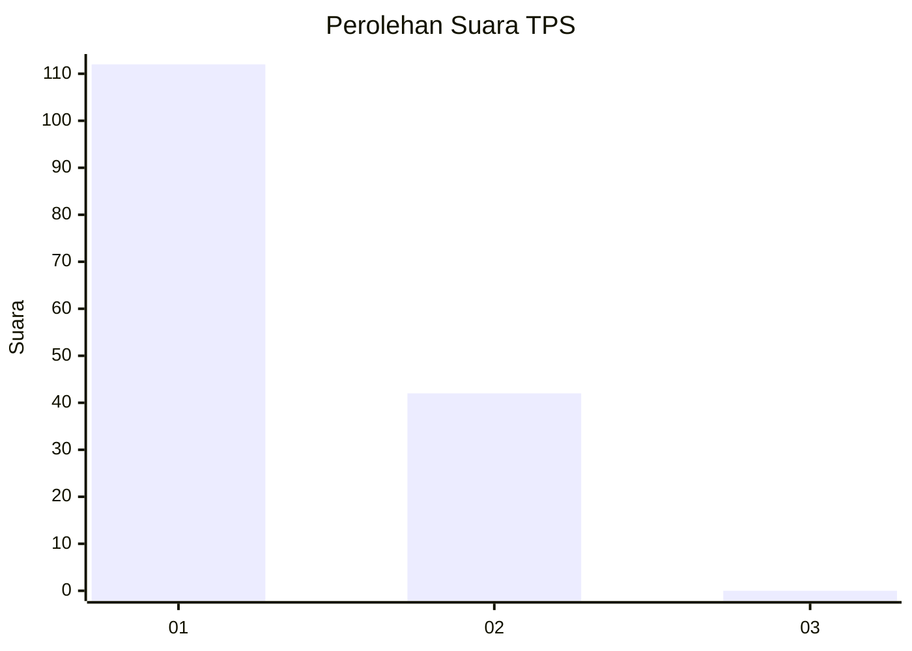
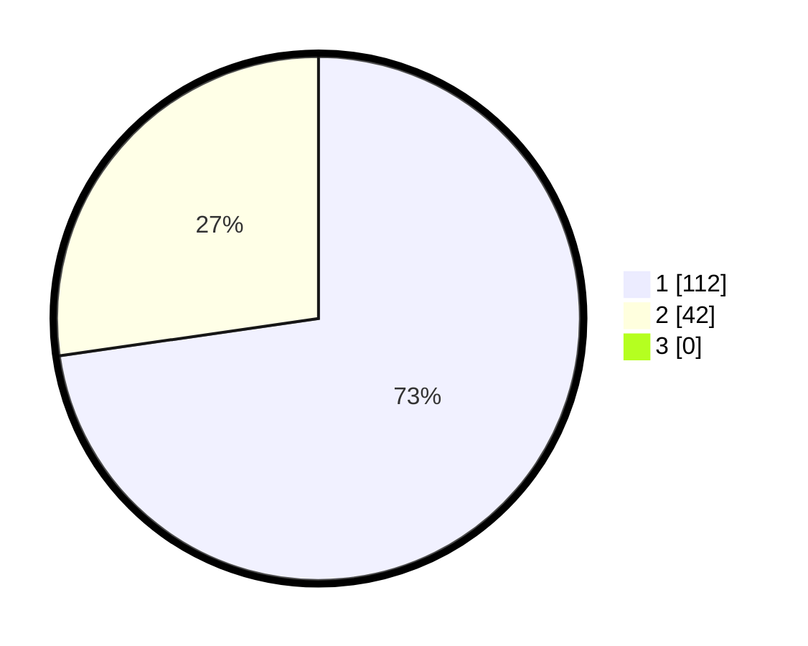

# Hasil

## Grafik

## Tabel

| No. | Nama Paslon    | Suara | Suara (raw) | Persentase |
|:--- |:-------------- | -----:| -----------:| ----------:|
| 1   | ANIES MUHAIMIN | 112   | [112][p-1]  | 72,73      |
| 2   | PRABOWO GIBRAN | 42    | [42][p-2]   | 27,27      |
| 3   | GANJAR MAHFUD  | 0     | [0][p-3]    | 0,00       |

[p-1]: https://github.com/gigit-pemilu/pemilu-2024/blob/main/pilpres/hitung-suara/sub/12-sumatera-utara/sub/77-kota-padang-sidempuan/sub/01-padangsidimpuan-utara/sub/1006-tobat/sub/007-tps/sub/paslon-1.txt
[p-2]: https://github.com/gigit-pemilu/pemilu-2024/blob/main/pilpres/hitung-suara/sub/12-sumatera-utara/sub/77-kota-padang-sidempuan/sub/01-padangsidimpuan-utara/sub/1006-tobat/sub/007-tps/sub/paslon-2.txt
[p-3]: https://github.com/gigit-pemilu/pemilu-2024/blob/main/pilpres/hitung-suara/sub/12-sumatera-utara/sub/77-kota-padang-sidempuan/sub/01-padangsidimpuan-utara/sub/1006-tobat/sub/007-tps/sub/paslon-3.txt

## Foto C Plano

https://sirekap-obj-formc.kpu.go.id/dafd/pemilu/ppwp/12/77/01/10/06/1277011006007-20240214-202735--1a04ed97-2f75-4488-abbd-0a4c90d00d07.jpg

https://sirekap-obj-formc.kpu.go.id/dafd/pemilu/ppwp/12/77/01/10/06/1277011006007-20240214-202800--76f52b04-ad60-4442-b0b4-301e1d06d946.jpg

https://sirekap-obj-formc.kpu.go.id/dafd/pemilu/ppwp/12/77/01/10/06/1277011006007-20240214-202933--b7d41b62-0741-425d-9171-577fa450287b.jpg

## Metadata

| Key        | Value               |
| ---------- | ------------------- |
| Time Stamp | 2024-02-19 10:00:00 |

