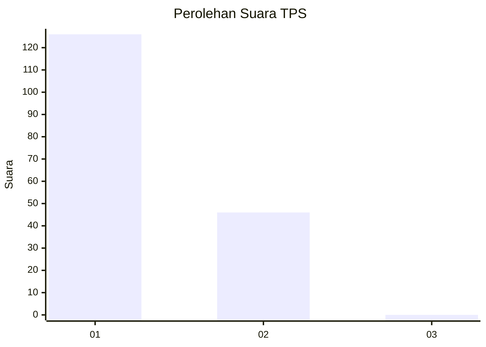
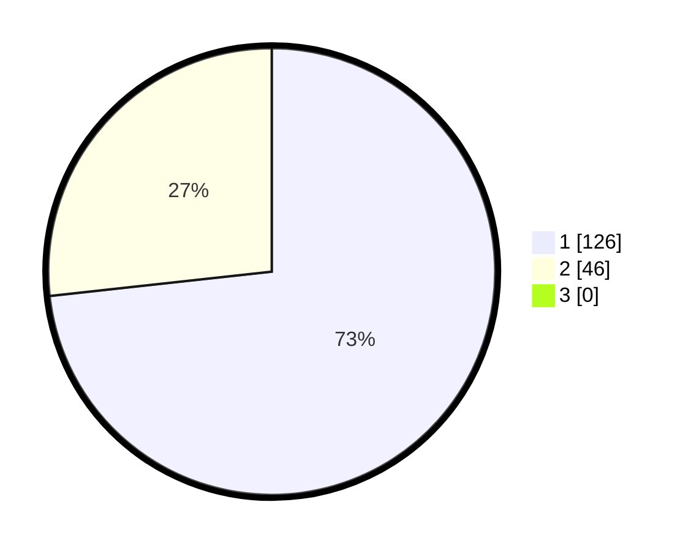

# Hasil

## Grafik

## Tabel

| No. | Nama Paslon    | Suara | Suara (raw) | Persentase |
|:--- |:-------------- | -----:| -----------:| ----------:|
| 1   | ANIES MUHAIMIN | 126   | [126][p-1]  | 73,26      |
| 2   | PRABOWO GIBRAN | 46    | [46][p-2]   | 26,74      |
| 3   | GANJAR MAHFUD  | 0     | [0][p-3]    | 0,00       |

[p-1]: https://github.com/gigit-pemilu/pemilu-2024-12-sumatera-utara/blob/main/pilpres/hitung-suara/sub/12-sumatera-utara/sub/77-kota-padang-sidempuan/sub/01-padangsidimpuan-utara/sub/1006-tobat/sub/008-tps/sub/paslon-1.txt
[p-2]: https://github.com/gigit-pemilu/pemilu-2024-12-sumatera-utara/blob/main/pilpres/hitung-suara/sub/12-sumatera-utara/sub/77-kota-padang-sidempuan/sub/01-padangsidimpuan-utara/sub/1006-tobat/sub/008-tps/sub/paslon-2.txt
[p-3]: https://github.com/gigit-pemilu/pemilu-2024-12-sumatera-utara/blob/main/pilpres/hitung-suara/sub/12-sumatera-utara/sub/77-kota-padang-sidempuan/sub/01-padangsidimpuan-utara/sub/1006-tobat/sub/008-tps/sub/paslon-3.txt

## Foto C Plano

https://sirekap-obj-formc.kpu.go.id/ec06/pemilu/ppwp/12/77/01/10/06/1277011006008-20240215-050134--e18b086b-0102-4690-a2ec-ac9d55eea4f4.jpg

https://sirekap-obj-formc.kpu.go.id/ec06/pemilu/ppwp/12/77/01/10/06/1277011006008-20240215-042600--fd66fc06-cece-4aba-b7bf-f52f2243cdce.jpg

https://sirekap-obj-formc.kpu.go.id/ec06/pemilu/ppwp/12/77/01/10/06/1277011006008-20240215-042929--32893518-3e8d-4e61-9bd1-f7f270b6ddec.jpg

## Metadata

| Key        | Value               |
| ---------- | ------------------- |
| Time Stamp | 2024-02-15 15:00:29 |

