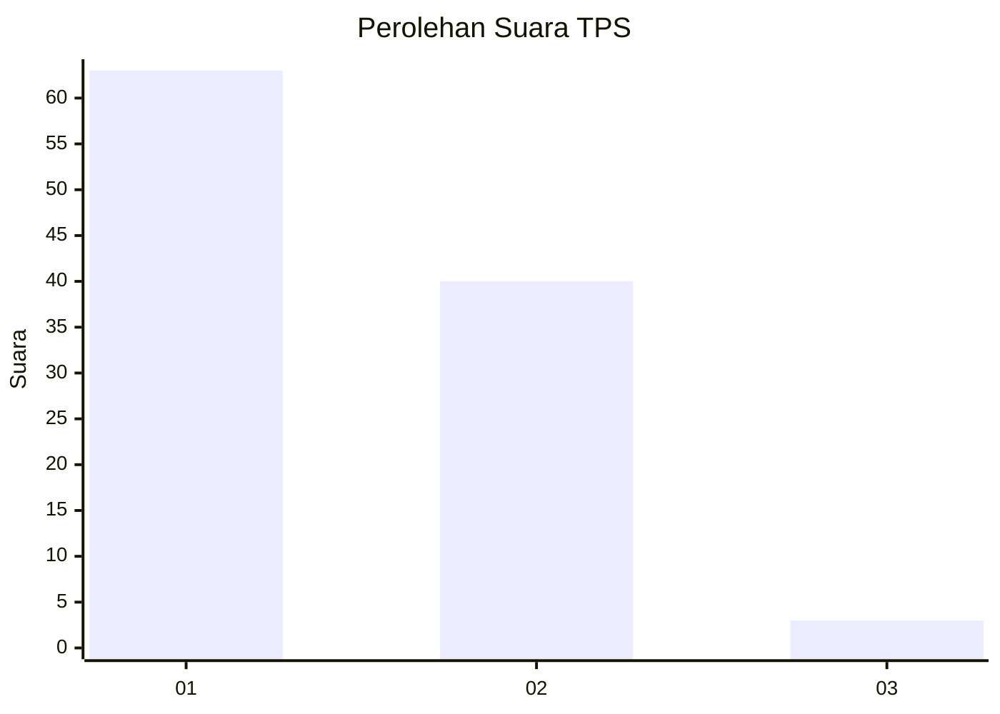
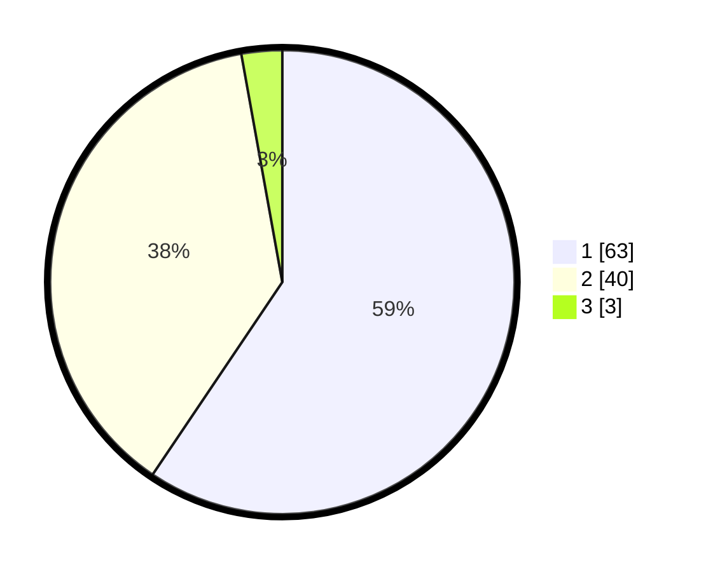

# Hasil

## Grafik

## Tabel

| No. | Nama Paslon    | Suara | Suara (raw) | Persentase |
|:--- |:-------------- | -----:| -----------:| ----------:|
| 1   | ANIES MUHAIMIN | 63    | [63][p-1]   | 59,43      |
| 2   | PRABOWO GIBRAN | 40    | [40][p-2]   | 37,74      |
| 3   | GANJAR MAHFUD  | 3     | [3][p-3]    | 2,83       |

[p-1]: https://github.com/gigit-pemilu/pemilu-2024/blob/main/pilpres/hitung-suara/sub/12-sumatera-utara/sub/77-kota-padang-sidempuan/sub/01-padangsidimpuan-utara/sub/1008-batang-ayumi-julu/sub/001-tps/sub/paslon-1.txt
[p-2]: https://github.com/gigit-pemilu/pemilu-2024/blob/main/pilpres/hitung-suara/sub/12-sumatera-utara/sub/77-kota-padang-sidempuan/sub/01-padangsidimpuan-utara/sub/1008-batang-ayumi-julu/sub/001-tps/sub/paslon-2.txt
[p-3]: https://github.com/gigit-pemilu/pemilu-2024/blob/main/pilpres/hitung-suara/sub/12-sumatera-utara/sub/77-kota-padang-sidempuan/sub/01-padangsidimpuan-utara/sub/1008-batang-ayumi-julu/sub/001-tps/sub/paslon-3.txt

## Foto C Plano

https://sirekap-obj-formc.kpu.go.id/5002/pemilu/ppwp/12/77/01/10/08/1277011008001-20240214-211745--30fb5a61-2080-4e49-8095-805b649ea602.jpg

https://sirekap-obj-formc.kpu.go.id/5002/pemilu/ppwp/12/77/01/10/08/1277011008001-20240214-211928--1c1742d9-44e8-4ef2-a82d-0351f12fd46f.jpg

https://sirekap-obj-formc.kpu.go.id/5002/pemilu/ppwp/12/77/01/10/08/1277011008001-20240214-212207--71dc3635-7c53-449d-b69d-9eb51c3f771c.jpg

## Metadata

| Key        | Value               |
| ---------- | ------------------- |
| Time Stamp | 2024-02-19 10:00:00 |

