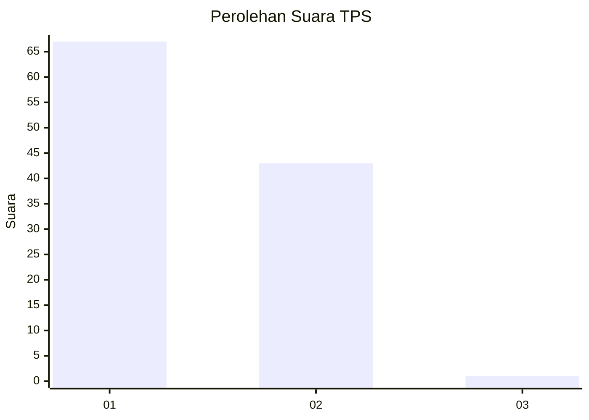
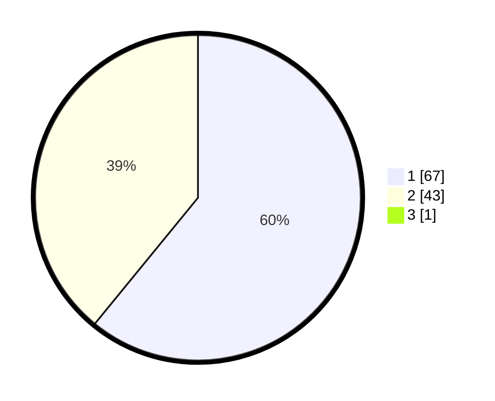

# Hasil

## Grafik

## Tabel

| No. | Nama Paslon    | Suara | Suara (raw) | Persentase |
|:--- |:-------------- | -----:| -----------:| ----------:|
| 1   | ANIES MUHAIMIN | 67    | [67][p-1]   | 60,36      |
| 2   | PRABOWO GIBRAN | 43    | [43][p-2]   | 38,74      |
| 3   | GANJAR MAHFUD  | 1     | [1][p-3]    | 0,90       |

[p-1]: https://github.com/gigit-pemilu/pemilu-2024/blob/main/pilpres/hitung-suara/sub/12-sumatera-utara/sub/77-kota-padang-sidempuan/sub/01-padangsidimpuan-utara/sub/1008-batang-ayumi-julu/sub/002-tps/sub/paslon-1.txt
[p-2]: https://github.com/gigit-pemilu/pemilu-2024/blob/main/pilpres/hitung-suara/sub/12-sumatera-utara/sub/77-kota-padang-sidempuan/sub/01-padangsidimpuan-utara/sub/1008-batang-ayumi-julu/sub/002-tps/sub/paslon-2.txt
[p-3]: https://github.com/gigit-pemilu/pemilu-2024/blob/main/pilpres/hitung-suara/sub/12-sumatera-utara/sub/77-kota-padang-sidempuan/sub/01-padangsidimpuan-utara/sub/1008-batang-ayumi-julu/sub/002-tps/sub/paslon-3.txt

## Foto C Plano

https://sirekap-obj-formc.kpu.go.id/49d2/pemilu/ppwp/12/77/01/10/08/1277011008002-20240214-224634--1d428bd1-df50-40e5-a7c2-803bf0b82685.jpg

https://sirekap-obj-formc.kpu.go.id/49d2/pemilu/ppwp/12/77/01/10/08/1277011008002-20240214-224927--9f6de942-12fb-4ff6-ae31-508455db68f1.jpg

https://sirekap-obj-formc.kpu.go.id/49d2/pemilu/ppwp/12/77/01/10/08/1277011008002-20240214-223424--8f4117f0-4aaa-4b32-af7e-ae81ca825be2.jpg

## Metadata

| Key        | Value               |
| ---------- | ------------------- |
| Time Stamp | 2024-02-19 10:00:00 |

