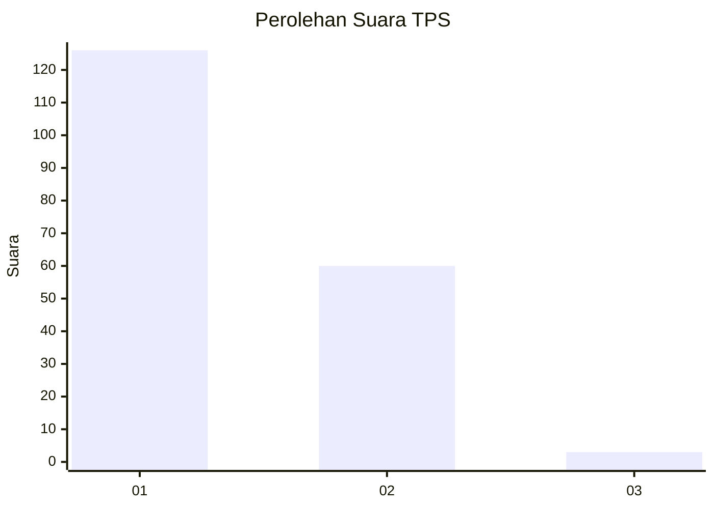
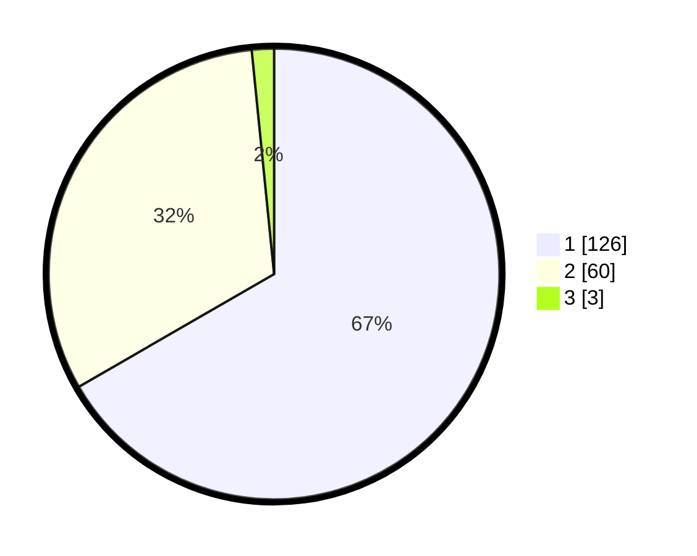

# Hasil

## Grafik

## Tabel

| No. | Nama Paslon    | Suara | Suara (raw) | Persentase |
|:--- |:-------------- | -----:| -----------:| ----------:|
| 1   | ANIES MUHAIMIN | 126   | [126][p-1]  | 66,67      |
| 2   | PRABOWO GIBRAN | 60    | [60][p-2]   | 31,75      |
| 3   | GANJAR MAHFUD  | 3     | [3][p-3]    | 1,59       |

[p-1]: https://github.com/gigit-pemilu/pemilu-2024/blob/main/pilpres/hitung-suara/sub/12-sumatera-utara/sub/77-kota-padang-sidempuan/sub/01-padangsidimpuan-utara/sub/1008-batang-ayumi-julu/sub/005-tps/sub/paslon-1.txt
[p-2]: https://github.com/gigit-pemilu/pemilu-2024/blob/main/pilpres/hitung-suara/sub/12-sumatera-utara/sub/77-kota-padang-sidempuan/sub/01-padangsidimpuan-utara/sub/1008-batang-ayumi-julu/sub/005-tps/sub/paslon-2.txt
[p-3]: https://github.com/gigit-pemilu/pemilu-2024/blob/main/pilpres/hitung-suara/sub/12-sumatera-utara/sub/77-kota-padang-sidempuan/sub/01-padangsidimpuan-utara/sub/1008-batang-ayumi-julu/sub/005-tps/sub/paslon-3.txt

## Foto C Plano

https://sirekap-obj-formc.kpu.go.id/e5f0/pemilu/ppwp/12/77/01/10/08/1277011008005-20240215-020307--a8b2306d-6fee-41e1-ae7d-91d56d1e57fe.jpg

https://sirekap-obj-formc.kpu.go.id/e5f0/pemilu/ppwp/12/77/01/10/08/1277011008005-20240215-020409--d3da56e3-79db-4cef-84bd-362de72b2fad.jpg

https://sirekap-obj-formc.kpu.go.id/e5f0/pemilu/ppwp/12/77/01/10/08/1277011008005-20240215-020533--9ae70a82-8b94-40e6-aae4-506a20ddbf18.jpg

## Metadata

| Key        | Value               |
| ---------- | ------------------- |
| Time Stamp | 2024-02-19 10:00:00 |

