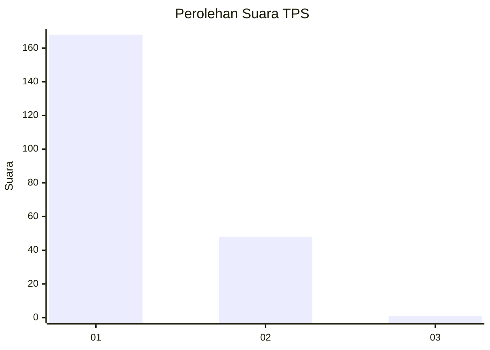
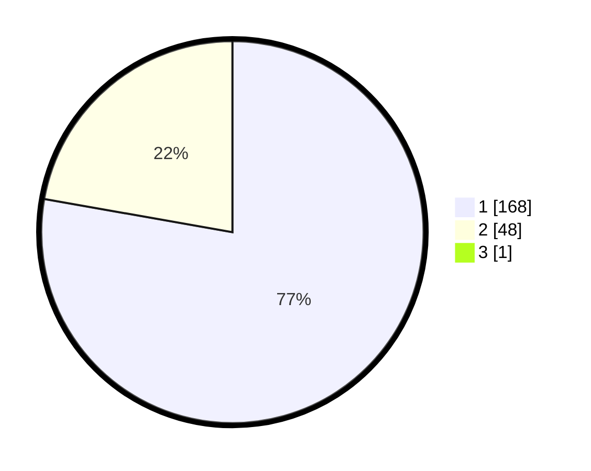

# Hasil

## Grafik

## Tabel

| No. | Nama Paslon    | Suara | Suara (raw) | Persentase |
|:--- |:-------------- | -----:| -----------:| ----------:|
| 1   | ANIES MUHAIMIN | 168   | [168][p-1]  | 77,42      |
| 2   | PRABOWO GIBRAN | 48    | [48][p-2]   | 22,12      |
| 3   | GANJAR MAHFUD  | 1     | [1][p-3]    | 0,46       |

[p-1]: https://github.com/gigit-pemilu/pemilu-2024/blob/main/pilpres/hitung-suara/sub/12-sumatera-utara/sub/77-kota-padang-sidempuan/sub/01-padangsidimpuan-utara/sub/1010-panyanggar/sub/003-tps/sub/paslon-1.txt
[p-2]: https://github.com/gigit-pemilu/pemilu-2024/blob/main/pilpres/hitung-suara/sub/12-sumatera-utara/sub/77-kota-padang-sidempuan/sub/01-padangsidimpuan-utara/sub/1010-panyanggar/sub/003-tps/sub/paslon-2.txt
[p-3]: https://github.com/gigit-pemilu/pemilu-2024/blob/main/pilpres/hitung-suara/sub/12-sumatera-utara/sub/77-kota-padang-sidempuan/sub/01-padangsidimpuan-utara/sub/1010-panyanggar/sub/003-tps/sub/paslon-3.txt

## Foto C Plano

https://sirekap-obj-formc.kpu.go.id/8a31/pemilu/ppwp/12/77/01/10/10/1277011010003-20240215-004535--e364caf5-8121-4334-8ce3-a371295dc433.jpg

https://sirekap-obj-formc.kpu.go.id/8a31/pemilu/ppwp/12/77/01/10/10/1277011010003-20240215-004602--cb1a7dab-7ac0-45f4-b865-9bd462b28c5f.jpg

https://sirekap-obj-formc.kpu.go.id/8a31/pemilu/ppwp/12/77/01/10/10/1277011010003-20240215-004629--1a0079b1-cddc-4ab0-801b-609dd5ec4c96.jpg

## Metadata

| Key        | Value               |
| ---------- | ------------------- |
| Time Stamp | 2024-02-19 10:00:00 |

