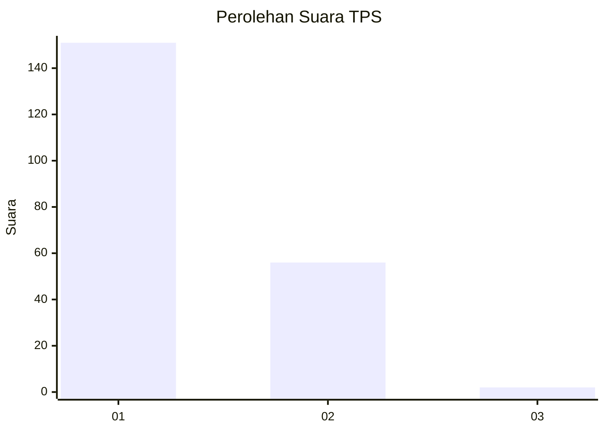
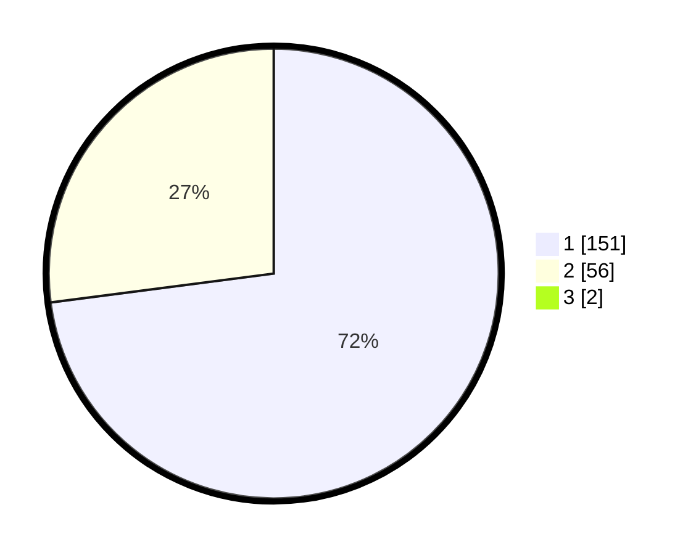

# Hasil

## Grafik

## Tabel

| No. | Nama Paslon    | Suara | Suara (raw) | Persentase |
|:--- |:-------------- | -----:| -----------:| ----------:|
| 1   | ANIES MUHAIMIN | 151   | [151][p-1]  | 72,25      |
| 2   | PRABOWO GIBRAN | 56    | [56][p-2]   | 26,79      |
| 3   | GANJAR MAHFUD  | 2     | [2][p-3]    | 0,96       |

[p-1]: https://github.com/gigit-pemilu/pemilu-2024/blob/main/pilpres/hitung-suara/sub/12-sumatera-utara/sub/77-kota-padang-sidempuan/sub/01-padangsidimpuan-utara/sub/1012-losung-batu-/sub/001-tps/sub/paslon-1.txt
[p-2]: https://github.com/gigit-pemilu/pemilu-2024/blob/main/pilpres/hitung-suara/sub/12-sumatera-utara/sub/77-kota-padang-sidempuan/sub/01-padangsidimpuan-utara/sub/1012-losung-batu-/sub/001-tps/sub/paslon-2.txt
[p-3]: https://github.com/gigit-pemilu/pemilu-2024/blob/main/pilpres/hitung-suara/sub/12-sumatera-utara/sub/77-kota-padang-sidempuan/sub/01-padangsidimpuan-utara/sub/1012-losung-batu-/sub/001-tps/sub/paslon-3.txt

## Foto C Plano

https://sirekap-obj-formc.kpu.go.id/a244/pemilu/ppwp/12/77/01/10/12/1277011012001-20240215-100621--3623a512-099c-4376-bd71-4609a46f2641.jpg

https://sirekap-obj-formc.kpu.go.id/a244/pemilu/ppwp/12/77/01/10/12/1277011012001-20240215-100144--6367fcce-c929-4264-8b6f-ed976d039b7e.jpg

https://sirekap-obj-formc.kpu.go.id/a244/pemilu/ppwp/12/77/01/10/12/1277011012001-20240215-100208--b01343cf-73c6-463d-b692-383b57b7f00c.jpg

## Metadata

| Key        | Value               |
| ---------- | ------------------- |
| Time Stamp | 2024-02-19 10:00:00 |

