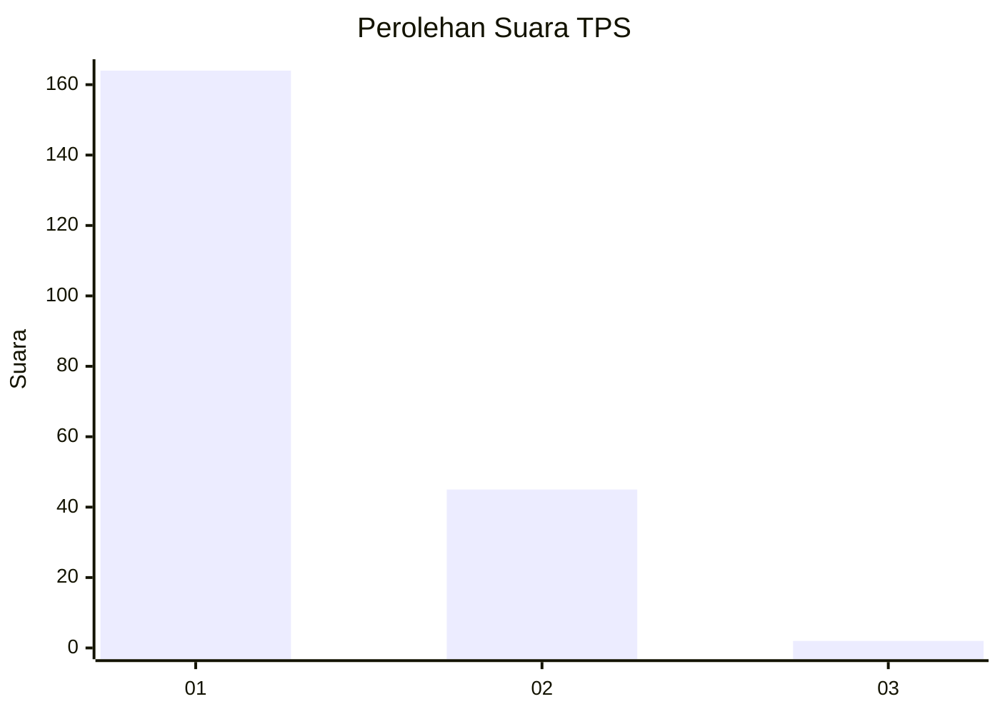
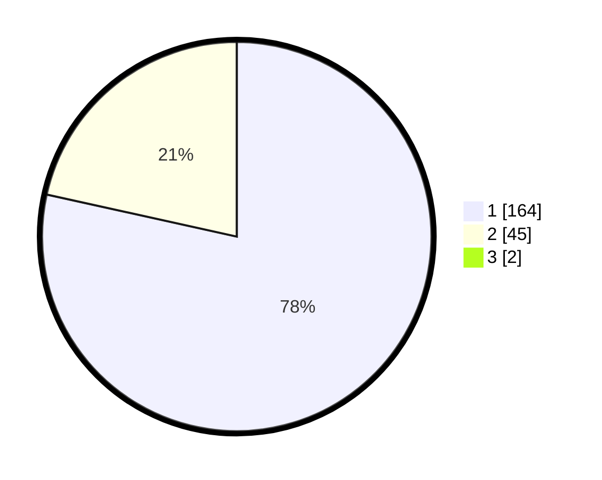

# Hasil

## Grafik

## Tabel

| No. | Nama Paslon    | Suara | Suara (raw) | Persentase |
|:--- |:-------------- | -----:| -----------:| ----------:|
| 1   | ANIES MUHAIMIN | 164   | [164][p-1]  | 77,73      |
| 2   | PRABOWO GIBRAN | 45    | [45][p-2]   | 21,33      |
| 3   | GANJAR MAHFUD  | 2     | [2][p-3]    | 0,95       |

[p-1]: https://github.com/gigit-pemilu/pemilu-2024/blob/main/pilpres/hitung-suara/sub/12-sumatera-utara/sub/77-kota-padang-sidempuan/sub/01-padangsidimpuan-utara/sub/1012-losung-batu-/sub/002-tps/sub/paslon-1.txt
[p-2]: https://github.com/gigit-pemilu/pemilu-2024/blob/main/pilpres/hitung-suara/sub/12-sumatera-utara/sub/77-kota-padang-sidempuan/sub/01-padangsidimpuan-utara/sub/1012-losung-batu-/sub/002-tps/sub/paslon-2.txt
[p-3]: https://github.com/gigit-pemilu/pemilu-2024/blob/main/pilpres/hitung-suara/sub/12-sumatera-utara/sub/77-kota-padang-sidempuan/sub/01-padangsidimpuan-utara/sub/1012-losung-batu-/sub/002-tps/sub/paslon-3.txt

## Foto C Plano

https://sirekap-obj-formc.kpu.go.id/d398/pemilu/ppwp/12/77/01/10/12/1277011012002-20240215-085833--a153b61b-e2b7-476b-81f0-194dc2132f3b.jpg

https://sirekap-obj-formc.kpu.go.id/d398/pemilu/ppwp/12/77/01/10/12/1277011012002-20240215-091123--a8008c30-1754-4235-9eaa-4cf5c331d631.jpg

https://sirekap-obj-formc.kpu.go.id/d398/pemilu/ppwp/12/77/01/10/12/1277011012002-20240215-091517--d0e93976-94df-430a-b6ff-e364f66e6da2.jpg

## Metadata

| Key        | Value               |
| ---------- | ------------------- |
| Time Stamp | 2024-02-19 10:00:00 |

