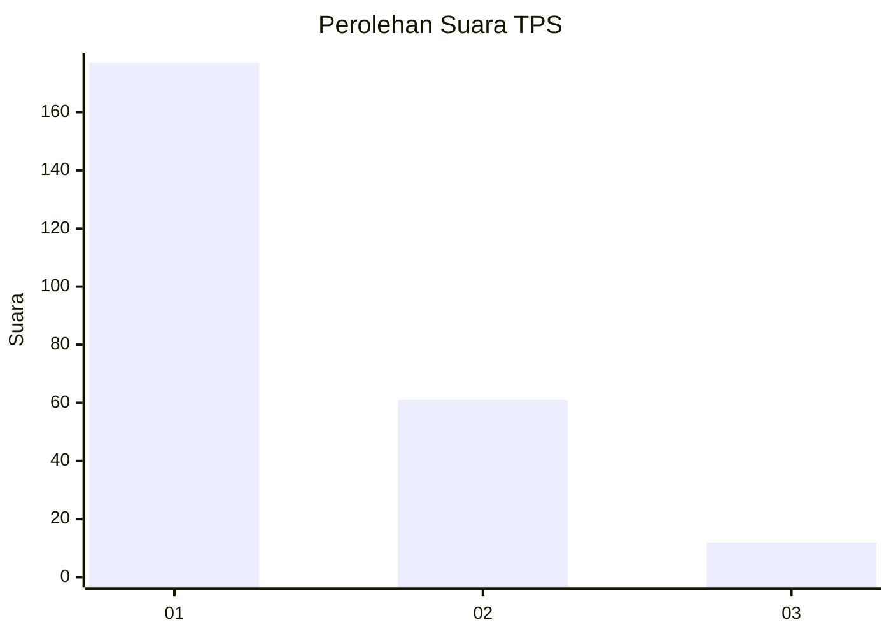
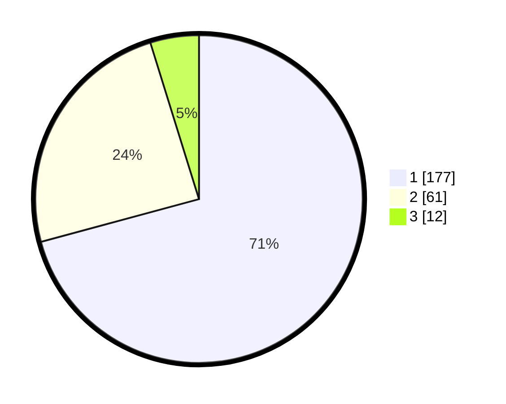

# Hasil

## Grafik

## Tabel

| No. | Nama Paslon    | Suara | Suara (raw) | Persentase |
|:--- |:-------------- | -----:| -----------:| ----------:|
| 1   | ANIES MUHAIMIN | 177   | [177][p-1]  | 70,80      |
| 2   | PRABOWO GIBRAN | 61    | [61][p-2]   | 24,40      |
| 3   | GANJAR MAHFUD  | 12    | [12][p-3]   | 4,80       |

[p-1]: https://github.com/gigit-pemilu/pemilu-2024/blob/main/pilpres/hitung-suara/sub/12-sumatera-utara/sub/77-kota-padang-sidempuan/sub/01-padangsidimpuan-utara/sub/1012-losung-batu-/sub/003-tps/sub/paslon-1.txt
[p-2]: https://github.com/gigit-pemilu/pemilu-2024/blob/main/pilpres/hitung-suara/sub/12-sumatera-utara/sub/77-kota-padang-sidempuan/sub/01-padangsidimpuan-utara/sub/1012-losung-batu-/sub/003-tps/sub/paslon-2.txt
[p-3]: https://github.com/gigit-pemilu/pemilu-2024/blob/main/pilpres/hitung-suara/sub/12-sumatera-utara/sub/77-kota-padang-sidempuan/sub/01-padangsidimpuan-utara/sub/1012-losung-batu-/sub/003-tps/sub/paslon-3.txt

## Foto C Plano

https://sirekap-obj-formc.kpu.go.id/7d5e/pemilu/ppwp/12/77/01/10/12/1277011012003-20240214-232322--393c2e1c-35d9-4796-97fc-ec7d190ed559.jpg

https://sirekap-obj-formc.kpu.go.id/7d5e/pemilu/ppwp/12/77/01/10/12/1277011012003-20240215-032808--0fc234b9-036e-43dc-8ea7-dddb7706f2d4.jpg

https://sirekap-obj-formc.kpu.go.id/7d5e/pemilu/ppwp/12/77/01/10/12/1277011012003-20240215-033006--adddb808-50f1-47ae-bd08-cf5084770d8d.jpg

## Metadata

| Key        | Value               |
| ---------- | ------------------- |
| Time Stamp | 2024-02-19 10:00:00 |

