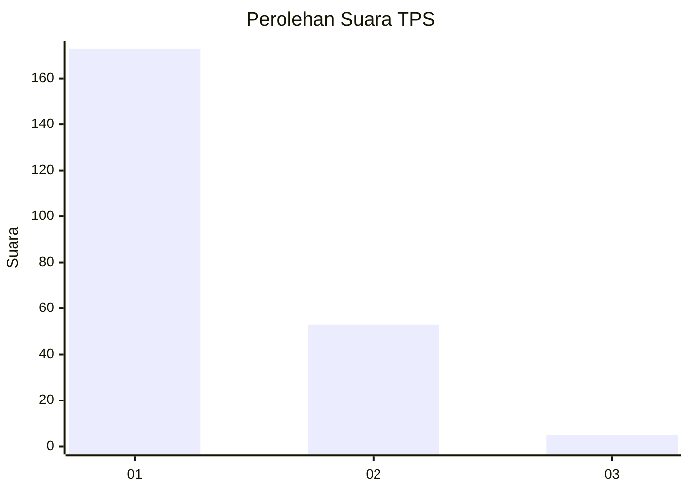
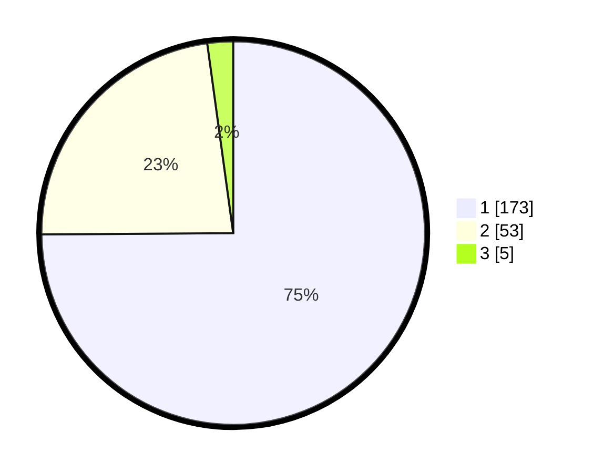

# Hasil

## Grafik

## Tabel

| No. | Nama Paslon    | Suara | Suara (raw) | Persentase |
|:--- |:-------------- | -----:| -----------:| ----------:|
| 1   | ANIES MUHAIMIN | 173   | [173][p-1]  | 74,89      |
| 2   | PRABOWO GIBRAN | 53    | [53][p-2]   | 22,94      |
| 3   | GANJAR MAHFUD  | 5     | [5][p-3]    | 2,16       |

[p-1]: https://github.com/gigit-pemilu/pemilu-2024/blob/main/pilpres/hitung-suara/sub/12-sumatera-utara/sub/77-kota-padang-sidempuan/sub/01-padangsidimpuan-utara/sub/1012-losung-batu-/sub/005-tps/sub/paslon-1.txt
[p-2]: https://github.com/gigit-pemilu/pemilu-2024/blob/main/pilpres/hitung-suara/sub/12-sumatera-utara/sub/77-kota-padang-sidempuan/sub/01-padangsidimpuan-utara/sub/1012-losung-batu-/sub/005-tps/sub/paslon-2.txt
[p-3]: https://github.com/gigit-pemilu/pemilu-2024/blob/main/pilpres/hitung-suara/sub/12-sumatera-utara/sub/77-kota-padang-sidempuan/sub/01-padangsidimpuan-utara/sub/1012-losung-batu-/sub/005-tps/sub/paslon-3.txt

## Foto C Plano

https://sirekap-obj-formc.kpu.go.id/4c92/pemilu/ppwp/12/77/01/10/12/1277011012005-20240215-041047--a60bad24-560f-4ab7-84a0-c72b56f947d5.jpg

https://sirekap-obj-formc.kpu.go.id/4c92/pemilu/ppwp/12/77/01/10/12/1277011012005-20240215-041329--f7839338-aeaa-4863-88f1-4295022742f1.jpg

https://sirekap-obj-formc.kpu.go.id/4c92/pemilu/ppwp/12/77/01/10/12/1277011012005-20240215-041454--916039c5-a673-45fa-ac13-0c544a0ed923.jpg

## Metadata

| Key        | Value               |
| ---------- | ------------------- |
| Time Stamp | 2024-02-19 10:00:00 |

