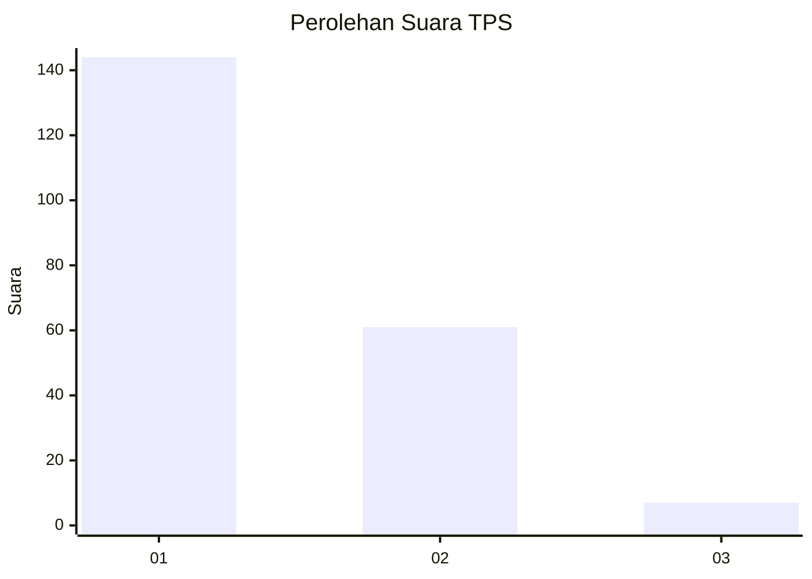
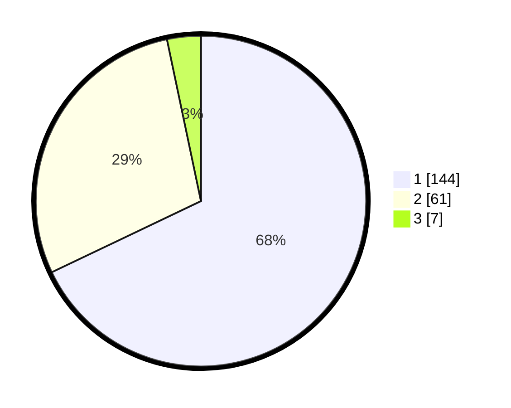

# Hasil

## Grafik

## Tabel

| No. | Nama Paslon    | Suara | Suara (raw) | Persentase |
|:--- |:-------------- | -----:| -----------:| ----------:|
| 1   | ANIES MUHAIMIN | 144   | [144][p-1]  | 67,92      |
| 2   | PRABOWO GIBRAN | 61    | [61][p-2]   | 28,77      |
| 3   | GANJAR MAHFUD  | 7     | [7][p-3]    | 3,30       |

[p-1]: https://github.com/gigit-pemilu/pemilu-2024/blob/main/pilpres/hitung-suara/sub/12-sumatera-utara/sub/77-kota-padang-sidempuan/sub/01-padangsidimpuan-utara/sub/1012-losung-batu-/sub/019-tps/sub/paslon-1.txt
[p-2]: https://github.com/gigit-pemilu/pemilu-2024/blob/main/pilpres/hitung-suara/sub/12-sumatera-utara/sub/77-kota-padang-sidempuan/sub/01-padangsidimpuan-utara/sub/1012-losung-batu-/sub/019-tps/sub/paslon-2.txt
[p-3]: https://github.com/gigit-pemilu/pemilu-2024/blob/main/pilpres/hitung-suara/sub/12-sumatera-utara/sub/77-kota-padang-sidempuan/sub/01-padangsidimpuan-utara/sub/1012-losung-batu-/sub/019-tps/sub/paslon-3.txt

## Foto C Plano

https://sirekap-obj-formc.kpu.go.id/2138/pemilu/ppwp/12/77/01/10/12/1277011012019-20240215-121941--b218c775-9001-47c4-a250-505be555cf72.jpg

https://sirekap-obj-formc.kpu.go.id/2138/pemilu/ppwp/12/77/01/10/12/1277011012019-20240215-122954--4ad54138-79a8-4b9a-99cd-2840d5b0b57e.jpg

https://sirekap-obj-formc.kpu.go.id/2138/pemilu/ppwp/12/77/01/10/12/1277011012019-20240215-122004--e04457fd-3ffb-4ffd-a57c-d4f1f81618cc.jpg

## Metadata

| Key        | Value               |
| ---------- | ------------------- |
| Time Stamp | 2024-02-19 11:00:00 |

